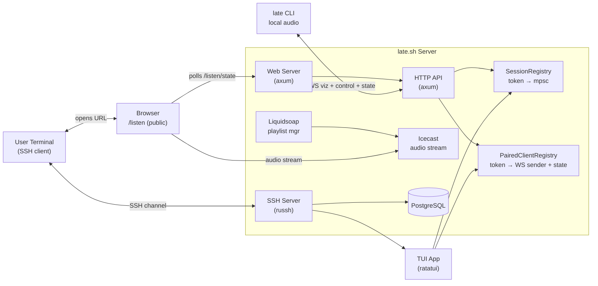
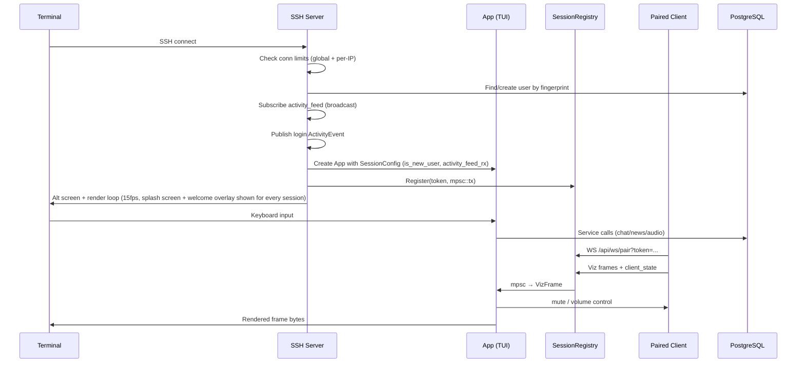
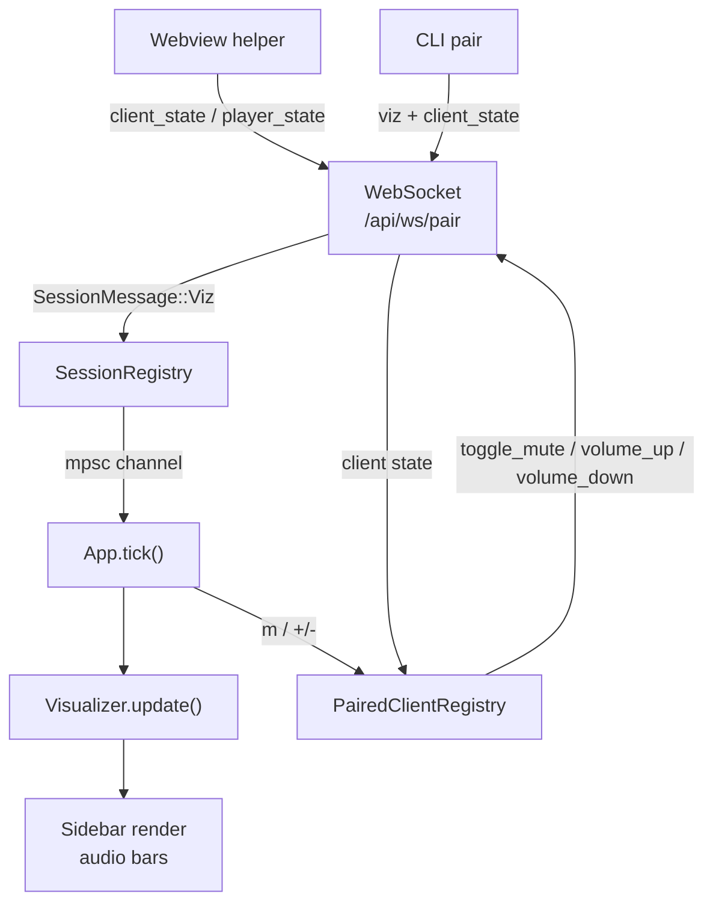
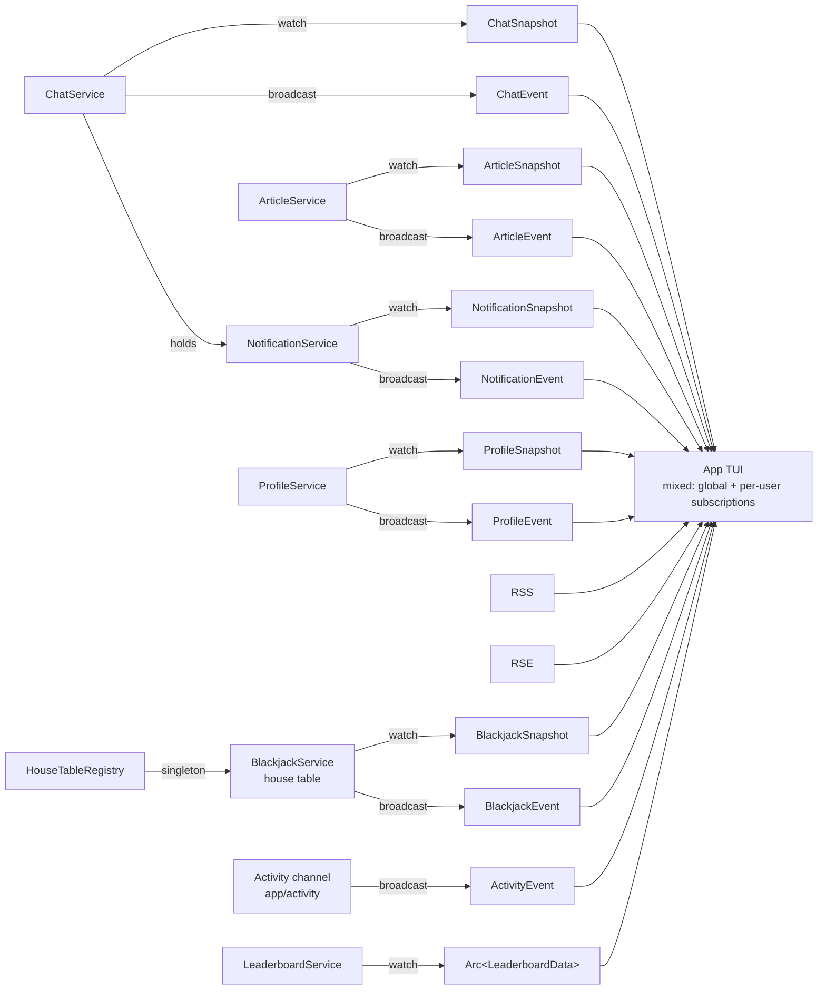
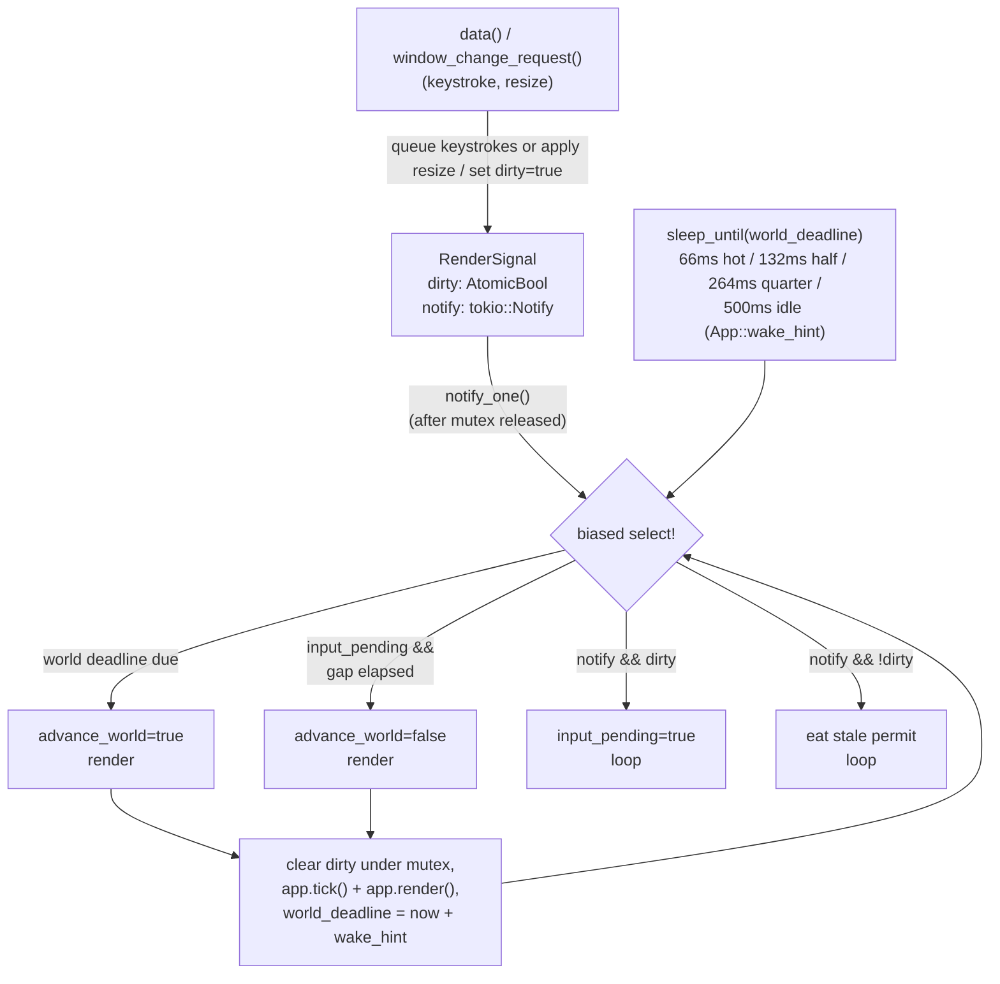
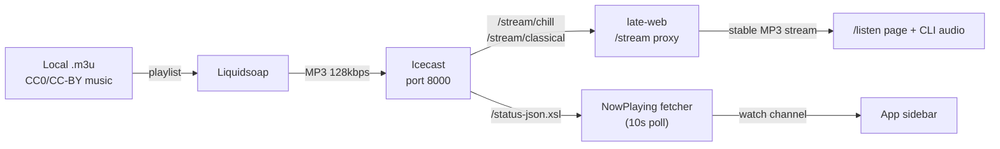

# late.sh Context

## Metadata
- Domain: late.sh - Command-Line Clubhouse for Computer People
- Primary audience: LLM agents working on this codebase, human contributors
- Last updated: 2026-08-21 (Sliding Puzzle has persisted, unrewarded personal boards; details in `late-ssh/src/app/arcade/CONTEXT.md`)
- Status: Active
- Stability note: Sections marked `[STABLE]` should change rarely. Sections marked `[VOLATILE]` are expected to change often.

---

## 0. Context Maintenance Protocol (LLM-First) [STABLE]

This file is the primary working context for the entire late.sh project.

- LLM agents should treat this as a living document and update it whenever meaningful behavior changes.
- If code and this file diverge, prefer updating this file quickly so future work stays reliable.
- Temporary or branch-specific behavior should be documented here with clear cleanup notes.
- **KEEP THIS THING THIN.** This file (and every local `CONTEXT.md`) is loaded into LLM context on every task — it is not a changelog. `Last updated` gets *overwritten* with the newest change only; never append "Previous update ...", "Same day ...", or "Previously ..." chains onto it. Describe current-state behavior, not the history of how it got that way. The only sanctioned running log is the Incident log (§10.5) — everything else should read as if written fresh today.

### Quick update checklist
- Overwrite `Last updated` with only the newest change (no history chain)
- Review `Current Work` and `Future Work`
- Validate `Critical Invariants`
- Update telemetry references if operation/event names changed
- Remove obsolete notes
- After any crash/incident investigation, add a dated entry to the Incident log (§10.5) — that is the one place a running log belongs
- Read `late-ssh/assets/splash_tips/new_and_returning_users_tip_pool.json` and `late-ssh/assets/splash_tips/returning_users_tip_pool.json` to keep splash tips aligned with any feature/key changes
- On any bigger feature/keybinding/screen change, update `late-ssh/src/app/help_modal/data.rs` — it backs the in-app global guide (`?`), the `bot_app_context()` string fed to @bot (the full guide, since explaining features in depth is his job), and the much smaller `bartender_app_context()` fed to @bartender (navigation only — @bartender points deeper questions at @bot rather than answering them himself). @graybeard gets neither; he only riffs on chat history. Stale help lines there mislead users and the bots alike.

### Freshness target
- Re-review this file regularly (every 2 weeks) to prevent context drift.

### Context Directory (Read-First Routing) [STABLE]

Use this root file as the entry point. Before changing a domain, read the matching local context file(s) below. If a task crosses domains, read every row it touches and keep root plus local docs aligned.

| Context file | Read when the task touches | What it contains |
|---|---|---|
| `CONTEXT.md` | Any task in this repo; cross-domain behavior; global contracts. | Repo architecture, test policy, service contracts, data model, telemetry, runbook, global screens/keybindings, and high-risk invariants. |
| `late-cli/CONTEXT.md` | The `late` companion binary, local audio playback, SSH launch behavior, token acquisition, pairing, installers, or CLI env/flags. | CLI architecture, native/OpenSSH/old SSH modes, identity generation, token handshake, audio decode/output/analyzer, paired-client WebSocket behavior, logging, scripts, release artifacts, and fragile CLI invariants. |
| `late-web/CONTEXT.md` | Public web pages, the `/listen` page, gallery/profiles, web route tests, templates/assets, web config, or `/stream`. | Axum app shape, routes, Askama templates, static assets, the listen-state proxy, audio stream proxy, gallery/profile DB contracts, web telemetry, and web-specific test placement. |
| `late-ssh/src/app/audio/CONTEXT.md` | Icecast, now-playing, YouTube queue, Music Booth, visualizer, `/audio` commands, paired audio source switching, or the public `/listen` snapshot. | AudioService state machine, queue persistence, server-owned playback timers, fallback behavior, pair-WS audio messages, source-selection policy, skip-vote eligibility, and cross-crate audio touchpoints in CLI/Web. |
| `late-ssh/src/app/voice/CONTEXT.md` | LiveKit voice rooms, TUI voice controls/status, CLI voice media, or pair-WS voice messages. | VoiceService token/snapshot ownership, LiveKit grants, pair-WS voice protocol, native CLI voice runtime, pruning/heartbeat invariants, and current voice UX gaps. |
| `late-ssh/src/app/hub/CONTEXT.md` | The `/shop` Shop modal, the Arcade quest strip's service, marketplace, pet/aquarium unlocks, or chip economy presentation. | Shop modal ownership, reward/economy rules, daily/weekly quest service, marketplace and entitlement projection, aquarium tray behavior, and known gaps. |
| `late-ssh/src/app/leaderboard/CONTEXT.md` | The Leaderboards page (screen `6`), `LeaderboardService`, the board rosters/queries in `late-core/src/models/leaderboard.rs`, the door/Lateania boards, monthly profile awards, or the leaderboard seed script. | Refresh model (subscriber gate, seed-on-connect, query-count cost rules), roster-generated data model incl. the door board triples, **the cross-door log-pipe contract that fills them** (transport, cursors/idempotency, handle identity, lifetime grants, feed gating, deploy order, settled decisions), page rail/detail behavior, profile award machinery and badge collapse, `make seed-leaderboard`, and known gaps. |
| `late-ssh/src/app/bonsai_v2/CONTEXT.md` | Dynamic Bonsai branch graph, care modal, sidebar preview, growth simulation, badge scoring, or `dynamic_bonsai` shop selection. | Dynamic Bonsai persistence, renderers, input model, growth/death rules, chat badge scoring, classic Bonsai compatibility bridge, and prototype invariants. |
| `late-ssh/src/app/lobby/CONTEXT.md` | The Lobby: the `Ctrl+G` modal, `LobbyState`/`LobbyEntry`, or the backtick workspace cycle spanning daily boards, house tables, unfinished Arcade dailies, live (detached) roguelike door games, and a recently-detached Lateania world. | Lobby domain overview and the modal/workspace contracts; routes onward to `lobby/daily/CONTEXT.md` and `lobby/house/CONTEXT.md` for the two game domains. |
| `late-ssh/src/app/lobby/house/CONTEXT.md` | House tables (the fixed Poker/Blackjack/Asterion/Tron/Super Snake tables behind the Lobby modal), `Screen::HouseTable`, the five game runtimes, their singleton registry, or seeded table chat/voice. | `HouseTable` roster enum, `HouseTableRegistry` singletons + occupancy + seat activity + blackjack event feed (@dealer), per-session `HouseState`/`HouseTableClient`, screen input/render split, and runtime contracts for the five games. |
| `late-ssh/src/app/door/lateania/CONTEXT.md` | Lateania top-level screen, landing/launch/leave/reset behavior, active-world key capture, game runtime, world/content, combat, classes, abilities, items, wildlife, Frontier, persistence, or game UI panels. | Single Lateania context: screen lifecycle, module map, gameplay loop, service/runtime model, world and content invariants, progression/combat/economy rules, save schemas, tests, and gotchas. |
| `late-ssh/src/app/door/greendragon/CONTEXT.md` | Green Dragon door screen, the native LORD-style remake's village/forest/shops/training/dragon flow, combat resolver, character persistence, or its Games-hub landing/launch/leave/reset. | Single Green Dragon context: module map, LoGD balance-data provenance, the pure combat resolver, the Character model and rules, the per-user save schema, integration points, and deferred gaps. |
| `late-ssh/src/app/door/nethack/CONTEXT.md` | NetHack door screen, launcher/launch/leave behavior, the local PTY process bridge, raw input forwarding/filtering, the F1 cheat sheet, or NetHack config/deploy wiring. | NetHack door context: screen lifecycle, module map, PTY bridge architecture (openpty/vt100/status), input capture and mouse/paste stripping, launcher UI, config knobs and binary sourcing, invariants, tests, and gotchas. |
| `late-ssh/src/app/door/dopewars/CONTEXT.md` | dopewars door screen, launcher/launch/leave behavior, the local-PTY child proxy, raw input forwarding/filtering, the `-t -n -b -f` spawn args, or dopewars config/build wiring. | dopewars door context: the simplest door (local `openpty` child, no host crate/auth/save-lock/awards), module map, spawn args (incl. the load-bearing `-b` readability fix), config knobs, the from-source 1.6.2 build + link-bug workaround, invariants, tests, and gotchas. |
| `late-ssh/src/app/door/codekeep/CONTEXT.md` | CodeKeep screen, npm-package pinning with Bun, `late-codekeep` PTY host, account save identity, input forwarding, or deploy wiring. | CodeKeep client/host transport, immutable-account HOME saves, single-session lease, package integrity, config, infra, and tests. |
| `late-ssh/src/app/door/bashquest/CONTEXT.md` | BashQuest door screen, launcher/launch/leave behavior, the `late-bashquest` PTY host, arcade-handle identity (`BASHQUEST_AUTOLOGIN`), raw input forwarding/filtering, or BashQuest config/deploy wiring. | BashQuest door context: the one native late.sh original among the doors (not a foreign upstream binary), module map, shared-not-per-player HOME rationale, the pinned-commit fetch-and-verify build (no compilation), config knobs, invariants, tests, and gotchas. |
| `late-ssh/src/app/door/dcss/CONTEXT.md` | DCSS door screen, launcher/launch/leave behavior, the SSH client transport, the `late-dcss` host (PTY bridge / auth / TERM handling), input forwarding, the F1→`?` remap, the public `late.sh/crawl` file publishing, or DCSS config/deploy wiring. | DCSS door context: the NetHack-twin network door (client + `late-dcss` host crate), module map, `-name` playname identity, SIGHUP-save teardown, from-source 0.34.1 build, the log pipe, the read-only crawl-file publisher for dcss-stats/Sequell, config knobs, invariants, and tests. |
| `late-ssh/src/app/door/brogue/CONTEXT.md` | Brogue door screen, launcher/launch/leave behavior, the SSH client transport, the `late-brogue` host (PTY bridge / auth / per-player cwd identity), input forwarding, the F1→`?` remap, or Brogue config/deploy wiring. | Brogue door context: the DCSS-twin network door (client + `late-brogue` host crate), module map, per-player save-directory identity via the arcade handle, patched SIGHUP-save teardown, from-source Brogue CE 1.15.1 build, config knobs, invariants, and tests. |
| `late-ssh/src/app/door/darkroom/CONTEXT.md` | A Dark Room door screen, the incremental's room/village acts, the settle-forward clock, the pacing rules (credit accrual, daily cap, slowdown), the save shape, or the MPL file boundary inside that directory. | A Dark Room context: the Green-Dragon-shaped native port, module map, the licensing split between MPL-derived and our own files, the no-timers settle model, the pacing design and why it deviates from upstream, persistence, scope, and gotchas. |
| `late-ssh/src/app/door/usurper/CONTEXT.md` | Usurper door screen, launcher/launch/leave behavior, the SSH client transport, the `late-usurper` host (PTY bridge / auth / DOOR32 dropfiles / node leases / CP437 transcoding), input forwarding/F-key stripping, or Usurper config/deploy wiring. | Usurper door context: the DCSS-twin network door (client + `late-usurper` host crate), module map, dropfile identity via the arcade handle, shared-world PVC + boot seeding/sweeps, from-source Free Pascal build, config knobs, invariants, tests, and gotchas. |
| `late-ssh/src/app/chat/CONTEXT.md` | Home chat, DMs, public/private rooms, embedded Rooms chat, composer commands, moderation, notifications, message rendering, or chat-adjacent feed services. | Chat service/state/input/UI ownership, room ordering, snapshots versus tails, message/reaction/reply/edit/delete contracts, RSS/News/Mentions/Voice/Discover entries, Directory-backed Showcase/Work services, row caches, commands, and chat integration tests. |
| `late-ssh/src/app/chat/cyberspace/CONTEXT.md` | The Cyberspace rail entry/pane, `/cs` commands, the cyberspace.online API client, account linking/tokens, the `cyberspace_accounts` table, or the AI blocklist for their URLs. | Personal-client contract (their API terms are load-bearing), api/svc/state/input/ui ownership, refresh-token storage and id-token cache, the feed read cursor behind the rail badge, views/modals/keys, rail gating, the `CyberspacePosted` activity line, the cIRC deferral, and tests. |
| `late-ssh/src/ircd/CONTEXT.md` | Embedded IRC server, IRC token auth, IRC client compatibility, IRC TLS/listener behavior, IRC channel/DM projection, or IRC moderation mapping. | Listener/config, token registration, welcome/MOTD burst, channel and DM bridge, moderation projection, registry disconnect semantics, and protocol helper tests. |
| `late-ssh/src/app/artboard/CONTEXT.md` | Shared ASCII Artboard, dartboard code, editor input/rendering, canvas persistence, provenance, gallery snapshots, archives, or artboard bans. | Artboard lifecycle, live `dartboard_local` server, per-session editor state, active/view/archive input routing, swatches/glyph picker, provenance, persistence/archive rollovers, gallery contract, tests, and fragile layout/provenance areas. |
| `late-ssh/src/app/arcade/CONTEXT.md` | The Arcade screen, single-player games, high scores, daily puzzles, nonogram assets, Arcade rewards, or adding a new Arcade game. | Arcade lifecycle, lobby/navigation, per-game source shape, persistence/service patterns, high-score and daily puzzle categories, chip reward hooks, leaderboard integration, nonogram runtime assets, controls, and Arcade test guidance. |
| `late-ssh/src/app/games/CONTEXT.md` | Shared game primitives used by the Arcade, the house tables, and daily games, especially cards, Late Chips, or the `chess_core` chess kernel. | Boundaries for shared card rendering, chip services, and the surface-agnostic chess rules/board renderer; use this for common primitives only, not Arcade or Lobby runtime/UI ownership. |
| `late-ssh/src/app/lobby/daily/CONTEXT.md` | Daily correspondence games: the open-challenge lobby, daily chess/battleship/connect-four/briscola matches, the game roster (`DailyGame`), the `Ctrl+G` Lobby modal, the sidebar Lobby panel, the full-screen daily boards, move deadlines/forfeits, `/challenge`, or the `daily_matches` table. | Daily domain context: the `DailyGame` roster enum (per-game name/prize/reward key + add-a-game checklist), `DailyService` snapshot/events/sweeper, single-table challenge+match persistence with revision guard, battleship + connect four + briscola rules (briscola is the roster's first hidden-hand game: both hands live in the state and only the renderer keeps them hidden), the three UI surfaces, per-match private chat + voice on the board, the backtick cycle, your-turn desktop notify, v1 scope boundaries, and future hooks (wagers, announcements). |
| `late-ssh/src/app/clubhouse/CONTEXT.md` | The Late Lounge tavern (screen `0`): the shared multiplayer lobby, seating/walkers, speech bubbles, emotes, door ambience, the first-visit tutorial, or the generated floor plan. | Clubhouse module map, the process-global `SharedLobby` contract (single-replica!), bubble/composer chat surface, tutorial persistence, and map-generator gotchas. |
| `late-ssh/src/app/scratchpad/CONTEXT.md` | `/pair @user`, the shared two-person live text scratchpad, `Screen::Scratchpad`, syntax highlighting/line numbers, or the in-memory pairing registry. | Registry contract (single-replica, dies when both sides leave), the mutual `/pair` handshake and its 10 minute intent TTL, editor input model, the `syntect`-backed highlighting/gutter render, and known gaps. |
| `late-ssh/src/app/stream/CONTEXT.md` | `/golive` / `/watch`, "watch me" streaming rooms, the in-process stream registry, `/api/stream/*` routes, the rail's `stream` section, the LIVE tag / ON AIR strip, or the late-web `/live` and `/golive` pages. | Stream domain context: the one-LiveKit-room media model, registry phase machine and capability URLs, publish/watch grant shapes, the went-live announcement contract, consent invariants (born-silent pages, ON AIR confirm, no invisible speaker), and v1 scope boundaries. |

Routing rules for future LLM agents:
- Update a local context file when behavior changes inside that domain.
- Update this root file when a contract is global, crosses crate/domain boundaries, changes keybindings/screens, or adds/removes a local `CONTEXT.md`.
- If code and context disagree, trust the code, then patch the relevant context before handing off.
- No local context currently exists for `late-core`, profile, classic bonsai, pet companion, the Profiles page, infra, or AI modules; use this root file plus the code until one is added.

---

## 1. Summary [STABLE]

> A cozy command-line clubhouse for computer people. Chat, music, games, art, coding, and tech news. Connect with any SSH client!

`ssh late.sh` and you're in. Zero friction, terminal-first, always-on vibes.

The system is a Rust workspace with four main crates (`late-cli`, `late-core`, `late-ssh`, `late-web`) — plus `late-webview` (the CLI's embedded YouTube helper, split out so `late` never links WebKitGTK on Linux) and the standalone door hosts (`late-bashquest`, `late-brogue`, `late-codekeep`, `late-dcss`, `late-dopewars`, `late-nethack`, `late-usurper`) — backed by PostgreSQL, Icecast audio streaming, Liquidsoap playlist management, and LiveKit voice media.

- **Primary entry points:** SSH server (russh on port 2222), optional embedded IRC server (plaintext 6667 or TLS 6697), HTTP API (axum on port 4000), Web server (axum on port 3000), LiveKit RTC (`rtc.<domain>`)
- **Main responsibilities:** Multi-screen TUI over SSH (Clubhouse `0`, Home/Dashboard `1`, The Arcade `2`, Games `3`, Artboard `4`, Directory `5`, Leaderboards `6`; top-level pages are selected by their number key or cycled with `Tab`/`Shift+Tab`. The Clubhouse `0` is the landing screen for every session: the walkable multiplayer Late Lounge tavern (see `late-ssh/src/app/clubhouse/CONTEXT.md`). The Games hub at page `3` is the dedicated landing/launcher for the Lateania, NetHack, DCSS, Brogue, Usurper, Green Dragon, Rebels, dopewars, BashQuest, and CodeKeep door games: a selector row of game cards with the selected game's full landing rendered below it (arrows/h/l switch, Enter launches). A Dark Room joins that row as the first game on the incremental shelf: a save that grows rather than a run or a daily-turn RPG. These games are no longer top-level tabs but live-game screens reached only through the hub), optional IRC access to late.sh chat, public web frontend including the token-less late.sh/listen page, paired CLI audio control, LiveKit-backed voice room control for native `late` CLI users, real-time chat and chat-adjacent surfaces inside Home including room-scoped `/poll` polls and AI message translation (`t` on a selected message; opt-in auto mode for new messages in the open room; results cached and shared across viewers), private per-user RSS/Atom inboxes that can be shared into News, link/YouTube sharing with AI summaries/ASCII thumbnails, Arcade games with the daily-quest strip at the top of the lobby, the `Ctrl+G` Lobby (daily correspondence matches + fixed house tables), the Leaderboards page `6` (a Games section leading the rail with the two Lateania snapshot boards and the DCSS/NetHack/Brogue door board triples, then Top Chips, Arcade Wins, per-game daily-win and high-score boards, monthly + all-time), a shared multi-user ASCII Artboard, Lateania's persistent shared world, the Rebels in the Sky SSH door-game proxy, the NetHack door game (real upstream NetHack run locally on a PTY), the Green Dragon door game (a native, in-process LORD-style remake of LoGD with per-user persistent characters), the dopewars door game (real upstream dopewars isolated in its own SSH/PTY host), the BashQuest door game (a native late.sh original teaching Linux/Bash, isolated in its own SSH/PTY host like dopewars, identity carried by the arcade handle), the CodeKeep door game (the lockfile-pinned upstream Bun/Ink TUI isolated in `late-codekeep`, with per-account saves), the Usurper door game (the real upstream LORD-era BBS door run on a PTY in its own `late-usurper` host, one shared persistent world), the Brogue door game (the real upstream Brogue CE run on a PTY in its own `late-brogue` host, per-player save directories), the `/shop` Shop modal (marketplace, repeatable Chat/Companion consumables) plus permanent monthly leaderboard profile awards, a Shop-unlocked ambient Aquarium tray shown only in the Home Lounge view, toggled with the `/aquarium` composer command (alias `/aq`; state persists per user), and one structured global Activity stream for user actions. The complete local context routing map is in `Context Directory (Read-First Routing)` above. Configurable Home layout surfaces: the global right sidebar (a pinned two-row core block — online human count + clock, then connected friends or the AFK indicator — plus a user-ordered, individually toggleable list of visualizer, audio playback, daily games, and bonsai panels; the bonsai panel is the one flexible panel and absorbs leftover rows, its tree scaling to the space) shown on Home and Arcade only via a master on/off/auto mode, the Home room-list rail (same three modes), and the pet strip above the Lounge chat composer (Pet Companion owners only, `Pet companion strip` tweak or the `/pet` command); these live under `Ctrl+O` settings (Tweaks → Appearance), where the sidebar panel editor reorders panels and toggles each on/off; the main Settings tab carries a Translation group (target language + auto-translate), which is per account rather than per device; **the two rail rows are per device, not per account** (see `Per-device home rails` below); when vertical space runs short the sidebar drops panels by a fixed shrink priority (visualizer first, then bonsai, daily; the music stage is the last panel standing) independent of the user's display order. There is no sidebar Activity panel: legacy `"activity"` entries in stored panel lists are dropped on read, and the public feed ships to #lounge (see the `Activity` service row). Pet care runs through the strip: click the bowls/pet or use `/pet feed`, `/pet water`; locked users are dropped straight into the Shop modal (`/shop` opens it from any composer). Global `q` opens quit confirm; pressing `q` again exits and `Esc` dismisses it.
- **Highest-risk areas:** SSH render loop backpressure, connection limiting, chat sync consistency, paired-client WS routing/state drift

---

## Test Strategy [STABLE]

### Scope and intent

- Cover both runtime apps: `late-ssh` and `late-web`.
- Keep most tests close to code under change (small, deterministic, focused).
- Use integration/smoke tests for boundary behavior across crates/services.

### Test layout rules (required)

**One rule: tests live next to the code they exercise.**
- Tests for `src/.../foo.rs` go in `foo_test.rs` beside it, wired with `#[cfg(test)] mod foo_test;` in the parent module file. This applies to every test kind, pure and DB-backed alike.
- Small pure unit tests may stay inline in the source file's own `#[cfg(test)] mod tests` block (e.g. `rate_limit.rs`, `input.rs` key routing). Do NOT create `src/.../<domain>/tests/` folders.
- Preferred source layout for a domain is `src/.../<domain>/mod.rs` plus adjacent `state.rs`, `input.rs`, `ui.rs`, `svc.rs` as needed. `mod.rs` files must only contain `mod`/`pub mod` declarations (cfg-gated test `mod`s included), never `pub use` re-exports.
- DB access always goes through `late_core::test_utils::test_db()` and `create_test_user()`. NEVER use `Db::new(&DbConfig::default())` or hardcoded connection strings as a substitute for real DB access. Exception: a test that constructs a service purely to exercise logic which touches no DB path may hold an inert `Db::new(&DbConfig::default())`, since it is not substituting for real DB access, it is not making any. Current cases: `late-web` route smoke tests that instantiate `AppState` without exercising DB-backed routes, and `late-ssh/src/app/leaderboard/svc_test.rs`, which tests the leaderboard refresh gate (`has_subscribers`, pure channel state). If the test would touch the DB at all, it uses `test_db()`.
- `late-ssh/src/test_helpers.rs` (`#[cfg(test)]`, declared in `lib.rs`) owns the shared app-level harness: `new_test_db`, `test_config`, `test_app_state`, `make_app*`, `render_plain`, `wait_for_render_contains`, `wait_until`, `chat_compose_app`, etc. Test files import it as `crate::test_helpers`.
- External-boundary smoke tests (real listeners) live adjacent too: `src/ssh_test.rs` (SSH over TCP), `src/api_test.rs` (WebSocket pairing), `src/ircd/serve_test.rs` (IRC over TCP), `src/app/door/rebels/proxy_test.rs` (stub SSH door server). No crate has a `tests/` directory.

**LLM enforcement:**
- On every code change, check: does this need a test? If yes, write it in the adjacent `<file>_test.rs` (or inline `mod tests` for small pure cases).
- LLM agents run the tests targeted at their change via `make test-llm ARGS="-p <crate> -E 'test(<filter>)'"` — it starts the check DB and runs `cargo nextest` inside a memory-capped systemd scope so a heavy build cannot freeze the machine. Never run raw `cargo test`/`cargo nextest`/`cargo clippy` or full-suite runs; `make check` stays the human-owned gate.
- If a test is intentionally deferred (WIP/incomplete dependency), document the gap and cleanup plan in PR/context notes.

### Preferred test pyramid for this repo

1. Adjacent `<file>_test.rs` and inline `#[cfg(test)]` tests in `src/` — pure logic, DB-backed service/model tests, and listener smoke tests alike.
2. Workspace-wide checks before merge (`fmt`, `clippy`, `nextest`).

### Per-app guidance

For `late-ssh`:

- `app/*/state.rs` / `input.rs` / `ui.rs`: pure unit tests, inline or in adjacent `<file>_test.rs`.
- `app/*/svc.rs`: DB-backed tests in the adjacent `svc_test.rs` (real DB via `crate::test_helpers::new_test_db`).
- Whole-App flow tests (drive `App::handle_input` + render against a real DB) live in `src/app/*_test.rs`: `smoke_test.rs`, `input_flow_test.rs`, `dashboard_flow_test.rs`, `singleton_isolation_test.rs`, `state_test.rs` (splash lifecycle).
- `ssh.rs` / `api.rs` / ircd / rebels proxy: listener smoke tests in the adjacent `src/ssh_test.rs`, `src/api_test.rs`, `src/ircd/serve_test.rs`, `src/app/door/rebels/proxy_test.rs`.

For `late-web`:

- Handler/route behavior in adjacent `_test.rs` files under `src/pages/` (`pages/stream_test.rs`, `pages/dashboard/dashboard_test.rs`) with request/response assertions.
- Page/model transformations as inline unit tests under `src/pages/*` (pure logic only).
- Error mapping tests in `src/error.rs` for stable status/body behavior (pure logic only).

### Command policy

- LLM agents run the tests targeted at their change through `make test-llm ARGS="..."` (memory-capped `cargo nextest` with the check DB; `TEST_LLM_MEM_HIGH`/`TEST_LLM_MEM_MAX` tune the cap).
- Full-suite verification and lint gates stay with the human owner; if broader verification is merited, note the expected command(s) in handoff instead of running them.
- The human owner may still use the full CI-equivalent gate locally:

```bash
make check
```

- `make check` intentionally formats/checks only first-party workspace packages (`late-cli`, `late-core`, `late-ssh`, `late-web`, `late-webview`). Do not replace it with `cargo fmt --all`: Cargo's `--all` also formats local path dependencies, including vendored crates like `vendor/irc-proto`, whose upstream style is not rustfmt-clean in this repo.
- `make check` is the full pre-merge sweep: `cargo fmt --check` (first-party packages only, to skip vendored path deps) plus `cargo clippy` and `cargo nextest` over the whole workspace with `--features otel`. It is the only gate that compiles the otel telemetry/metrics code, since CI skips otel to stay cheap; otel breakage surfaces here or at the release Docker build, never in prod.
- `make check` starts a dedicated Compose Postgres project from `docker-compose.check.yml` (`CHECK_INSTANCE ?= late-check`, `CHECK_PG_HOST_PORT ?= 55433`) and tears it down with volumes. It must not start, stop, or reuse the app `postgres` service from `docker-compose.yml`.

### Known environment caveats

- Some integration/smoke tests require Docker-backed Postgres and may fail in restricted sandboxes.
- macOS `late-cli` builds compile and advertise native LiveKit voice again, from the upstream registry `webrtc-sys` with no repo-local patch. What replaced the old `vendor/webrtc-sys` fork is two darwin link args in `late-cli/build.rs` (`-ObjC` and the microphone `Info.plist` section); see `late-cli/CONTEXT.md` §9. Voice on a mac cannot be verified from Linux CI-style checks, so treat a macOS voice change as untested until someone joins a room from a mac build.
- If a feature area is intentionally WIP, temporary lint/test gaps are acceptable only when explicitly documented and tracked for cleanup.
- **Tool bootstrap:** The repo now includes `.mise.toml` with `rust`, `mold`, and `cargo-nextest`. Prefer `mise install` before local development so the expected toolchain and test runner are available.
- **Cargo environment setup:** For local host development, use Cargo's normal defaults, including the standard repo-local `target/` directory. Docker/dev containers still use `/app/target` via container configuration. `CARGO_HOME=$HOME/.cargo` remains a valid override when an environment needs it, but it is not a repo-wide requirement.
- **Test thread stack:** `.cargo/config.toml` sets `RUST_MIN_STACK=8388608`. libtest runs each test on a spawned thread, which takes std's 2 MiB default instead of the main thread's 8 MiB, and an unoptimized test build driving two full `App` sessions (the scratchpad pairing tests) overflows that and aborts with SIGABRT. Nextest's own config cannot carry this: `.config/nextest.toml` has no `[env]` key and silently ignores one. If a test dies with "has overflowed its stack", check this value before suspecting recursion.
- **`force_admin`** — dev-only escape hatch: OR'd with `users.is_admin` at session init (`late-ssh/src/ssh.rs`), so every SSH session lands as admin. It is a profile literal in `late-ssh/src/config.rs`: `true` in the dev profiles, `false` in prod, no env override.

---

## 2. Architecture (with Graphs) [STABLE]

### 2.1 Component map



### 2.2 SSH session lifecycle



### 2.3 Paired client control + visualizer flow



### 2.4 Service pub/sub model



- `ChatService` (in `app/chat/svc.rs`), `ArticleService` (in `app/chat/news/svc.rs`), and `NotificationService` (in `app/chat/notifications/svc.rs`) expose shared `watch` snapshots (`subscribe_state()` / `subscribe_snapshot()`).
- `ProfileService` (in `app/profile/svc.rs`) exposes per-user `watch` snapshots backed by service-owned maps (`subscribe_snapshot(user_id)`).
- `LeaderboardService` (in `app/leaderboard/svc.rs`) exposes a shared `watch::Receiver<Arc<LeaderboardData>>` refreshed from DB every 5 minutes, and only while at least one session is subscribed; sessions seed from the published snapshot at construction and a connect can buy one refresh when the snapshot has aged out. The data model is roster-generated (`late-core/src/models/leaderboard.rs`: `DailyPuzzle`, `ScoreGame`, `DoorGame`), and the fourteen-query pass includes the paired current-month/all-time Late Time rollups. The same service tracks process-local authenticated SSH+IRC presence from `active_users` 0→1/1→0 transitions, checkpoints it in one five-minute array upsert with no DB work on connection churn, and snapshots monthly top-3 placements plus one-time milestone badges into permanent `profile_awards` (shown in profiles and chat author labels). The full story — refresh/cost rules, online-time persistence, board rosters incl. the roguelike-door triples, the page, awards and badge collapse, the seed script — lives in `late-ssh/src/app/leaderboard/CONTEXT.md`.
- `ShopService` (in `app/hub/shop/svc.rs`) exposes per-user `watch::Receiver<ShopSnapshot>` values and purchase result broadcasts. It loads marketplace items, user purchases, and chip balance into a per-user snapshot at session init and after changes; render/input gates read the snapshot instead of querying DB on every keypress. It also runs a Postgres LISTEN/NOTIFY listener for `shop_user_changed`, `shop_catalog_changed`, and `chip_user_changed`, so multiple SSH replicas can refresh active users after another process changes shop or chip state. It additionally owns the 24h username-effect flair pipeline: a process-shared `NameFlairDirectory` (`app/common/username_effect.rs`, snapshot-swap like `UsernameDirectory` — readers clone an `Arc`, no polling task) seeded once at startup, written through on a local purchase, and refreshed per-user from the `shop_user_changed` notify. Effect rows are user-scoped `shop_consumable_effects` (`effect_kind = 'username_effect'`, `room_id IS NULL`, `ends_at = now + 24h`, expiry read-time only; migration 112 seeds Name Glow 200 / Name Gradient 500 / Name Shimmer 1000 and restores the user-scoped partial index dropped by 104). One active effect per user: any rebuy replaces the live row and resets the clock. Each session resolves the directory into `App.name_styles` (`HashMap<Uuid, NameStyle>`) once a second in `tick.rs` (which also steps shimmer at 1 Hz); chat author labels and clubhouse name labels paint the resolved fg per character over the bare username (effect fg overrides own-amber/friend-gold; IRC stays plain text). Purchases announce via `ActivityKind::UsernameEffectApplied` through the standard #lounge feed ("mat is glowing (24h)", repeat-keyed on the full style slug).
- `QuestService` (in `app/hub/dailies/svc.rs`) exposes per-user `watch::Receiver<QuestSnapshot>` values for the quest strip at the top of The Arcade lobby (`dailies/ui.rs::draw_arcade_strip`). Reward templates are DB-backed in `reward_templates`; rows with `is_quest = true` are eligible for daily/weekly quest draws. Current global draws live in `quest_assignments`, per-user progress lives in `user_quest_progress`, and per-user daily streaks live in `user_daily_quest_streaks`. The service assigns one Arcade daily quest, one multiplayer room-game daily quest, and one weekly quest on UTC periods, consumes structured Activity events for progress, pays template-defined chip rewards automatically once per assignment, pays daily-streak bonuses for consecutive days where at least one daily quest is completed (+100 through +500 chips), and listens for `quest_user_changed` / `quest_assignments_changed` notifications for cross-process refresh.
- `Hub` (in `app/hub`) is the Shop modal, a single Shop tab titled " Shop ". It has no global chord; the `/shop` composer command (`open_shop_modal_globally`) and the locked pet/aquarium nudges open it. The hub module still owns the leaderboard/quest/shop services even though leaderboards render on page `6` and quests render on The Arcade. Former Guide content lives in the global `?` guide's Economy topic. Hub-owned marketplace and entitlement projection code lives under `app/hub/shop`. Detailed behavior lives in `late-ssh/src/app/hub/CONTEXT.md`.
- `ChipService` (in `app/games/chips/svc.rs`) manages the Late Chips economy: every chip mutation names a `ChipMove` variant (`late-core/src/models/chips.rs`, the closed roster of ledger reasons, floor guards, and earnings flags; `UserChips::apply` is the single delta write path) and the `chip_user_changed` notify is owned by `user_chips` triggers (migration 128), so no write path can forget it. `ensure_chips(user_id)` creates new chip rows with 1000 chips, its activity reward task awards daily puzzle base chips from `reward_templates` after `GameWon` events (including Sliding Puzzle's 100/250/500 easy/medium/hard tiers), and reward-template payout helpers record minted game rewards in `game_payout_claims`. Chip-paying room games and Lateania hold a `ChipService` clone; Lateania's four crowns use lifetime payout claims and all pay the same 10,000 chips: the Archdemon Mal'gareth, the King Who Was Promised Nothing, Yssgar the Sundering Deep, and Kaethyr Ascendant (migration 144 flattened the old 10k/20k/none/none spread; banked claims kept their old amount). The roguelike door badge pairs use the same lifetime payout claims — NetHack's Amulet of Yendor (10,000 chips) and ascension (20,000), DCSS's Orb pickup (10,000) and win (20,000), Brogue's escape (10,000) and mastery (20,000) — granted by the door log pipe's shared award sink (`app/door/ingest/award.rs`) from the hosts' spoof-proof log files. A Dark Room's two endings pay the same way, in-process (`app/door/darkroom/svc.rs::reward_escape`, 10,000 chips + a badge each: `ADE` for the ascent won, `ADB` for the ascent won holding the fleet beacon off the ravaged battleship), each once per account and claimed separately, and then delete the save so the next run starts from a dead fire. The DCSS and NetHack pairs are stages (the win back-grants the pickup); Brogue's two endings and A Dark Room's are alternatives, so each grants only itself. The clubhouse @bartender sells drinks through `ChipService::buy_drink`: one transaction that debits chips with a floor guard (`UserChips::apply` with `ChipMove::DrinkPurchase`, only pours if the balance keeps the 100-chip floor; source_ref = drink name) and upserts the buyer's `user_drinks` buzz (`late-core/src/models/drinks.rs`: decay-at-read drunk points, capped at `MAX_DRUNK_POINTS` 4000, wearing off on wall clock alone whether the drinker is online or not; the rate is derived from `DRUNK_SOBER_UP_HOURS` (12), the one dial, giving 334/hour). The AI decides drink and price (100-1000; out-of-range or unaffordable prices are refused uncharged so the debit always matches the quoted line) via `GhostService`'s ungrounded, schema-enforced JSON bartender flow in `app/ai/ghost.rs`; drunk levels print a `(word)` label on chat author headers from level 1 (tipsy) up (no background tint), and from level 1 they also scramble what the patron types: `ChatService::send_message` runs `app/chat/slur.rs` over outgoing **public-room** bodies (never DMs or private rooms) as the last step before the insert, so the slurred text is what gets stored and IRC/search/replies all see one version. Word interiors are reordered but first and last letters never move, which is what keeps even "wasted" legible. See `late-ssh/src/app/chat/CONTEXT.md` "Drunk Text" for the dials and the protected-token list.
- `BonsaiService` (in `app/bonsai/svc.rs`) owns tree care persistence and activity. First daily watering marks the care row and credits 200 chips through `UserChips`; watering is once per UTC day for everyone.
- `Activity` (in `app/activity`) owns the structured global user-action event type, channel helpers, and `ActivityPublisher` username lookup helper. `ActivityEvent` carries a dedupe id, `user_id`, `username`, display `action`, structured `ActivityKind`, category, and timestamp. The public surface is the #lounge system feed: `activity/lounge.rs` spawns one process-global task (started in `main.rs`) that drains the broadcast, filters through `filter::lounge_includes` (the ONE exhaustive kind+game match deciding what ships to #lounge: joins, table-game sits, door-game starts/boss falls/events, human-vs-human match wins, finished daily correspondence matches (one `DailyResult` line per match, win/loss or draw), and daily-puzzle solves (Sudoku/Nonogram/Minesweeper/Solitaire/Le Word/Rubik's Cube/Sliding Puzzle — their `GameWon` fires only in daily mode, so a once-per-board finish, not a practice grind) — never per-hand gambling wins, score-run arcade wins (Lateris/2048/Snake ride the hidden `GameScored` signal), per-mob kills, bonsai waterings, or bonsai losses (the bonsai is a private ritual; both its watering and its death are excluded)), throttles per-(user, event-shape) repeats inside 30 minutes, and posts each survivor as a persisted #lounge message authored by the lazily-ensured `system` bot user (`settings.bot` + `settings.system`, fingerprint `system-fp-000`) with the `· ` body prefix. The TUI never renders these as chat rows: `ChatState` diverts them at every ingestion point into a newest-first 10-item queue rendered as the one-row activity ticker in the composer-gap row of both Home chat surfaces — events pack left to right with compact stamps until the row is full (see `late-ssh/src/app/chat/CONTEXT.md`). Bodies never contain `@` so no mentions fire, and `ChatRoom::list_for_user_with_state` excludes `settings.system` authors so system lines never light unread badges; IRC sees them as normal PRIVMSGs from `system`. Per-session TUIs keep a broadcast subscription only to edge-detect friend joins for the friend-online banner (`tick.rs`); there is no per-session activity buffer, no seeded history, and no sidebar feed panel anymore. Quest-only progress signals such as score submissions and settled hand counts use `ActivityCategory::Quest`, which is hidden from every public surface but consumed by `QuestService`. New structured kinds: `GameStarted` (door-game entry), `BossSlain` (Lateania: only the three named realm crowns recognized by `boss_achievement_for`, gated on `KillOutcome.achievement` — the ~9 regional zone bosses stay dashboard-only), `SatDown` (published at the single `RoomGameRegistry::start_dashboard_room_join_feed_task` choke point where every room game's `SeatJoined` converges), and `DailyResult` (a finished daily correspondence match — one line per match, published from `DailyService::finish_events` via `ActivityPublisher::daily_result_task`; a win reads "won a game of Chess" — attributed to the winner, the loser never named — while a draw reads "drew with X at Connect Four", naming both since a draw shames no one).
- `HouseTableRegistry` (in `app/lobby/house/registry.rs`) owns the process-global fixed house tables behind the Lobby modal: one lazy singleton Poker/Blackjack/Asterion/Tron/Super Snake service (no DB rows), seeded permanent `chat_rooms(kind='game')` + voice channels per table, live occupancy for the modal, the house `SatDown` activity choke point, and the eager blackjack event feed the @dealer ghost subscribes to. Detailed contracts live in `late-ssh/src/app/lobby/house/CONTEXT.md`.
- Events remain `broadcast` for all subscribers; targeted variants carry `user_id` and are filtered in UI state.

### 2.5 TUI Rendering and State Architecture (Sync vs Async Boundary)

To maintain a buttery-smooth 15-60 FPS over SSH, the architecture strictly separates synchronous UI rendering from asynchronous business logic:

1. **The Setup (`ssh.rs` / `main.rs`)**
   When a new SSH client connects, a `SessionConfig` is built containing global *Services* (like `ArticleService`, which hold DB pools and API keys).
2. **The Initialization (`app/state.rs`)**
   Inside `App::new()`, these services are used to create the *UI States* (e.g., `ChatState` which owns the `news::State` and `notifications::State`). Each UI State stores its `user_id`, subscribes to service channels, and spawns a per-user background refresh task (aborted on `Drop`).
3. **The Sync Loop (`app/tick.rs`)**
   On each adaptive world tick (66ms hot to 500ms idle, see §2.6), `App::tick()` runs. It calls `tick()` on all UI states. This:
   - Drains the channels to instantly update local memory state (e.g., `Vec<Article>`). User-targeted events are filtered by `self.user_id`.
4. **The Paint Job (`app/render.rs` -> `ui.rs`)**
   Immediately after the tick, `App::render()` runs. It passes the purely synchronous UI state directly to the draw functions. The UI just reads local memory and draws boxes. No `.await`, no freezing.
5. **The User Action (`app/input.rs`)**
   SSH keystrokes now first land in a per-session bounded queue (`INPUT_QUEUE_CAP = 256`, input dropped with a warning when full) owned by the render task (`late-ssh/src/ssh.rs`). Right before each render, the task drains queued bytes into `App::handle_input()`, then runs `tick()` / `render()`. That keeps the input handler off the app mutex entirely for ordinary keystrokes while preserving the same synchronous UI state model. When an action requires I/O (like hitting `Enter` to save), the input handler fires a fire-and-forget method on the Service. The Service spawns a Tokio task to do the DB/API work, pushes the result to the channel, and the UI catches it on the next world tick (the post-input hot window keeps that at 66ms for 2s after any keystroke).

### 2.6 Render loop timing (adaptive world tick + input-driven)

Each SSH session spawns **one render task** (`late-ssh/src/ssh.rs`) with two independent trigger sources:

- **Adaptive world tick** — each render pass returns `App::wake_hint() -> Duration` (read under the app lock, after the draw) and the loop sleeps exactly that long unless input or a `RenderSignal` wake lands first. Four tiers (`app/tick.rs` consts): `HOT_TICK` 66ms for full-rate surfaces (splash, post-input 2s window, active ultimate effect, house tables, an open arcade game, bonsai modals), `ANIM_HALF_TICK` 132ms for the Clubhouse, any visible right sidebar (the eq strip + bonsai sway), pet roaming, and the drawn pet strip, `ANIM_QUARTER_TICK` 264ms for the aquarium surfaces (tray + profile reef), `IDLE_TICK` 500ms floor otherwise. Frame edges are divisors of the one wall clock: the ambient music equalizer (`viz::render_eq`, a stateless synthesized spectrum driven by `marquee_tick`, no audio data), pet, bonsai sway, and clubhouse ambience paint on the `anim_half` /2 edge (~7.5fps); aquarium sim steps on the `anim_quarter` /4 edge (~3.8fps). A sidebar-visible session therefore never settles fully clean, but what holds the edge depends on the panels: the bonsai sway always animates, while the eq only animates when a client is paired and unmuted (`EqState`, audio CONTEXT §10). An unpaired session still repaints, and the strip it repaints is identical, so those frames diff to nothing and ship no bytes. The pet's clocks are wall-synced (`PetState::tick(wall_tick)`), so its wake matches its paint edge; bonsai modals wake hot because the care watering animation still counts per tick call. Ticks at the floor only drain channels; an unprompted event (a chat message while idle) waits at most one floor interval. Advancing the world = `app.tick()`, render if dirty, ship the frame.
- **Input-driven render** — fires within `MIN_RENDER_GAP` (15ms) of any keystroke or terminal resize. Renders *without* advancing world time, so typed characters echo at near-native latency. Door proxies push-wake the same path for remote output.

Because ticks can be sparse, `marquee_tick` is derived from wall clock (elapsed/66ms) rather than incremented: phase consumers (marquee text, shimmer, blink) divide the counter and stay correct at any cadence, but **`is_multiple_of` on the counter is a bug pattern** — an edge must compare its period index against the previous tick's (`self.marquee_tick / N != prev / N`; tick() computes a shared `one_hz` edge this way). The same rule covers per-call accumulators: any animation clock that increments or decays per tick() call runs at the loop cadence instead of wall time (the clubhouse `anim_tick` is synced to `marquee_tick`; the ambient eq and both bonsai sways are stateless functions of `marquee_tick`, nothing to accumulate at all).

**Dirty gate (render-cost phase 1).** `App::tick()` returns `changed: bool` accumulated from every drain and animation it runs. `render_once` (ssh.rs) ORs that with the `RenderSignal` dirty flag and drained input; a clean pass skips `terminal.draw()` entirely — ratatui's diff state does not advance on a skip, so no forced repaint is needed on resume. Idle sessions with the sidebar hidden settle to ~1 frame/min (sidebar clock); with it visible the `anim_half` edge holds ~7.5fps by design (the bonsai sway always, the eq only while paired and unmuted). Metrics: `late_ssh_renders_total{reason=input|tick}` vs `late_ssh_renders_skipped_clean_total` show the skip ratio per node.

**The dirty contract (rule of three).** Every domain state exposes `tick(&mut self) -> bool` answering one question: *did anything this session currently shows change?* Exactly three sources of `true`:

1. **Channel-fed state reports its drain.** Peek before draining (`has_changed()` on watches, `!is_empty()` on mpsc/broadcast) or compare-before-assign; a landed drain = changed. A watch that is only `borrow()`ed at render must be marked seen (`borrow_and_update`) by whoever peeks it, or the peek latches dirty forever.
2. **Animations report their frame boundary, only while visible.** The local clock is the source of change; wrap it in a boundary predicate (marquee step ticks, pet strip travel slots, the anim_half edge for the sidebar eq/sway), gated on the screen/panel actually showing it. Time-driven change that is *shared truth* (a server-side game loop: tron/ssnake/asterion, the blackjack dealer) does NOT belong here — it lives in the service as published snapshots, so consumers see it via rule 1 and it goes quiet when no round runs. Per-session decoration never goes through a channel.
3. **Anything uncertain reports changed.** Prove-clean, not prove-dirty: over-reporting degrades to pre-gate behavior; a wrong "clean" freezes UI.

A blanket `changed = true` or fixed cadence needs a written justification at its call site (current survivors, all in tick.rs: splash typing, lobby modal 1Hz occupancy, DailyMatch 1Hz deadline clock, a running `/pomodoro` countdown's 1Hz HUD badge, the `anim_half` ~7.5fps edge shared by pet, roam overlay, bonsai sway, and clubhouse ambience, and the `anim_quarter` ~3.8fps edge for aquarium steps). The program summary, design rules, test gotchas, and open follow-ups live in SCALE.md (Render-Cost Program).

The select loop picks which branch to act on:



`biased` ordering ensures the world deadline wins on ties so animations aren't starved under a keystroke flood. `next_render_action` is extracted as a standalone async fn so the decision logic is unit-testable without a full session. An input render can pull the world deadline closer (the post-input hot window shrinks the hint) but never pushes it out; the budget-stall path re-arms the deadline at `HOT_TICK` so a past deadline cannot spin the loop.

#### Timing example — typing burst

```
t=0     world tick fires → render, previous_render=0, dirty=false
t=3     keystroke → dirty=true, notify_one (permit stored)
t=3+    select: notify branch → dirty=true → input_pending=true, continue
t=3+    select: sleep_until(0+15ms) armed, notify disabled
t=8     keystroke → dirty=true (already), notify_one (permit stored, branch disabled)
t=15    sleep_until fires → render covers BOTH keystrokes, dirty cleared
t=15+   select: notify branch eats leftover permit → dirty=false → nothing
t=66    world deadline due (hot: input opened the 2s window) → tick + render
```

Two keystrokes → one render at t=15. No spurious trailing frame.

#### Why `dirty` is separate from `Notify`

`tokio::sync::Notify::notify_one()` stores **one** permit when no waiter is active. If `Notify` alone gated renders, permits left over from input already batched into an earlier render would fire an identical repeat frame one throttle window later. Two primitives, two jobs:

- `Notify` — alarm clock. Wakes the task.
- `dirty` — sticky note. Source of truth for "there is unrendered state".

The input path now sets `dirty` immediately after enqueueing bytes for the render task, without taking the app mutex. The render task clears `dirty` immediately before draining that queue under the mutex. Invariant: input that lands during a render flips `dirty` back to `true`, so the current frame may miss it, but the next loop iteration must pick it up.

The stored-permit regression is locked down by `ssh::tests::stale_permit_does_not_arm_throttle`; the surrounding tests cover throttle timing, `biased` wins, and the idle/active paths.

#### Scope and constraints

- **Throttle is per-session** — one session's flood can't affect another's cadence.
- **Ceiling: ~67 renders/sec per session** (`1000 / MIN_RENDER_GAP_MS`) — above smoothness threshold, below CPU-DoS territory.
- **Output-budget guard** — an `OutputBudget` per session tracks bytes handed to russh vs window credit returned via `Handler::window_adjusted`; over 32 MB outstanding the loop stops rendering (russh buffers window-exhausted writes unboundedly otherwise; see the incident log §10.5), and 30 s of sustained stall disconnects the session.
- **Does not address lock contention** — the app mutex is still shared between `data()` and the render task; see SCALE.md (Pain Point 1). This change only closes the input-to-frame cadence gap, not the lock-held-across-tick stall.

### 2.7 Audio infrastructure

`late-ssh/src/app/audio/CONTEXT.md` owns the audio domain: Icecast house
radio, per-user source selection, the YouTube queue + booth, visualizer
behavior, voice-room audio boundary notes, parked work, and deferred backlog.



Voice media is separate from the Icecast/Liquidsoap stack. `late-ssh` owns
voice auth/control and mints LiveKit tokens; `late-cli` owns microphone capture
and remote voice playback; LiveKit is deployed by `infra/livekit.tf` and exposed
as `rtc.<domain>`. LiveKit signaling uses HTTPS/WSS through ingress, while
ICE/TCP, ICE/UDP mux, TURN/UDP, and TURN/TLS are bound directly on the node.
Do not route voice media through the SSH render loop.

#### Music licensing strategy [VOLATILE]

The default audio stack is local-playlist-only. Liquidsoap reads curated local `.m3u` playlists backed by files in `/music`, then streams the result through Icecast. There are no third-party live radio upstreams in `radio.liq`.

Approved direct-client exception: Nightride FM gave informal approval to include Nightride/Chillsynth-style stations as an optional source, with the main requirement that late.sh show attribution for the artists playing when possible. Do **not** proxy or restream Nightride audio through Icecast/Liquidsoap. `source=radio` currently selects one of the official Chillsynth, Nightride, Datawave, Spacesynth, or Ambient stream URLs in paired clients, and live artist/title metadata is consumed from `https://nightride.fm/meta` when available. Radio is the default audio source for users who never picked one (`AudioSource::default()`), with Chillsynth as the default station. (Ambient is Nightride's `rektify.mp3` stream: its display label is `ambient` but its settings/metadata key is `rektify`, matching the station name in the `/meta` feed.)

#### Source priority

Local music streams use `mksafe(local_playlist)` only. Each playlist uses `mode="randomize"` + `loop=true` to shuffle all tracks and play through before re-shuffling, with `check_next` guards against back-to-back repeats at loop boundaries.

**Migration status (April 2026):**
- Lofi: **DONE** — 50 tracks, all CC0/CC-BY
- Ambient: **DONE** — 20 curated CC-BY 4.0 tracks
- Classical: **DONE** — 40 curated public-domain Musopen tracks
- Jazz: local-only for now; still the thinnest genre and a likely removal candidate

There are no live upstream radio sources in `radio.liq`.

#### Current local music library [VOLATILE]

Music binaries live in Cloudflare R2 (bucket configured via `MUSIC_BUCKET` GitHub var), synced to the Liquidsoap PVC at `/music/` during infra deploys by the `sync_music` job in `deploy_infra.yml`. Playlists are `.m3u` files in `infra/liquidsoap/` using Liquidsoap `annotate:` format and remain in git.

Every published GitHub Release lands in `release.yml`, which parses the tag suffix once and routes to exactly one deploy workflow: `deploy_service.yml` for ssh (no suffix), web, and every door game; `deploy_cli.yml` for `-cli`; `deploy_infra.yml` for `-infra`. Each of those also supports manual `workflow_dispatch` with explicit `release_tag` and `environment` inputs, the recovery path when GitHub misses a release event; shared `ci`, `build`, and `terraform` workflow calls accept `source_ref`, so manual deploys check out the requested tag instead of the UI-selected branch. `deploy_service.yml` is image-only for every component: `ci` + `build` (docker target `runtime-<component>`; the Dockerfile gives each door its own `builder-<door>` stage, so a door image build compiles only that host crate, never `late-ssh`/`late-web`), then `kubectl set image deployment/<name> '*=<image>'` and a rollout wait. It never runs terraform on ordinary releases, so nothing else in the cluster is touched. Doors self-bootstrap: a `check_deployment` job reads live cluster state, and when the door's deployment is missing (first deploy, disaster recovery) the run switches to `terraform.yml` with `targets: module.door["<game>"]`, scoping the apply to exactly that game's resources plus dependencies; no manual dispatch needed. Manifest changes ship through `deploy_infra.yml` (full apply). Terraform never needs current image tags: every deployment carries `ignore_changes` on its images, so applies leave running images alone, and the `IMAGE_TAGS` terraform var only matters when a deployment is being created. Door asset images (the pinned upstream binaries) build in `doors.yml`, one matrix over `docker/doors/`, publishing each `door-<game>` at the tag pinned in the root Dockerfile's `FROM` lines (the single source of truth).

#### Music library [VOLATILE]

All music is CC0 or CC-BY licensed. CC-BY tracks require attribution — handled automatically via `annotate:` metadata in `.m3u` files flowing through ICY metadata to the sidebar "now playing" display.

Detailed track lists and source URLs live in [`MUSIC.md`](MUSIC.md).

- Lofi: done, 50 tracks, mixed `CC0` and `CC-BY 4.0`
- Ambient: done, 20 curated `CC-BY 4.0` tracks from Amarent, Ketsa, and The Imperfectionist
- Classical: done, 40 curated public-domain tracks from Musopen / Internet Archive
- Jazz: planned, source targets are HoliznaCC0, Kevin MacLeod, and Ketsa

Playlist generation uses curated manifests in `scripts/fetch_cc_music.py`, preserves `duration` in `annotate:` metadata, and can intentionally limit a playlist to the curated set even if older files still exist on disk.

#### Future music sources [VOLATILE]

**High-potential (verified CC0/CC-BY, not yet downloaded):**
- HoliznaCC0: 571 total tracks across ~50+ albums, all CC0. Full discography: https://freemusicarchive.org/music/holiznacc0/discography
- Ketsa: large catalog (lofi, jazz, soul, ambient, downtempo), CC-BY. Album "CC BY: FREE TO USE FOR ANYTHING" has 70 tracks: https://freemusicarchive.org/music/Ketsa/cc-by-free-to-use-for-anything
- John Bartmann: "Public Domain Soundtrack Music: Album One" (CC0) on Bandcamp
- Kevin MacLeod: 359 tracks (CC-BY): https://kevinmacleod.bandcamp.com/album/complete-collection-creative-commons
- FMA public domain search (9,000+ tracks): https://freemusicarchive.org/search?adv=1&music-filter-public-domain=1

**Not selected for the local library:**
- **Pixabay:** custom license, not ideal for a standalone music stream
- **Chad Crouch:** CC BY-NC + commercial licensing split
- **Blue Dot Sessions:** CC BY-NC only
- **Kai Engel:** mixed CC-BY/CC-BY-NC catalog, licensing instability after July 2025
- **Classicals.de:** license terms unclear

#### Music storage [STABLE]

Music binaries live in Cloudflare R2, synced to the Liquidsoap PVC during infra deploys (`sync_music` job in `deploy_infra.yml`). Git is the source of truth for playlists, licenses, and source URLs — not for binaries. ConfigMap changes (playlists, radio.liq, icecast.xml) trigger automatic rollouts via `config_hash` annotations on deployment templates — no explicit restart job needed.

#### Download tooling

- `scripts/fetch_cc_music.py` — Downloads from Bandcamp (via yt-dlp) and Internet Archive (via urllib), generates `.m3u` playlists with ffprobe metadata. Supports `--genre` and `--m3u-only` flags.
- Ambient uses a curated FMA manifest inside `scripts/fetch_cc_music.py` instead of the older broad-source ambient target.
- FMA CDN scrape pattern: FMA pages embed `fileUrl` in HTML as `https://files.freemusicarchive.org/storage-freemusicarchive-org/tracks/{hash}.mp3`. These are direct-downloadable without authentication. Extract with regex on the page source (see `/tmp/fetch_fma_tracks.py` for reference).
- Dependencies: `yt-dlp` (installed via pipx), `ffmpeg`, `ffprobe`, `python3`.

#### Metadata handling

Local playlist files retain full annotated metadata including duration (when present in ID3 tags). The `rewrite_np_metadata` function in `radio.liq` formats "now playing" as `Artist - Title | Duration` for the sidebar. Internet streams provided ICY metadata with no duration; local files may or may not have duration depending on the source.

### 2.8 Arcade Runtime Notes

The Arcade source domain is `late-ssh/src/app/arcade`. It owns single-player terminal games, daily puzzle state, high scores, and the Arcade lobby. Sliding Puzzle easy/medium/hard boards are 3x3/4x4/5x5 legal-move scrambles with separate persisted daily and personal slots. Daily boards are deterministic by UTC date and award 100/250/500 chips plus 1/3/5 Arcade Wins points through Activity `GameWon`; random personal boards are replayable and emit no reward or win event. Shared card/chip primitives live in `late-ssh/src/app/games`; Hub owns cross-product leaderboard surfaces. Detailed Arcade file maps, per-game controls, persistence rules, nonogram asset generation, and test guidance live in `late-ssh/src/app/arcade/CONTEXT.md`.

### 2.9 Lateania Runtime Notes

The Lateania source domain is `late-ssh/src/app/door/lateania`, with top-level screen wiring still under `late-ssh/src/app/door` for historical reasons. Lateania is launched from the Games hub (`late-ssh/src/app/door/hub`, page `3`): the hub is a selector of door-game cards (Lateania, NetHack, DCSS, Brogue, Usurper, Green Dragon, A Dark Room, Rebels, dopewars, BashQuest, CodeKeep) that renders the selected game's full landing, and `Enter` on the selected game enters the live world directly; `d` while Lateania is selected opens a confirmation prompt to delete the current user's saved character. Active Lateania captures ordinary keys, including number keys and `q`, while `Esc` leaves the live world back to the Games hub and reserved/global modal shortcuts plus `?` remain available. Lateania character state persists to `mud_characters`, including progression, inventory/equipment, ability scores, visited rooms, earned title levels, active title selection, and completed Frontier quests; shared mob/world runtime state persists to `mud_world_states`; per-player combat targets/cooldowns/effects and auto-follow targets remain transient. Detailed lifecycle, runtime, content, and input contracts live in `late-ssh/src/app/door/lateania/CONTEXT.md`.

### 2.10 Local CLI

`late-cli` builds the `late` companion binary. It launches the SSH TUI, plays the audio stream locally, sends visualizer frames over `/api/ws/pair`, and receives paired mute/volume controls from the TUI.

Root-level contracts:
- `late-cli` is a standalone crate with no `late-core` dependency.
- The CLI and its webview helper share the paired-client WebSocket schema, so the TUI can show client kind plus live mute/volume state.
- Native SSH is the default launcher path. `--ssh-mode old` remains the legacy OpenSSH-through-PTY compatibility path, and `--ssh-mode openssh` is the OpenSSH-managed path for hardware-backed keys.
- Native and OpenSSH modes require server support for the `late-cli-token-v1` SSH exec handshake.
- Detailed CLI architecture, flags/env vars, audio pipeline, installer behavior, SSH modes, and fragile invariants live in `late-cli/CONTEXT.md`.

### 2.11 Artboard (Shared ASCII Canvas) [STABLE]

The Artboard is a shared, persistent, multiplayer ASCII canvas on its own top-level screen (`4`, or cycle with `Tab` / `Shift+Tab`). User-facing docs say `Artboard`; code and upstream crates still use `dartboard` heavily, so search both terms.

Detailed Artboard/dartboard behavior lives in `late-ssh/src/app/artboard/CONTEXT.md`, including lifecycle, `late-ssh/src/dartboard.rs` persistence, provenance, keybindings, archive snapshots, tests, and fragile invariants.

Root-level facts:
- The server owns one in-process `dartboard_local::ServerHandle` for the whole `late-ssh` process.
- The canonical canvas size is `384 x 192`.
- Users connect to the shared board only after opening Artboard; leaving drops that session's `LocalClient` and frees the slot.
- Artboard opens in `view` mode; `i` / `Enter` switches into active edit mode.
- Canvas and provenance are saved together in `artboard_snapshots`; special/daily/monthly archives are exposed by the read-only web gallery at `/gallery`.
- The gallery reads saved DB snapshots, not live server memory, so `main` can lag active drawing by the persistence interval.

---

## 3. File Tree (Curated) [STABLE]

```text
late-sh/
├── Cargo.toml                  # Workspace: late-cli, late-core, late-ssh, late-web
├── CONTEXT.md                  # This file
├── README.md                   # Public project README
├── docker-compose.yml          # Dev stack: ssh, web, postgres, icecast, liquidsoap
├── Makefile / Dockerfile       # Local dev + image build entry points
├── scripts/                    # Helper scripts, local CLI runner, CLI artifact builder
├── late-core/
│   └── src/
│       ├── db.rs               # DB pool + migrations
│       ├── model.rs            # model! + user_scoped_model! macros
│       ├── models/             # Core DB-backed domain entities
│       ├── nonogram.rs         # Shared pack schema, clue derivation, daily selection
│       ├── rate_limit.rs       # Sliding-window per-IP limiter
│       └── test_utils.rs       # shared DB test helpers
├── late-ssh/
│   ├── src/
│   │   ├── main.rs             # Starts SSH + API + background loops
│   │   ├── ssh.rs              # russh server + render loop
│   │   ├── api.rs              # /api/* + /api/ws/pair
│   │   ├── dartboard.rs        # Shared Artboard server/persistence wrapper; see app/artboard/CONTEXT.md
│   │   ├── session.rs          # SessionRegistry + PairedClientRegistry
│   │   ├── state.rs            # Shared app state, activity, presence
│   │   ├── app/
│   │       ├── ai/             # AI services: bot/graybeard + summarization + chat message translation
│   │       ├── arcade/         # Arcade hub + single-player game subdomains; see app/arcade/CONTEXT.md
│   │       ├── artboard/       # Shared ASCII Artboard; see app/artboard/CONTEXT.md
│   │       ├── audio/          # Audio/YouTube queue/source arbitration; see app/audio/CONTEXT.md
│   │       ├── bonsai/         # Persistent bonsai tree state, service, and UI
│   │       ├── pet/            # Persistent pet companion state, service, and UI
│   │       ├── chat/           # Chat implementation; see app/chat/CONTEXT.md
│   │       ├── dashboard/      # Landing screen layout + shortcuts
│   │       ├── games/          # Shared cards/chips primitives; see app/games/CONTEXT.md
│   │       ├── hub/            # Leaderboard, Quests, Shop, Events, Guide; see app/hub/CONTEXT.md
│   │       ├── icon_picker/    # Ctrl+] emoji + nerd font overlay (chat composer only)
│   │       ├── lobby/          # Ctrl+G Lobby: modal + workspace cycle; daily/ + house/ game domains; see app/lobby/CONTEXT.md
│   │       └── profile/        # Username/profile settings and stats
│   │   └── ircd/               # Optional embedded IRC server: token auth, channel/DM bridge, moderation projection
│   ├── assets/nonograms/       # Prebuilt puzzle packs
├── late-cli/
│   ├── CONTEXT.md              # Companion CLI details: SSH modes, pairing, audio, installers
│   └── src/                    # Standalone CLI: main + config, identity, raw_mode, pty, ssh, ws, audio/{decoder,resampler,output,decoder_thread,analyzer}
├── late-web/
│   ├── CONTEXT.md              # Web routes, browser protocols, stream proxy, profiles/gallery, tests
│   ├── src/
│   │   ├── main.rs / lib.rs    # Web entrypoint + router
│   │   ├── config.rs           # Web config
│   │   ├── error.rs            # App error mapping
│   │   └── pages/              # Connect/landing, gallery, profiles, stream
│   └── static/                 # Tailwind output/source
└── infra/
    ├── icecast/icecast.xml     # Icecast config
    └── liquidsoap/             # Radio config + local fallback playlists
```

---

## 4. Core Contracts [STABLE]

### 4.1 Public/API contracts

**SSH API (late-ssh, port 4000):**
- `GET /api/health` - DB health check
- `GET /api/now-playing?mount={chill|classical}` → `NowPlayingResponse { current_track, listeners_count, started_at_ts }` (`mount` defaults to `chill`)
- `GET /api/radio-meta` → `{ "<station>": { artist, title }, ... }` - live Nightride station metadata; empty map while the SSE feed is down
- `GET /api/status` → `StatusResponse { online, message, version }`
- `GET /api/ws/pair?token={token}` - WebSocket upgrade for paired CLI and webview-helper control plus helper player reports
- `GET /api/listen` - public, unauthenticated, memory-only snapshot of both Icecast mounts, the Nightride stations, and the YouTube queue; backs late-web's `/listen` page
- `GET /api/stream/publish/{token}`, `POST /api/stream/publish/{token}/state`, `GET /api/stream/watch/{id}`, `GET /api/stream/watch/{id}/grant`, `POST /api/stream/watch/{id}/heartbeat` - "watch me" stream capability routes (registry-memory only, capability id in the URL is the whole auth), proxied by late-web's `/golive/{token}` and `/live/{id}` pages; see `late-ssh/src/app/stream/CONTEXT.md`

**WS payloads (client → server):**
- `{ "event": "heartbeat" }`
- `{ "event": "viz", "position_ms": u64, "bands": [f32; 8], "rms": f32 }`
- `{ "event": "client_state", "client_kind": "webview" | "cli", "ssh_mode"?: "native" | "openssh" | "old", "platform"?: "android" | "linux" | "macos" | "windows", "muted": bool, "volume_percent": u8 }` (helpers from older releases send `client_kind: "browser"` and an `ssh_mode` of `"webview"`; both still deserialize, see `client_state_test.rs`)

**WS payloads (server → client):**
- `{ "event": "toggle_mute" }`
- `{ "event": "volume_up" }`
- `{ "event": "volume_down" }`

Pair WS also carries audio-source arbitration, clipboard-image transfer, YouTube/player state, and LiveKit voice control/state messages; detailed payload ownership lives in `late-ssh/src/app/audio/CONTEXT.md`, `late-ssh/src/app/voice/CONTEXT.md`, and `late-cli/CONTEXT.md`.

**Web routes (late-web, port 3000):**
- `GET /` - Landing page: late.sh branding, `ssh late.sh` CTA, CLI install/build copy actions, and links to gallery/profiles
- `GET /{token}` - Audio pairing page: WS connection to terminal session, local audio playback, paired mute/volume/source control, now-playing/source banners, and YouTube player-state reports
- `GET /status` - HTMX fragment: now-playing track + listener count for the landing footer. Polled every 5s.
- `GET /gallery?key=...` - Read-only Artboard snapshot gallery backed by saved DB snapshots
- `GET /profiles`, `/profiles/{slug}` - Public work profile index/detail pages
- `GET /stream` - `audio/mpeg` chill stream proxy to Icecast with bundled silence fallback
- `GET /stream/{mount}` - `audio/mpeg` stream proxy for supported Icecast mounts (`chill`, `classical`)
- `GET /live/{id}` - public "watch me" stream page (unlisted per-stream capability URL; muted-by-default video + room audio), with `/live/{id}/state`, `/live/{id}/grant`, and `/live/{id}/heartbeat` same-origin proxies to the late-ssh stream API
- `GET /golive/{token}` - streamer broadcast console (screen picker, off-by-default browser mic), with `/golive/{token}/grant` and `/golive/{token}/state` proxies
- `GET /test` - Error simulation endpoint
- All other routes → redirect to `/`
- Detailed web route, template, runtime config, browser protocol, and stream-proxy notes live in `late-web/CONTEXT.md`.

**Service stream contracts (internal):**
- Chat service/news/notifications/showcase/work stream contracts live in `late-ssh/src/app/chat/CONTEXT.md`.
- `ProfileService::subscribe_snapshot(user_id)` → per-user `watch::Receiver<...Snapshot>` (durable latest state)
- `ProfileService::prune_user_snapshot_channel(user_id)` → explicit cleanup hook called from UI state `Drop`; removes idle per-user snapshot senders
- `LeaderboardService::subscribe()` → `watch::Receiver<Arc<LeaderboardData>>` (shared, refreshed every 5 minutes from DB while subscribed; contains today's champions, daily completion statuses, monthly Arcade champion points, high scores, and chip boards)
- `subscribe_events() → broadcast::Receiver<...Event>` - transient events/notices

**Embedded IRC server (late-ssh, local-dev plaintext port 6667; TLS default 6697):**
- IRC settings are profile literals in `late-ssh/src/config.rs`: the dev profiles run plaintext on 6667 (6668 for dev2), prod runs rustls TLS on 6697 with cert/key paths pointing at the mounted `irc-tls` secret. `late-ssh/src/ircd/serve.rs` starts only when the profile enables it (all current profiles do).
- Users mint, reset, and revoke IRC tokens from `Ctrl+O` Settings > Account. Tokens are shown once, stored hashed only in `irc_tokens`, and are supplied as the IRC `PASS`. The IRC nick is locked to the late.sh username after authentication.
- `#lounge` is force-joined and cannot be permanently parted from IRC. Public rooms project as channels; DMs bridge through IRC query/private-message semantics. Channel messages route through `ChatService`, so IRC clients share the same DB writes, broadcasts, permissions, ignores, and notifications as the TUI.
- IRC moderation uses the existing moderation service path: channel ops map `KICK`, `MODE +b/-b`, and ban list requests to room moderation; admins can use `KILL` for server kicks. TUI/server kicks, bans, token resets, and token revokes call `IrcRegistry::disconnect_user` so live IRC clients close immediately with an IRC `ERROR`.
- Keep protocol behavior aligned with `devdocs/FRD-IRCD.md` and implementation progress in `devdocs/TODO-IRCD.md`.

### 4.2 Auth and scope model

- **Identity:** First unknown SSH key creates a user instantly. `user_ssh_keys` maps many fingerprints to one user. The key a session actually authenticated with (`ClientHandler::auth_fingerprint`, not `users.fingerprint`, which is only the account's first key) is the closest thing to a device identity and is what per-device settings scope to. Settings > Account supports destructive account linking by moving the losing account's SSH keys to the chosen main account; no user data is merged.
- **Open access:** `Config.open_access` (a config.rs profile literal, `true` in every current profile) enables auth, but only public-key auth is accepted; password and keyboard-interactive are always rejected
- **SSH auth banner:** The russh server sends a short pre-auth public-key setup hint so plain `ssh late.sh` users who hit `Permission denied (publickey)` see the companion CLI curl installer plus manual OpenSSH-default key-generation guidance. Native `late-cli` suppresses this generic server hint because it owns richer local key generation and auth-failure messaging.
- **User scoping:** User-owned records are scoped to `user_id` (FK to `users.id`)
- **Chat scoping:** Rooms visible via membership (`ChatRoom::list_for_user`, `ChatRoomMember`)
- **Auto-join:** Public rooms with `auto_join=true` are seeded for a user only when the user record is first created; reconnecting does not re-add rooms the user already left. The regular `/public #room` user command creates/opens an opt-in room only for the caller (`auto_join=false`, no bulk member add). Permanent/admin room creation still bulk-adds all existing users when the room is created/promoted. Login announcement checks are the narrow exception: if public `#announcements` exists, startup idempotently joins the user before reading unread messages.
- **Multi-tenant isolation:** All user data queries filter by `user_id`; no cross-user reads

#### Per-device home rails [STABLE]

The two Home rails (the room-list rail and the right sidebar) are **per device, not
per account**: one account linked across a desktop and a phone would otherwise
overwrite its own layout on every reconnect.

- **Storage:** `user_ssh_keys.settings` (migration 124), keyed by the SSH key the
  session authenticated with. Written as a complete pair by
  `UserSshKey::set_layout`, scoped by `user_id` as well as fingerprint. Nothing
  stored, no row, or a half-written blob all read as "inherit".
- **Read path:** `App::rail_modes()` is the only resolver: this device's layout if
  its key has one, else the live account profile. Render, input hit-testing, and
  the settings draft all go through it, so they cannot disagree.
- **Write path:** `\` (cycles this device through both / room-list hidden /
  sidebar hidden / both hidden / `auto`) and the two `Ctrl+O` Appearance rows.
  Both land on the key and **never** on the account. The account values are only
  the seed a key with no stored layout inherits, so the rails UI does not write
  them at all. Keyless sessions (ghost bots, tests) apply the change for the
  session and persist nothing.
- **Why the modal keeps them out of its draft:** `SettingsModalState::draft` is
  what `save()` writes to the account, and `save()` fires from every tweak and
  field edit in the modal. Device rails therefore live in a separate
  `device_rails` field (`settings_modal_state.device_rails()`), read by the two
  rail rows' value spans and by the render/tick preview. Holding them in the draft
  republished one device's layout as the account default on any unrelated settings
  edit, which every unconfigured key then inherited; regression-tested by
  `unrelated_settings_edits_do_not_republish_this_device_rails`.
- **`auto`:** resolved against the live terminal width every frame
  (`AUTO_ROOM_LIST_MIN_COLS` 96, `AUTO_RIGHT_SIDEBAR_MIN_COLS` 72 in
  `app/render.rs`), so rotating a phone or dragging a window reflows on the next
  paint. Below 72 columns the chat gets the full width, which is where Termux
  sessions land. This is the horizontal twin of the sidebar's existing vertical
  shrink priority; a key copied to two machines still gets a sensible layout on
  both.
- **Legacy mirrors:** `users.settings.show_right_sidebar` /
  `show_room_list_sidebar` bools are still written alongside their `*_mode`
  strings, so rolling back to an older binary keeps working.

### 4.3 Data model and key enums

**Entities (all use UUID v7 PKs, `id`/`created`/`updated` built into `model!` macro, lists default to `ORDER BY created DESC`):**

| Entity | Table | Key constraints |
|--------|-------|----------------|
| User | `users` | `fingerprint` UNIQUE; `is_admin` and `is_moderator` role flags; `username` trimmed length 1-32, case-insensitive UNIQUE via `idx_users_username_lower`, format `^[A-Za-z0-9._-]+$` and no `@` (canonical public handle); `settings` JSONB holds `ignored_user_ids: [uuid]` (keyed by id, not username, so renames don't drop ignores), `theme_id` (string), `enable_background_color` (bool), `text_brightness_adjustment` (int -5..5, default 0), `show_right_sidebar` (bool, default-on when absent), `show_room_list_sidebar` (bool, default-on when absent), `favorite_room_ids: [uuid]` (ordered room pins toggled from Home with `f`, not edited in Settings), `show_aquarium_tray` (bool, default-off when absent; whether the Lounge aquarium tray was open when last toggled), `show_pet_strip` (bool, default-on when absent; shows the pet strip above the Lounge chat composer for Pet Companion owners, toggled in settings or with `/pet`), `notify_kinds: [text]` (desktop-notification opt-ins: `dms`, `mentions`, `game_events`, `streams`; free-form text, no migration needed to add one), `notify_cooldown_mins` (int >= 0; 0 = no throttle) |
| UserSshKey | `user_ssh_keys` | `fingerprint` UNIQUE; many SSH key fingerprints may point to one `users.id`; account linking moves rows from the abandoned user to the kept user before deleting the abandoned user. Every op on this table lives in `late-core/src/models/user_ssh_key.rs`. `settings` JSONB holds this device's overrides: `room_list_mode` and `right_sidebar_mode` (`"on"`/`"off"`/`"auto"`), written as a pair or not at all, empty = inherit the account default |
| IrcToken | `irc_tokens` | One IRC token per user; `token_hash` is SHA-256 hex of the plaintext token and is unique; plaintext exists only at mint/reset time and is never persisted or logged |
| AccountLinkCode | `account_link_codes` | Short post-login link codes, `code` UNIQUE, per-user expiry and `consumed_at`; used only from Settings > Account between already-created accounts |
| ChatRoom | `chat_rooms` | `kind` IN (lounge, language, dm, topic, game), complex constraints |
| ChatRoomMember | `chat_room_members` | PK `(room_id, user_id)`, `last_read_at` |
| ChatMessage | `chat_messages` | `body` 1-2000 chars, nullable `reply_to_message_id` self-FK for reply jumps |
| MessageTranslation | `message_translations` | Shared chat-translation cache, PK `(message_id, target_lang)`, cascade from the message (migration 136). Written only by `TranslationService` after a successful model call, and only while the translated body is still current (`upsert_if_current`); deleted by message edits inside the edit transaction, so a cached translation can never outlive the text it translated, including one in flight during the edit. Cost scales with messages written, not readers. See `late-ssh/src/app/chat/CONTEXT.md` §14 Translation. |
| ChatSlowMode | `chat_slow_modes` | Per-user send throttle. `room_id` nullable (`NULL` = server scope, non-null = room scope), `interval_secs` 1-86400, nullable `expires_at` (`NULL` = permanent), unique per target/scope. Enforced in `ChatService::send_message`; server scope applies to non-DM rooms only, and early sends get a private slow-mode banner, not a queued send. |
| Article | `articles` | `url` UNIQUE, `user_id` FK |
| ArticleFeedRead | `article_feed_reads` | `user_id` PK/FK, per-user news read checkpoint |
| Notification | `notifications` | `user_id`+`actor_id` FK to users, `message_id` FK to chat_messages, `room_id` FK to chat_rooms, `read_at` nullable, CHECK(user_id<>actor_id) |
| SudokuDailyWin | `sudoku_daily_wins` | `UNIQUE(user_id, difficulty_key, puzzle_date)`, score tracked |
| NonogramDailyWin | `nonogram_daily_wins` | `UNIQUE(user_id, difficulty_key, puzzle_date)`, binary completion |
| MinesweeperGame | `minesweeper_games` | `UNIQUE(user_id, difficulty_key, mode)`, stores seeded mine_map + player_grid + lives (3-life system) |
| MinesweeperDailyWin | `minesweeper_daily_wins` | `UNIQUE(user_id, difficulty_key, puzzle_date)`, best score (lives remaining) retained |
| SolitaireGame | `solitaire_games` | `UNIQUE(user_id, difficulty_key, mode)`, stores seeded stock/waste/foundations/tableau |
| SolitaireDailyWin | `solitaire_daily_wins` | `UNIQUE(user_id, difficulty_key, puzzle_date)`, best score retained |
| LeWordDailyWord | `le_word_daily_words` | `puzzle_date` UNIQUE, globally selected five-letter answer, answer words are not reused |
| LeWordGame | `le_word_games` | `UNIQUE(user_id, puzzle_date)`, stores answer, submitted guesses, current guess, and game-over/win flags |
| LeWordDailyWin | `le_word_daily_wins` | `UNIQUE(user_id, puzzle_date)`, best score retained as guesses used |
| BonsaiTree | `bonsai_trees` | `user_id` UNIQUE, growth_points, last_watered DATE, seed BIGINT, is_alive BOOLEAN |
| BonsaiGrave | `bonsai_graveyard` | `user_id` FK (not unique — multiple deaths), survived_days, died_at |
| BonsaiDailyCare | `bonsai_daily_care` | `UNIQUE(user_id, care_date)`, UTC daily care row with watered flag, generated branch goal, cut branch ids, and one-shot water/prune penalty flags |
| GamePayoutClaim | `game_payout_claims` | `UNIQUE(user_id, game, payout_kind, period_kind, period_key)`, reusable chip-payout claim rows; Asterion escape uses `period_kind=utc_day`, while Chess/ssHattrick/Tron wins use `period_kind=cooldown` for DB-backed per-player reward cooldowns |
| PetCompanion | `pet_companions` | `user_id` UNIQUE, nullable `last_fed`/`last_watered` plus legacy `last_played`/`last_treated` timestamps, `species` (`cat`/`dog`), and `care_streak_days`/`care_streak_date`; SSH pet care uses food every two days and daily water (the chase-toy play session and the separate treat action were both removed; `last_played` and `last_treated` are legacy columns). Feeding spends one Pet Food from the Shop, is capped at one meal per UTC day by a `last_fed` check inside `consume_pet_food`, and starts a 30-minute session-local roam. Mood is weighted: food hurts most, missing water is softer, and `Happy` requires all needs met for a 3-day completed-care streak; pets never die. |
| UserChips | `user_chips` | `user_id` PK/FK, `balance` BIGINT (new users start at 1000; busted-player floor restore is 100), `last_stipend_date` DATE |
| MarketplaceItem | `marketplace_items` | `sku` UNIQUE, curated Hub Shop item metadata, `item_kind`, optional `slot`, chip price, JSONB payload, active/time-window visibility fields, and sort order |
| UserPurchase | `user_purchases` | durable per-user ownership of marketplace items, `UNIQUE(user_id, item_id)`, optional equip slot, quantity/remaining uses, and captured purchase price |
| Showcase | `showcases` | `user_id` FK; `title` 1-120, `url` 1-2000, `description` 1-800, `tags` TEXT[] (lowercased, ≤8). Listed newest-first, edit/delete restricted to author or admin |
| ShowcaseFeedRead | `showcase_feed_reads` | `user_id` PK/FK, `last_read_at` timestamp cursor for per-user Showcase unread counts |
| WorkProfile | `work_profiles` | `user_id` UNIQUE FK; `slug` UNIQUE (`w_` + 12 lowercase alnum), `headline`, status (`open`, `casual`, `not-looking`), type/location, links, skills, summary. Listed latest-update-first, edit/delete restricted to author or admin |
| WorkFeedRead | `work_feed_reads` | `user_id` PK/FK, `last_read_at` timestamp cursor for per-user Work unread counts |
| DailyMatch | `daily_matches` | Correspondence games (chess/battleship/connect4). Single table for challenge + match: `status` IN (`open`, `active`, `finished`, `cancelled`), `challenger_id`, nullable `opponent_id`/`target_user_id`/`turn_user_id`/`turn_deadline_at`/`winner_user_id`, `result` TEXT (`checkmate`/`draw`/`resign`/`timeout`/``''``), `state` JSONB (FEN, colors, move/position history, monotonic revision), nullable `chat_room_id` FK (migration 109: private two-player match chat + voice channel created in the claim transaction, reaped 30 days after finish/cancel). Claim is a guarded UPDATE; deadlines are DB timestamps swept by `DailyService`. See `late-ssh/src/app/lobby/daily/CONTEXT.md`. |
| ArtboardSnapshot | `artboard_snapshots` | `board_key` UNIQUE (`main`, `daily:YYYY-MM-DD`, `monthly:YYYY-MM`, `curated:YYYY-MM-DD[-N]`, restore backups), `canvas` JSONB, `provenance` JSONB. Runtime contracts live in `late-ssh/src/app/artboard/CONTEXT.md`. |

**Key enums:**
- `Screen`: `Dashboard`, `Arcade`, `Games`, `Artboard`, `Lateania`, `Rebels`, `Nethack`, `Dopewars`, `Bashquest`, `Codekeep`, `GreenDragon`, `Profiles`, `Clubhouse`, `DailyMatch`, `HouseTable` (the door-game screens — Lateania/Rebels/Nethack/Dopewars/Bashquest/Codekeep/GreenDragon — are reached only through the Games hub, and `DailyMatch`/`HouseTable` only from the Lobby modal; none are in the tab cycle. `Profiles` is the people list (one row per user with projects or a work card) on key `5` (rendered by the `directory` slice); `Clubhouse` is the tavern on key `0`, first in the Tab cycle and the landing screen for every session — see `late-ssh/src/app/clubhouse/`). `Dashboard` is rendered as Home and owns the chat room rail/center. News, Mentions, RSS, Voice, and Discover are synthetic room-like entries within Home chat. Showcase/Projects and Work data still use chat-adjacent services and unread cursors, but their UI lives on the Profiles page 5, not the Home rail or room jump picker.
- `ChatRoom.kind`: `lounge` (slug=lounge), `language` (slug=lang-{code}), `topic` (user/admin created), `dm` (canonical user pair), `game` (chat attached to a game surface: public house-table rooms, private daily match chats)
- `ChatRoom.visibility`: `public`, `private`, `dm`
- `GameKind`: Rust enum in `late-core::models::game_room`; the house-table roster `Asterion`, `Blackjack`, `Poker`, `Tron`. Persisted as `TEXT` in `chat_rooms.game_kind` to keep future game-kind changes/migrations simple.

### 4.4 Error model

- **Service errors:** Propagated via `anyhow::Result`, surfaced as service-specific event variants such as `ChatEvent`
- **Chat:** `SendSucceeded` / `SendFailed` with `request_id` for composer feedback
- **SSH:** Connection rejected on limit exceeded; render frame drops logged
- **Web:** `AppError::Internal` / `AppError::Render` → HTTP 500 with template fallback

### 4.5 Configuration model

- **Config is compiled, not environed.** `late-ssh/src/config.rs` and `late-web/src/config.rs` each hold explicit `dev`/`dev2`/`prod` profiles as code literals, selected by the single env var `LATE_ENV`. The only other process-env reads are secrets: DB credentials, LiveKit key/secret, door shared secrets, and the personal opt-ins below. Changing a non-secret value (ports, limits, hosts, URLs, buckets) means editing the profile and deploying; there is no runtime override.
- **Startup is strict.** `Config::load()` runs `Config::validate()` over cross-field invariants (PROXY protocol requires trusted CIDRs, TLS cert/key must pair, AI enabled requires a key, enabled doors require secrets), so a bad profile fails at boot instead of half-working. Unknown or missing `LATE_ENV` is a hard startup error. Tests live in `late-ssh/src/config_test.rs`.
- **Dev opt-ins** (helpers in `config.rs`, keyed on env presence, off when absent): `dev_ai()` enables AI features when `LATE_AI_API_KEY` is set; `dev_files()` points uploads at the prod R2 bucket when both `LATE_FILES_S3_ACCESS_KEY_ID` and `LATE_FILES_S3_SECRET_ACCESS_KEY` are set (half-set pair is a startup error); `LATE_YOUTUBE_API_KEY` enables queue link validation. Prod requires the AI, YouTube, and R2 values unconditionally.
- **Local env files.** Committed `.env.dev` (instance 1) and `.env.dev2` (parallel instance 2 clone) hold compose port mappings, door-host settings, and fixed dev secrets; `make start` / `make start-instance2` copies the chosen one verbatim to the gitignored `.env` that compose reads. Personal keys go in `.env.local` (gitignored), loaded after `.env`, so it wins on duplicate keys. A fresh clone boots with `make start` alone. Edit the template, never `.env`.
- **Prod env.** `infra/service-ssh.tf` / `infra/service-web.tf` inject `LATE_ENV=prod` plus secrets only, sourced from cluster secrets (CloudNativePG `postgres-app`, terraform-generated door identity secrets, and GitHub environment secrets for AI/YouTube/R2). Terraform variables cover infrastructure shape, images, and secrets; app behavior never flows through GitHub variables.
- **Deploy skew rule.** A profile change that adds or removes a required secret must ship its image before or together with the terraform apply that changes the injected env; an old image against a new pod template crash-loops on `... must be set` (see the 2026-07-31 incident in the Runbook). Since every release is image-only (`deploy_service.yml` never runs terraform), the ordering is explicit: deploy the tolerant image first (`vX.Y.Z` for ssh, `-web` for web), then ship the pod-template change with an `-infra` release. A change touching `late-web/src/config.rs` needs a `-web` release; ssh releases no longer apply infra drift as a side effect.

---

## 5. Telemetry and Observability [STABLE]

- **Architecture:** 100% native OpenTelemetry (OTLP) pipeline powered by `opentelemetry` and `tracing` crates, routed through an OpenTelemetry Collector into a pure VictoriaMetrics backend.
- **Traces (`VictoriaTraces`):** Distributed tracing spans generated via `#[tracing::instrument]`. The Collector automatically generates RED metrics (Rate, Errors, Duration) from these spans using the `spanmetrics` connector.
- **Service graph requirement:** VictoriaTraces must run with `--servicegraph.enableTask=true` for the Grafana service graph / dependencies view to populate from trace relationships.
- **Logs (`VictoriaLogs`):** Structured JSON logs bypassing stdout completely via `opentelemetry-appender-tracing`. Trace IDs and Span IDs are natively embedded for full cross-correlation in Grafana.
- **Metrics (`VictoriaMetrics`):** Custom metrics (e.g., counters) pushed directly via OTLP PeriodicReader, alongside the RED metrics generated by the Collector.
- **HTTP server spans:** `late-web` wraps the router with request middleware that emits `otel.kind=server` spans and records `http.request.method`, `http.route`, `url.path`, and `http.response.status_code`; 5xx responses set `otel.status_code=ERROR`.
- **Trace propagation:** `late-core::telemetry::init_telemetry()` installs the W3C Trace Context propagator. `late-web` injects trace headers on outbound `/api/now-playing` requests, and `late-ssh` extracts incoming headers on API requests so cross-service traces can form real parent/child relationships.
- **Web metrics:** `late_web_page_views_total{page,has_token}` and `late_web_now_playing_fetch_total{result}` are emitted when `late-web` is built with the optional `otel` feature; metrics are no-ops without it.
- **Grafana provisioning invariant:** The metrics datasource uses the stable UID `victoriametrics`; provisioned dashboards must reference that UID instead of Grafana-generated datasource IDs.
- **Console Output:** Local dev uses `tracing_subscriber::fmt` with `RUST_LOG=info,late_web=debug,late_ssh=debug,late_core=debug`.
- **DB health:** `GET /api/health` endpoint, `Db::health()` method
- **Connection counts:** Per-IP tracking in `State.conn_counts`, global via semaphore. When the profile enables `ssh_proxy_protocol` (prod only), SSH per-IP limits use the client IP from PROXY protocol.
- **Presence/listener count source:** TUI sidebar online/users and `/api/now-playing.listeners_count` both use `State.active_users`.
- **Username display source:** `State.username_directory` is the app-wide `Uuid -> username` map for plain display labels. It is loaded from `users` at startup, refreshed from DB every 30 minutes, and updated on SSH/web login, profile save, mod rename, and account delete. Render paths merge chat-known names with this directory and let the directory win, so room-game seats and Home recent joins must not depend on a user having spoken in chat.

---

## 6. Current Work [VOLATILE]

In progress:
- **Lobby/house tables:** Active multiplayer table-game work is documented in `late-ssh/src/app/lobby/house/CONTEXT.md`. Root context keeps only project-wide contracts; local context owns the registry, runtimes, rendering, and known-gap details.
- **Clubhouse tavern (the landing screen):** Top-level screen `0`, open to everyone, first in the Tab cycle, and where every session lands on connect (`App::new` starts on `Screen::Clubhouse` and runs the entry hook by hand; `skip_splash_for_tests` resets tests to Home because the integration suite drives flows from there). Full-bleed walkable ASCII tavern, now truly multiplayer: one process-global `SharedLobby` (`crate::state::State.clubhouse_lobby`, single SSH replica only) parks every active human on a random free seat (then standing spots, then a door stack), the first movement key frees your seat and turns you into a walker whose live position every session renders, and door-stack patrons promote into freed seats. No seat rotation; the headcount is always the full active count. There is no embedded chat panel anymore: fresh #lounge messages float as speech bubbles over their authors' avatars (staff bots included) and the shared composer block pins to the bottom of the screen; full chat history stays on Home. `w` waves and `x` dances for everyone, Enter pets the dog visibly for everyone, arrivals/departures show `* name slipped in` ambience by the glowing door sign, and a persisted first-visit tutorial (door spawn → walk to the bar → chat lesson + scripted @bartender #lounge greeting → landmark send-off, Esc-skippable, `users.settings.clubhouse_tutorial_done`) replaces the removed "open settings on connect" behavior with a Ctrl+O profile nudge. The map literal is generated — do not hand-edit `MAP` in `map.rs`; re-run `scripts/gen_clubhouse_map.py --write`. Landmark signposts (`ARCADE·2`, `DOORS·3`, `LOBBY` — the poker table, Enter opens the Lobby modal — and `ARTBOARD·4`), the jukebox/Music Booth, and the `t` bartender mention are unchanged. The bartender's freshest #lounge line pins as a top-left viewport banner rather than a bubble. Details live in `late-ssh/src/app/clubhouse/CONTEXT.md`.

Future:
- **Nonograms (v2)**: Replace random generation with pixel-art-to-nonogram pipeline or bulk-curate from webpbn.com.
- **Direct radio polish:** The first Chillsynth FM source is wired as direct-client playback. Next steps: surface artist/title attribution from Nightride SSE metadata and let voting choose between approved Nightride stations.
---

## 7. Future Work & Roadmap [VOLATILE]

1. Chat upgrades: better backlog pagination, moderation polish, and richer matchmaking hooks

Known gaps/risks:
- Online/listener metrics are app-level presence (`active_users`, includes @bot and @graybeard), not true Icecast listener analytics
- Time remaining is approximate (up to 5s polling delay on track change)
- No external metrics or alerting system
- **Single-replica assumption:** Several structures are purely in-memory and not shared across processes (see multi-replica notes below)
- **SSH pod drain window:** `infra/service-ssh.tf` sets `termination_grace_period_seconds = 21600` (6h) so rolling updates can stop new connections while allowing existing SSH sessions to drain for a long window before Kubernetes sends SIGKILL.
- **SSH ingress reload risk:** `ssh late.sh` currently reaches `late-ssh` through RKE2 ingress-nginx TCP passthrough (`infra/ssh-tcp.tf`, port `22 -> service-ssh-sv:2222::PROXY`). Long-lived SSH sessions can be dropped after any ingress-nginx config reload because old workers are terminated after `worker_shutdown_timeout` (240s; cert-manager certificate renewals are a recurring reload trigger). Future infra improvement: stop routing SSH through ingress-nginx; use a dedicated TCP LoadBalancer/NodePort/host proxy for SSH so HTTP/TLS reloads cannot kill SSH sessions. Short-term mitigation: increase ingress-nginx `worker-shutdown-timeout`, but that only delays the disconnect.
- **IPv6 ingress status:** RKE2/CNI `hostPort` exposes the current ingress-nginx path for IPv4 only; do not switch the main ingress controller to `hostNetwork` without a rollout plan. Public IPv6 is handled by the separate `kube-system/ipv6-proxy` HAProxy DaemonSet in `infra/ipv6-proxy.tf`, binding `2a01:4f9:c013:2ae1::1` on `80`, `443`, and `22`; HTTP(S) forwards to localhost ingress hostPorts, while SSH forwards to `service-ssh-sv:2222` with PROXY protocol. `Network is unreachable` during `ssh -6 late.sh` means the client lacks IPv6 egress.
- **Stateful VT parsing in `late-ssh/src/app/input.rs`:** SSH input runs through a persistent `vte::Parser`, so CSI/SS3 sequences and bracketed paste survive split russh reads instead of assuming the whole escape sequence lands in one chunk. The app still keeps two pragmatic layers on top: `is_likely_paste` heuristically treats large printable unmarked chunks as paste for terminals without bracketed paste, and `sanitize_paste_markers`/`strip_paste_markers` still scrub stored residue defensively when copying URLs from older polluted state. Standalone `Esc` is resolved on a short tick delay so split escape sequences are not mistaken for cancel keys.

Roadmap ideas:
1. Nail one addictive loop: join -> listen -> chat -> vote -> return tomorrow.
2. Pick a clear ICP first: solo devs at night vs remote teams during work hours.
3. ~~Add one "reason to come back" mechanic~~ ✓ Daily puzzle wins, chips, and leaderboard. Next: daily room rituals, timed events.
4. Keep friction near zero: ssh late.sh, with late.sh/listen for anyone who only wants the audio.
5. Measure retention early: D1/D7 return, session length, messages/user, votes/session.

### Arcade And Game Roadmap [VOLATILE]

Arcade runtime, shipped game categories, detailed controls, chips, leaderboards, daily puzzle wins, and nonogram generation notes live in `late-ssh/src/app/arcade/CONTEXT.md`. Multiplayer play lives behind the Lobby; see `late-ssh/src/app/lobby/CONTEXT.md`.

Product-level roadmap ideas that cross domains:
- Monthly chip leaderboard resets and hall-of-fame surfaces.
- Strategy multiplayer such as Chess or Battleship with W/L or rating.
- Chat-based matchmaking through `/play <game>` or `/challenge @user <game>`.

Community game research notes (2026-06-21):
- **NetHack as a BBS-like late.sh game:** IMPLEMENTED — see `late-ssh/src/app/door/nethack/CONTEXT.md` for the door architecture, upstream sourcing, and deploy notes.
- **Classic BBS / door-game candidates to study for future gum/game work:** Legend of the Red Dragon and LORD II; Arrowbridge / Arrowbridge II; TradeWars 2002; Falcon's Eye; Barren Realms Elite (often misremembered as "Baron Realms Elite"); Solar Realms Elite; Land of Devastation; The Pit; Sinbaud; Bordello; Yankee Trader. Treat these as design references and nostalgia checks, not as automatic port targets. Existing Dragon notes still apply: read `DRAGON.md` before any LORD-like work; the repo direction is native late.sh social RPG design, not running fragile DOS door binaries in production.
- **`monteslu/retroemu` lobby idea:** Researched for reference only; do not pursue for now. `https://github.com/monteslu/retroemu` is a Node.js terminal emulator that runs libretro cores compiled to WASM, renders ANSI/Unicode terminal graphics through chafa-wasm, and supports many ROM extensions for NES/SNES/Game Boy/Sega/Atari/etc. It has a programmatic API (`LibretroHost`, `VideoOutput`, `AudioBridge`, `InputManager`, `SaveManager`) that is more promising than shelling out blindly. However, it does not solve the actual product blocker: legally clean, high-quality, redistributable games. The best reference candidates found were Tobu Tobu Girl DX (`https://github.com/SimonLarsen/tobutobugirl-dx`, GB/GBC, code MIT + assets CC BY 4.0), uCity (`https://github.com/AntonioND/ucity`, GBC city builder, code GPLv3+ + assets CC BY-SA 4.0), Mr.Boom (`https://github.com/Javanaise/mrboom-libretro`, MIT, 8-player Bomberman-style libretro core), Freedoom via a Doom/libretro core (`https://freedoom.github.io/`, free Doom replacement data), and 2048 ports/cores (`https://github.com/Sanqui/2048-gb`, `https://github.com/libretro/libretro-2048`). If this is ever revisited, treat Mr.Boom as the only candidate that materially changes the multiplayer story; otherwise `retroemu` mostly broadens the cabinet while keeping the same ROM licensing/curation problem. A late.sh lobby would need a room/session host that owns one emulator process per game room, assigns users to controller ports, multiplexes remote SSH input into libretro input state, broadcasts rendered frames to room members, and reconciles audio with the existing late.sh audio stack. Upstream keyboard fallback is documented for player 1, while gamepad input is local SDL2/gamepad-node, so multiplayer over late.sh likely requires upstream/plugin work to support remote multi-port inputs. Also account for ROM licensing, per-room save/state storage, CPU/memory quotas, and abuse controls before prototyping.

### Persistent Multiplayer World (Big Bet) [VOLATILE]

An always-running game where every connected SSH session is automatically a participant. The world ticks forward whether you're watching or not — drop in, make moves, drop out, come back tomorrow.

**Direction:** 4X / trading / economy game. Think simplified space traders or terminal-scale Civilization — explore, expand, exploit, trade. Every connected user is a player in the same persistent world.

**Why it fits late.sh:**
- Always-on matches the clubhouse vibe — the world is alive when you SSH in
- Scales naturally with player count (more players = richer economy/politics)
- Gives a strong "check back tomorrow" retention loop
- Integrates with Late Chips economy
- Chat becomes strategic (alliances, trade negotiation, trash talk)

**Open design questions:**
- Turn-based (ticks every N minutes) vs real-time with rate-limited actions?
- How much can happen while you're offline? (auto-trade, passive income, vulnerability to raids?)
- Map topology: shared grid, star map, abstract network?
- Win conditions or endless sandbox?

### Bonsai Tree Enhancements
- Seasonal color shifts (real-world date), profile display for visitors, graveyard rendering on profile.
- Fancier renderer — possibly port/adapt `cbonsai` (https://github.com/mhzawadi/homebrew-cbonsai) for richer growth animation and branching.

### GitHub Notifications Widget
- Read-only dashboard widget showing PR reviews, mentions, issue updates via PAT.
- Gives solo devs a productivity reason to keep the terminal open.

### Other Ideas
- Daily/weekly rituals (lo-fi standup, shipped rollup, weekend recap)
- Ambient presence (quiet hours, listening since, typing indicator)
- ~~Micro-collab tools (shared scratchpad, pairing ping)~~ ✓ mutual `/pair @user` shared coding scratchpad shipped (`late-ssh/src/app/scratchpad/CONTEXT.md`); snippet paste is still open.
- Cozy utilities (~~pomodoro~~ ✓ `/pomodoro [minutes] [label]` shipped: session-local countdown in the status HUD, banner + desktop notification on completion, peers see a minutes-only presence badge on chat author lines; focus playlists, now-playing shoutouts still open)
- Community texture (rotating shoutout board, wall of thanks)
- Events (coffee breaks, AMAs, mini coding jams)
- Personalization (accent color, favorite vibe, custom tagline)

### Chat implementation

Chat-specific refresh/tail loading, commands, rendering, keybindings, synthetic entries, performance notes, and gotchas live in `late-ssh/src/app/chat/CONTEXT.md`.

### Multi-replica readiness (future)

Currently the SSH app assumes a single process. These in-memory structures would need to be externalized (Redis / Postgres) for multiple replicas:

| Structure | Location | Current | To externalize |
|-----------|----------|---------|----------------|
| `active_users` / `conn_counts` | `State` | In-memory counters | Shared store (Redis or DB) |
| `SessionRegistry` | `session.rs` | In-memory `token → mpsc` | Stays local — sticky sessions route SSH + WS to same replica |
| Chat/Article events + snapshots, Profile per-user snapshots | `broadcast` / `watch` channels | In-process only | Postgres `LISTEN/NOTIFY` or Redis pub/sub for cross-replica fan-out |
| @bot + @graybeard chat | `GhostService` | Always-on presence + AI chat tasks; both are dedicated DB users with fixed fingerprints | Single-leader to avoid duplicate chat responses. During pod drain today, the old pod cancels bot tasks immediately. |
| Leaderboard data | `LeaderboardService` | DB-backed `watch` channel, 30s refresh | Already DB-backed; each replica runs its own refresh loop — duplicate work but no write conflict |
| Chat translation | `TranslationService` (`app/ai/translate.rs`) | DB-backed cache + in-memory single-flight set, daily call cap, and concurrency gate, all per replica | Cache is already shared through Postgres, so correctness holds across replicas; only the dedupe and the cap are per-process, meaning N replicas can each spend up to the cap and can duplicate one call for the same message. Both are acceptable at current scale; a shared counter would be the fix. |
| `SharedScratchpadRegistry` | `scratchpad/registry.rs` | In-memory `/pair` intents + `user_id → pairing` | Stays local by design: `/pair` pairings are explicitly ephemeral, acceptable to drop on failover |
| `StreamRegistry` | `app/stream/registry.rs` | In-memory live-stream registry: one stream per user, capability ids, watcher heartbeats | Stays local by design: a stream dies with the process (the room and its history are DB rows and survive); the streamer just runs `/golive` again |

**Approach:** Sticky sessions (LB routes by source IP) so each SSH connection lives on one replica. Shared data via DB/Redis. Not needed yet — single replica handles thousands of concurrent SSH sessions.

---

## 8. Critical Invariants and Tricky Flows [STABLE]

### 8.1 Security/scoping invariants

- All user-data queries MUST filter by `user_id` - enforced by `user_scoped_model!` macro and explicit `_by_user` method variants
- Application SQL belongs in `late-core` models/migrations. `late-ssh` and `late-web` should call typed model/service methods rather than embedding SQL strings.
- `model!` macro hardcodes `id: Uuid`, `created: DateTime<Utc>`, `updated: DateTime<Utc>` — do NOT duplicate these in `@generated`; use `@generated` only for extra fields (e.g., `last_seen` on User)
- Chat room visibility enforced via `ChatRoom::list_for_user` (membership join) - never expose rooms user hasn't joined
- `#announcements` is read-joinable like other permanent public rooms, but only admins may post there; enforce this in the chat service send path, not only in the UI. SSH login loads up to the latest unread public `#announcements` messages from other users, shows them in a dismissible modal after splash/settings, and advances `chat_room_members.last_read_at` to the newest displayed announcement.
- DM rooms canonicalize user IDs (`dm_user_a < dm_user_b` text order) to prevent duplicate DM pairs
- DM room endpoints (`dm_user_a`, `dm_user_b`) are durable even when `chat_room_members` changes: if one participant leaves a DM, the next message from the other participant re-adds both endpoints before targeted delivery. Private topic rooms do not have durable endpoints and still require explicit invites/rejoins.
- `users.username` is the canonical public handle for chat/DM lookup; SSH login seeds it from the SSH username via `User::next_available_username` (sanitizes to `[A-Za-z0-9._-]`, adds `-N` suffixes to stay unique on `LOWER(username)`)
- Plain username display should use `State.username_directory` or the render snapshot derived from it. Do not add ad hoc per-feature username caches for seat labels, activity labels, or recent-join labels unless the feature needs richer author metadata such as badges, countries, or bonsai glyphs.
- @bot, @graybeard, @bartender, and @dealer bootstrap on app startup: ensure DB user with a fixed `username`, join public rooms, and insert into `active_users` (always online). All are dedicated users with fixed fingerprints (`bot-fp-000`, `graybeard-fp-000`, `bartender-fp-000`, `dealer-fp-000`). Ghost-bot entries in `active_users` have `fingerprint: None`; the Clubhouse roster uses that to keep bots out of the seat pool (and to capture the bartender/graybeard user ids for staff speech bubbles and the tutorial's scripted greeting).
- Connection limits (global semaphore + per-IP counter) plus SSH attempt rate limit (sliding window) MUST be enforced before any auth (effective client IP is resolved from PROXY protocol when enabled)
- Chat message deletes are hard deletes; any moderation/delete path must remove rows directly rather than relying on tombstones

### 8.2 Data integrity invariants

- UUID v7 PKs (`uuidv7()` default) for time-ordered IDs across all tables
- All foreign keys use `ON DELETE CASCADE` - deleting a user cascades to all their data
- Chat room constraints: lounge must have `slug='lounge'`, language must have `language_code`, DM must have both user IDs with correct ordering
- `auto_join` can only be `true` for public rooms

### 8.3 High-risk end-to-end flows

**Paired client control + visualizer:**
1. Trigger: SSH PTY request creates a session token plus the inbound `SessionRegistry` route.
2. Processing: The CLI or its webview helper connects `GET /api/ws/pair?token=...`; API registers an outbound paired-client sender/state slot in `PairedClientRegistry`.
3. Side effects: the webview helper sends `client_state`/`player_state`; the CLI sends `client_state`. `client_state` updates paired kind/mute/volume metadata in `PairedClientRegistry`, persists the reported mute/volume to this device's `user_ssh_keys.settings` row (the one source of truth for both), and, on the session's *first* paired client only, aligns that client to the stored value (the CLI boots silent and needs it to start playing). The alignment is claimed per session token, not per WebSocket: re-applying it on a mid-session pair-WS reconnect is what used to unmute a muted session. See `late-ssh/src/app/audio/CONTEXT.md`, "Mute and volume: one source of truth, stored per device".
4. Side effects: TUI `m`, `+`, and `-` send `toggle_mute`, `volume_up`, and `volume_down` back over the same WS to only the paired client for that token.
5. Failure: If the paired client disconnects, paired state disappears. If the CLI viz source disconnects or goes silent, visualizer bars decay (rms * 0.96 per tick). If SSH disconnects, the session token unregisters on drop.

**Chat flows:**
Chat send/edit/delete, ignore, roster/help overlays, replies, Home room favorites, autocomplete, synthetic entries, and chat rendering flows live in `late-ssh/src/app/chat/CONTEXT.md`.

### 8.4 Easy-to-break gotchas

- **House-table invariants live locally:** Blackjack render tiers, service-owned stake chips, seat player hydration, seat events, and table chat routing are documented in `late-ssh/src/app/lobby/house/CONTEXT.md`.
- **Chat invariants live locally:** room ordering, composer targets, replies, reactions, ignores, snapshots/tails, row caches, synthetic entries, and chat keybindings are documented in `late-ssh/src/app/chat/CONTEXT.md`.
- **Artboard invariants live locally:** dartboard lifecycle, persistence/archives, provenance, active-vs-view input routing, swatches, glyph picker, and gallery lag caveats are documented in `late-ssh/src/app/artboard/CONTEXT.md`.
- **Render loop never queues missed ticks:** the world deadline is re-armed from now after each pass (`world_deadline = now + wake_hint`, §2.6), so a slow frame skips ahead rather than snowballing catch-up ticks
- **SSH data timeout:** `handle.data` has 50ms timeout to avoid blocking render loop on backpressure
- **SSH send failure is terminal for render task:** if `handle.data` returns `Err` (closed/broken channel), `render_once` now returns an error so the render loop stops and closes channel once, instead of logging warnings every 66ms forever
- **All services are singletons** shared across SSH sessions. `ProfileService` snapshots are per-user channels keyed by `user_id`; events still require `user_id` filtering in UI state. Profile snapshots include the `Profile` projection plus a read-only `bonsai_trees` row when one exists, so viewing a profile can render bonsai without creating/mutating another user's tree. Per-user background refresh tasks are spawned on session init and aborted on `Drop`, and profile snapshot channels are pruned when receivers go away.
- **Paired-client control routing is latest-wins per token:** `PairedClientRegistry` stores one outbound sender/state entry per session token. If multiple clients pair against the same token, the most recent registration owns control/state until it disconnects.
- **The `/listen` page is stateless and never pairs:** it polls `/listen/state` on an interval and holds no token, no WebSocket, and no per-user server state. Nothing there can be broken by a pairing regression, and nothing there may grow a per-viewer connection.
- **CLI Audio and WS Resiliency:** The paired CLI uses bounded retry loops for WebSocket disconnections and audio stream failures; stream/audio specifics live in `late-cli/CONTEXT.md`.
- **Nothing analyses audio:** `viz` is an accepted-but-unused compatibility payload. The sidebar equalizer is `viz::render_eq`, synthesized from the wall tick and reacting to no audio at all; see `late-ssh/src/app/audio/CONTEXT.md` §10.
- **CLI invariants live locally:** SSH modes, token handshakes, identity generation, local audio pipeline, terminal resize forwarding, and pre-token input gating are documented in `late-cli/CONTEXT.md`.
- **Activity feed broadcast timing:** `broadcast::Receiver` only sees messages sent AFTER subscription. The receiver must be created in `auth_publickey` (before login event is sent), stored on `ClientHandler`, then `.take()`'d into `SessionConfig` in `pty_request`. Creating the receiver later misses the user's own login event.
- **Leaderboard refresh is async:** `LeaderboardService` refreshes every 5 minutes. Activity feed callouts are immediate, but leaderboard surfaces can lag until the next refresh. The session chip balance does NOT ride this loop: chip writes notify `chip_user_changed` and `ShopService` pushes the new balance per user, so balances stay live. Arcade-specific daily-win details live in `late-ssh/src/app/arcade/CONTEXT.md`.
- **Game services publish Activity wins:** Arcade daily services and door games publish structured `ActivityEvent::game_won(...)` callouts; house tables publish sit-downs only (`ActivityKind::SatDown`, owner decision 2026-07-13). Arcade details live in `late-ssh/src/app/arcade/CONTEXT.md`.
- **Bonsai death check runs on login:** `BonsaiService::ensure_tree()` checks `last_watered` against UTC today on every SSH session start. If 7+ days have passed, the tree is killed and a graveyard record is created. This means death is only detected when the user reconnects, not while offline.
- **Bonsai daily care is UTC-based:** session startup ensures today's `bonsai_daily_care` row and applies unapplied penalties from prior care rows once. Missing water does not directly reduce growth, but 7+ dry days kills the tree. Missing the generated daily wrong-branch cuts costs 10 growth. The global `w` opens the care modal; watering now happens inside that modal.
- **Bonsai growth comes from watering only:** there is no passive time-based growth in classic bonsai or Dynamic Bonsai. `BonsaiState::tick()` only watches for in-session death; growth points come from daily watering (and its streak bonus), Dynamic Bonsai waves from watering and daily events.
- **Chat username badge order:** Chat author labels render top-3 last-completed-UTC-month leaderboard award badges first as one bracketed group, then special allowlist badges (`mod`, `developer`, `artist` order), the bonsai stage glyph, equipped chat-shop badge, equipped flag, and finally the `/brb` moon when any active session for that user is away. Bonsai metadata loads each visible author's state and maps stages as Seed `·`, Sprout `⚘`, Sapling `🌱`, Young `🌲`, Mature `🌳`, Ancient `🌸`, Blossom `🌼`; Dead renders no glyph.
- **Bonsai growth stages:** living stages use a simple 100-point ladder capped at 700 growth points: Seed 0-99, Sprout 100-199, Sapling 200-299, Young 300-399, Mature 400-499, Ancient 500-599, Blossom 600-700.
- **Bonsai care modal owns pruning:** global `w` opens the care modal (`w care` is rendered on the Bonsai sidebar border). Inside the modal, `w` waters/replants, `p` hard-prunes the whole tree (-100 growth, rerolls seed, resets today's wrong-branch cuts), `hjkl`/arrows move a spatial pruning cursor, `x` cuts only when the cursor is on a generated wrong branch, `s` copies the ASCII snippet, and `?` opens the Bonsai help section. A wrong cut costs -10 growth immediately. Completing all daily wrong-branch cuts preserves the current shape; it no longer rerolls seed.
- **Pet Companion is a Hub Shop unlock:** `pet_companions` stores care timestamps, cat/dog species, and the completed-care streak used for `Happy`. Visibility/access is gated by Hub Shop entitlements from `user_purchases`. The current marketplace SKU is `pet_companion` (`PET_COMPANION_SKU`); migration 065 renames the legacy `cat_companion` seed item/table to pet terminology. The pet lives in a constant 3-row strip above the chat composer (Home card + chat page), shown only while `ShopEntitlements::has_pet_companion()` is true and the `Pet companion strip` tweak is on; care runs through bowl/pet clicks or `/pet feed`, `/pet water`. Feeding spends a Shop Pet Food and sends the pet on a 30-minute roam.
- **Bonsai seed math is stable, order-sensitive:** `seed % style_count` picks the Japanese style, `(seed / style_count) % shape_count` picks the hand-tuned silhouette within that style, `(seed / (style_count * shape_count)) % 3` picks the texture form (default / airy / dense). Reordering match arms in `tree_ascii` or inserting a new style mid-list silently remaps every existing user's tree to a different silhouette. Append new styles at the end and bump the stage's `high_stage_style_count` / `high_stage_shape_count`.
- **Bonsai music sway works in tight cards:** `render_tree_art_lines()` applies beat-driven horizontal sway through a small viewport helper, so the 24-column right sidebar can crop shifted canopy lines instead of clamping the motion away. The care modal and sidebar share this renderer.
- **Help modal (`?`) intercepts all input:** When `show_help` is true, the input handler dismisses the modal on any keypress before any other input processing. This includes `?` itself (toggle off) and `Esc`.
- **Terminal side-channel commands bypass the frame diff:** OSC 777 (kitty/Ghostty/rxvt-unicode/foot/wezterm/konsole/mlterm), OSC 9 (iTerm2), OSC 52 clipboard copies, and Kitty/iTerm2/Sixel image previews are written to `App::pending_terminal_commands`, not into the ratatui frame. `late-ssh::ssh::render_once` drains that buffer **after** pushing the frame diff and sends each payload as a separate `handle.data` call. Writing them inline with `write!(self.shared, …)` would slip them into the diff and get re-emitted on every redraw. The session emits XTVERSION (`CSI > q`), iTerm2 feature-reporting (`OSC 1337;Capabilities`), and DA1 (`CSI c`, sent last as a sync point since replies arrive in probe order) probes alongside the other alt-screen setup bytes. The input parser consumes XTVERSION DCS replies, `OSC 1337;Capabilities=...` replies, and DA1 `CSI ? ... c` replies to enable raster image previews. Kitty-family detection currently includes Kitty, Ghostty, WezTerm, Rio, Warp, and Konsole; iTerm2-family detection includes iTerm2, mintty, hterm-style identities, and `TERM_FEATURES`/Capabilities reports advertising `FILE`; Sixel detection includes Windows Terminal/foot/contour/mlterm/sixel identities plus `WT_SESSION`/`WT_PROFILE_ID` forwarded by native `late.exe`, plus DA1 attribute 4 as a fill-in-only signal: `apply_primary_device_attributes` never displaces an already-detected protocol, so Kitty/iTerm2 strictly win over Sixel when both are advertised (e.g. WezTerm). Chat rows always render the RGB block image fallback; native Kitty/iTerm2/Sixel image data is fetched lazily and only emitted by the explicit selected-message image modal. Sixel payloads are only generated for Sixel sessions; the image modal reports its image cell capacity back through `TerminalImageFrame` so Sixel fetches encode to a size that fits (first fetch deferred one frame after modal open), and payloads over the hard byte cap fall back to the RGB block preview. If the PTY `TERM` is tmux, full image previews are intentionally disabled and chat uses the RGB block fallback; no tmux graphics passthrough is attempted. Direct terminals still get Kitty cleanup commands on enter/leave-alt-screen. Kitty images use late.sh-owned ids in the `0x4C000000..0x4CFFFFFF` range plus a dedicated z-index for cleanup. Splash input handling avoids treating terminal replies as user `Esc`. **Sixel cleanup is pre-frame:** Sixel has no delete-by-id protocol, and on some terminals (notably WezTerm) the Sixel raster layer persists above cell content until cells are written to. `TerminalImageRenderState::pre_frame_sixel_wipe_bytes` is called in `App::render` **before** `terminal.draw`, writes wipe spaces (`\x1b[0m` + cursor-position + spaces per row) directly to `self.shared` so they land in the output buffer ahead of ratatui's frame diff, and only fires on transitions (image modal closed, image swapped, foreground overlay opened). Sixel re-emission is also suppressed by `build_commands` while a foreground overlay (`show_settings`, `icon_picker_open`, etc.) is open so the Sixel image doesn't repaint over modal cells.
- **Notification domain lives in `late-ssh/src/app/notify`:** one module owns the typed `Kind` enum (`Friends`/`Dms`/`Mentions`/`GameEvents`/`Streams`, `key()` matches `users.settings.notify_kinds`), all `Notification` copy constructors, and the OSC 777/OSC 9 byte building. Producers anywhere push through a cloned `notify::Notifier` (ChatState holds one for friend joins/DMs/mentions/new polls, plus the friend-went-live alert, which is the one friend-shaped notification on `Streams` rather than the always-on `Friends`, so a nightly streamer cannot force you to give up their login pings; `App::tick_stream` pushes the "someone opened your stream" alert off `StreamEvent::ViewerJoined` on the same `Streams` kind; `DailyState` pushes daily-match "your turn" edges; `HouseState::notify_turn_edges` pushes house poker/blackjack "your turn" edges off `HouseTableRegistry::awaiting_action`; `tick.rs` pushes the `/pomodoro` completion off `App::pomodoro`, reusing `GameEvents` rather than adding a fifth kind and settings row for one timer). `render.rs` drains `App::notify_outbox` once per frame; the outbox picks the first pending whose kind is enabled (`Friends` always passes — `/friend` is the opt-in), honors the shared `notify_cooldown_mins`, and drops the rest rather than queueing. Adding a new kind means: (1) add a `Kind` variant + copy constructor in `notify/mod.rs`, (2) add a matching toggle row in the settings modal UI/state, (3) push it from the relevant producer. No tmux DCS wrapping — tmux is explicitly unsupported.
- **Profile notifications default to all-off:** Migration 026 merges profile fields into `users.settings` with `notify_kinds = []` and `notify_cooldown_mins = 0`. The notify outbox only fires if the kind string is present in the user's array, so a brand-new account is silent until they opt in through the settings modal. A focus-tracking `"unfocused"` policy used to exist (DEC mode 1004) but was removed — `notify_kinds` is the whole model now.
- **`Profile` is a view, not a table:** Migration 026 dropped the `profiles` table — username + notify settings + theme now live on `users` (column + `settings` JSONB). `late_core::models::profile::Profile` is a projection loaded via `Profile::load(client, user_id)` and saved via `Profile::update(client, user_id, params)`, which merges into `settings` with `settings || jsonb_build_object(...)` to preserve unrelated keys (theme_id, ignored_user_ids) under concurrent writes. Profile also exposes JSON-backed system fields (`ide`, `terminal`, `os`) plus language tags (`langs`, normalized to up to eight `#tag` values) and `users.created` as `created_at`; the read-only profile modal loads profile + chip balance via `Profile::load_with_chip_balance()` and renders right-side `bonsai` and `late.fetch` boxes when the modal is wide enough.

---

## 9. Quick Reference APIs [STABLE]

```rust
// === Database ===
let db = Db::new(&config.db)?;
let client = db.get().await?;
db.migrate().await?;

// === User identity ===
if let Some(mut user) = User::find_by_fingerprint(&client, &fingerprint).await? {
    User::ensure_ssh_key(&client, user.id, &fingerprint).await?;
    user.update_last_seen(&client).await?;
}

// === Chat ===
// See late-ssh/src/app/chat/CONTEXT.md for ChatService and model examples.

// === Profile (view over users.username + users.settings) ===
let profile = Profile::load(&client, user_id).await?;
Profile::update(&client, user_id, ProfileParams { username, notify_kinds, notify_cooldown_mins }).await?;
User::set_theme_id(&client, user_id, "purple").await?;

// === Leaderboard ===
let lb_rx = leaderboard_service.subscribe();        // watch::Receiver<Arc<LeaderboardData>>
let data = lb_rx.borrow();                          // today_champions, arcade_champions, high_scores

// === Icecast ===
let tracks = late_core::icecast::fetch_tracks(&icecast_url)?;  // blocking; mount name → Track

```

---

## 10. Runbook [VOLATILE]

### 10.1 Local development

```bash
# Start full dev stack
docker compose up -d
```

There is no bare-cargo path: the dev profiles pin compose-internal hostnames
(`postgres`, `icecast`) and container paths (`/app/server_key`), so late-ssh
and late-web only run inside the compose network.

### 10.2 Database

```bash
# Quick connectivity check
PGPASSWORD=postgres psql -h localhost -p 5432 -U postgres -d postgres -c "select 1;"

# No current root seed scripts are available; local data is created through
# migrations, app flows, and targeted helper scripts such as
# scripts/add_admin_chips.sh.

```

### 10.2.1 Production DB access

Production Postgres runs as a CloudNativePG cluster in Kubernetes.

Fastest working path for interactive inspection is `scripts/connect_db.sh`. It discovers the current pod behind the read-write service, port-forwards it through `kubectl`, reads generated CNPG credentials from the Kubernetes Secret at runtime, stores the password only in a temporary `.pgpass` file, and deletes that file when `pgcli` exits.

```bash
# Requires local kubectl access to the production cluster and local pgcli.
scripts/connect_db.sh

# Optional overrides:
KUBE_CONTEXT=prod KUBE_NAMESPACE=default scripts/connect_db.sh
LATE_DB_LOCAL_PORT=15433 scripts/connect_db.sh
```

Notes:

- Defaults follow Terraform: namespace `default`, service `postgres-rw`, secret `postgres-app`.
- Override the service, secret, or pod with `LATE_DB_KUBE_SERVICE` / `LATE_DB_KUBE_SECRET` / `LATE_DB_KUBE_POD` if infra names change.
- For ad hoc prod inspection, prefer read-only `SELECT` queries.
- The script intentionally never prints the database password or passes it in the `pgcli` command line.

### 10.2.2 Production incident triage

When prod looks down or slow, start with Kubernetes state, then metrics shape, then DB evidence. Do not assume "too many users" unless the active-session metrics support it. Before diagnosing from scratch, read the incident log in §10.5: past crashes with verdicts, shipped fixes, and what-to-check-next live there, and every new investigation should add an entry.

Useful first pass:

```bash
kubectl get pods -n default -o wide
kubectl top pods -n default
kubectl get events -n default --sort-by=.lastTimestamp
kubectl get cluster -n default postgres -o jsonpath='{.status.currentPrimary} {.status.targetPrimary} {.status.phase}{"\n"}'
kubectl get pod -n default <pod> -o jsonpath='{.status.containerStatuses[0].restartCount} {.status.containerStatuses[0].lastState.terminated.reason} {.status.containerStatuses[0].lastState.terminated.finishedAt} {.status.containerStatuses[0].state.running.startedAt}{"\n"}'
```

For a live Rust service memory check inside a pod:

```bash
kubectl exec -n default deploy/service-ssh -- /bin/sh -c 'cat /proc/1/status | egrep "VmRSS|VmSize|VmHWM|Threads"'
```

VictoriaMetrics is usually available in-cluster as `monitoring/victoriametrics` on `127.0.0.1:8428` from inside its pod. Query it from there when local ClusterIP access hangs:

```bash
kubectl exec -n monitoring deploy/victoriametrics -- wget -qO- 'http://127.0.0.1:8428/api/v1/query?query=max_over_time(container_memory_working_set_bytes{namespace="default",pod="<pod>",container="<container>"}[12h])'
```

Postgres has `pg_stat_statements` preloaded in prod. Use it to find heavy time, row-volume, and temp-spill fingerprints:

```sql
SELECT extname, extversion FROM pg_extension WHERE extname = 'pg_stat_statements';
SHOW shared_preload_libraries;

SELECT calls,
       round(total_exec_time::numeric, 1) AS total_ms,
       round(mean_exec_time::numeric, 2) AS mean_ms,
       rows,
       temp_blks_read,
       temp_blks_written,
       left(regexp_replace(query, '\s+', ' ', 'g'), 180) AS query
FROM pg_stat_statements
ORDER BY total_exec_time DESC
LIMIT 12;

SELECT calls,
       rows,
       round(rows::numeric / nullif(calls, 0), 1) AS rows_per_call,
       round(mean_exec_time::numeric, 2) AS mean_ms,
       left(regexp_replace(query, '\s+', ' ', 'g'), 180) AS query
FROM pg_stat_statements
WHERE calls > 0
ORDER BY rows DESC
LIMIT 12;

SELECT calls, temp_blks_read, temp_blks_written, round(total_exec_time::numeric, 1) AS total_ms,
       left(regexp_replace(query, '\s+', ' ', 'g'), 180) AS query
FROM pg_stat_statements
WHERE temp_blks_read > 0 OR temp_blks_written > 0
ORDER BY temp_blks_written + temp_blks_read DESC
LIMIT 12;
```

Read Postgres logs around an OOM/failover from the affected pod and prior container:

```bash
kubectl logs -n default <postgres-pod> -c postgres --previous --tail=300
kubectl logs -n default <postgres-pod> -c postgres --tail=300
```

### 10.3 Testing

```bash
# Human-only verification commands. LLM agents should not run these.
make check
```

The human owner may use narrower crate-specific `cargo test` / `cargo nextest run` commands ad hoc while iterating, but `make check` remains the canonical repo-level check. LLM agents must not run `cargo test`, `cargo nextest`, or `cargo clippy`; `cargo check`, `cargo build`, and `cargo fmt` are allowed. Keep checks scoped to first-party packages so vendored path dependencies are compiled as dependencies but are not treated as formatting/test owners. The check targets use `docker-compose.check.yml` for an isolated Postgres instance instead of the app `postgres` service.

### 10.4 Debugging checklist

1. SSH won't connect → Check `open_access` and the limits in the active config.rs profile, SSH key path
2. No audio → Check Icecast container, Liquidsoap container, the `audio_base_url`/`icecast_url` profile values. If streams are down, verify fallback music exists on the PVC (see below)
3. Paired controls not reaching the client → Check the pair WS connection, token mismatch, SessionRegistry
4. Audio source not switching → Check pair WebSocket connectivity and the persisted user `audio_source`/stream settings
5. Chat not syncing → Check DB connectivity, 10s refresh cadence, snapshot/event channels
6. Now-playing shows "Unknown" → Check Icecast `/status-json.xsl`, metadata format: `"Artist - Title | Duration"` (duration is absent for internet streams — this is expected)
7. Liquidsoap debugging → `docker run --rm savonet/liquidsoap:v2.4.0 liquidsoap -h <topic>`
8. Music missing from PVC → Re-run infra deploy to trigger `sync_music` job (syncs from R2). For manual recovery: `aws s3 sync s3://$MUSIC_BUCKET/ ./music/ --endpoint-url $S3_ENDPOINT` then `kubectl cp` each genre dir individually into the pod.
9. Repeated Postgres `role "root" does not exist` lines in GitHub Actions are often service-log noise, not the failure. They’re misleading because Actions prints service container logs after a job fails. Generally check for other errors before stopping to try and fix this probable red-herring.
10. `service-ssh`/Postgres OOM with low user count → work through the incident log (§10.5): Lateania furniture amplification first, then the per-session pair/WS amplifiers from the 2026-07 OOMs.
11. NetHack door dead for everyone with `Too many hacks running now` → orphaned getlock slots; see the NetHack entry in §10.5 and `late-ssh/src/app/door/nethack/CONTEXT.md` §9.

### 10.5 Incident log [VOLATILE]

One dated entry per production crash or serious incident. **Add a new entry (newest first) whenever a crash is investigated**, even if the root cause stays unproven; the negative evidence ("we checked X, it was clean") is exactly what the next investigation needs. Keep verdicts honest: "consistent and plausible, not proven" beats a confident wrong root cause. Triage commands live in §10.2.2; the symptom checklist in §10.4; performance (non-crash) findings in SCALE.md.

Entry template: symptom → evidence → verdict → fixes shipped → what to check if it repeats.

#### 2026-08-08: shared IRC ingress address captured by a server ban (IRC outage, no crash)

- **Symptom:** users reconnecting after a service restart received IRC `465 You are banned from this server`; regenerating IRC access tokens did not help.
- **Evidence:** affected users had unrelated public addresses, while the active server-ban list contained `10.42.0.123`, a Kubernetes-internal ingress address. A raw TLS registration exposed the `465` that clients summarized as generic authentication failure. IPv4 ingress-nginx and the IPv6 HAProxy path did not send PROXY metadata for IRC, and `ircd::serve` passed the TCP transport peer into IP-ban auth and active-session state. A username ban of an IRC-connected account therefore captured the shared ingress address; established connections survived until restart, then all reconnects matched it before token lookup.
- **Verdict:** proven. IRC confused its proxy transport peer with the client IP.
- **Fix prepared:** the poisoned live ban was replaced without an IP. IRC now parses trusted PROXY v1 metadata before rustls, carries the verified client IP as optional state, and never substitutes the transport address for ban matching or persistence. Terraform keeps parser acceptance separate from ingress emission: deploy the parser-capable image with acceptance enabled and emission disabled, then enable emission in a subsequent infrastructure apply. Optional no-header parsing protects only the new-parser/old-ingress direction; it does not protect an old parser after ingress starts emitting PROXY. Rollback disables emission before rolling back below the parser-capable image.
- **If it repeats:** run `/mod view bans server` and look for pod/node addresses, confirm the ingress TCP mapping ends in `::PROXY`, confirm IPv6 HAProxy uses `send-proxy`, and inspect startup config/logs for the profile's `irc.proxy_protocol`/trusted CIDRs, missing headers, or proxy-parse failures.

#### 2026-08-06: news AI summaries dead after the 3.6-flash switch (feature outage, no crash)

- **Symptom:** every AI-summarized news link (articles and YouTube alike) fell back to generic summaries after the `model_update` commit (5829f9c6) moved `AI_MODEL` to `gemini-3.6-flash`. Logs: `gemini returned no usable text call=generate_json_with_search`, raw body holding only `usageMetadata` (thinking tokens spent, zero output). @bot and @bartender kept working.
- **Evidence:** reproduced live with curl. On 3.6-flash, combining the `googleSearch` tool with `responseMimeType: application/json` returns HTTP 200 with no `candidates` key at all; the identical request without the mime type answers normally. `generate_json_with_search` was the only caller of that combination, which is why the other three AI paths (grounded plain text, ungrounded schema JSON) were unaffected. Reverting was not an option: `gemini-3.1-pro` now 404s on v1beta.
- **Verdict:** proven. Grounding plus JSON response mode is unsupported on 3.6-flash and fails silently instead of erroring.
- **Fixes shipped:** `generate_json_with_search` no longer sends `responseMimeType`; JSON is requested via the prompt only, and a `strip_json_fence` helper in `app/ai/svc.rs` unwraps the ```json fence the model adds despite instructions. Callers already tolerated parse failures.
- **If it repeats:** a 200 whose body has no `candidates` key (only `usageMetadata` with `thoughtsTokenCount`) means the model rejected the request shape, not the content; diff the failing path's `GeminiRequest` against the working ones (tools versus response mime/schema) before suspecting prompts or quotas. `first_text` logs the raw body at WARN.

#### 2026-07-31: service-ssh stuck rollout + tainted codekeep PVC (deploy pipeline wedge, no user impact)

- **Symptom:** every terraform apply failed with `prevent_destroy` on `kubernetes_persistent_volume_claim_v1.codekeep_save` (tainted, plan wants replace), blocking all releases. Separately, a spare `service-ssh` pod (RS `6455988bf7`) crash-looped for a day (281 restarts) while the old pod kept serving; no user-facing outage, sessions never dropped.
- **Evidence:** crash log of the looping pod: `failed to load configuration: LATE_AI_MODEL must be set`. The `model_update` commit (5829f9c6, 2026-07-30) removed `LATE_AI_MODEL` from both code and `infra/service-ssh.tf`, but the cluster still ran image v0.42.4 (pre-removal, still requires the var). The 2026-07-31 codekeep deploy applied the new env-less pod template while keeping v0.42.4 (its `get_images` job reads the live tag), so the replacement pod could never boot. The same apply created the codekeep PVC with `wait_until_bound = true`; `local-path` is WaitForFirstConsumer and the consumer deployment had not been created yet, so the bind wait timed out, terraform marked the PVC tainted, and the apply died before creating `late-codekeep`/its Service. The PVC never bound and held no data.
- **Verdict:** proven. Two independent wedges from one apply: config/image skew (env removed from template before an image that tolerates its absence was deployed) and a bind-wait deadlock (PVC bind waits on a consumer the same apply had not created yet).
- **Fixes shipped:** `wait_until_bound = false` on the codekeep PVC (already in tree before this investigation); game deploy workflows rewritten to image-only `kubectl set image` so a game release can no longer touch `service-ssh` or any other cluster resource. Recovery: untaint the PVC (`terraform untaint kubernetes_persistent_volume_claim_v1.codekeep_save`, needs R2 state credentials), publish a `-codekeep` release, the workflow auto-bootstraps when the deployment is missing (targeted apply, touches only codekeep resources), then deploy a post-`model_update` ssh image (v0.42.7+) to heal the rollout.
- **If it repeats:** a crash-looping pod next to a healthy one = stuck rollout, read `kubectl logs --previous` of the looping pod first; a config-load error means template/image skew, and the fix is deploying an image built from the same ref as the template, not touching the healthy pod. When removing a required env var, deploy the image that stops requiring it before or together with the template change. New PVCs on `local-path` must use `wait_until_bound = false` or be created in the same apply order as their consumer.

- **Symptom:** at 06:36:06Z the single `service-ssh` container was OOM-killed (exit 137) at its 4 GiB memory limit, disconnecting all active sessions. Kubernetes restarted it immediately; Postgres stayed healthy and did not fail over. The recovered service was healthy with 33 sessions, ~677 MiB working set, and no second restart during the investigation.
- **Evidence:** active sessions were 61 immediately before the kill (64 peak in the preceding minutes), so this was not connection-limit exhaustion. Working set was ~1.51 GiB at 06:36:00, jumped to ~2.32 GiB at the 06:36:05 scrape, then crossed 4 GiB and died before the next scrape. Two earlier transient spikes recovered without a restart: ~3.80 GiB at 05:27 and ~2.77 GiB at 06:25. Previous-container logs contain no `clamped oversized` resize, unsolicited clipboard, panic, input-queue saturation, or DB-pool timeout marker; terminal dimensions near the kill were normal and within the 500×200 clamp. The repeated `idx_users_username_lower` profile-edit error from one session was noisy (103 failures in a sampled ten minutes) but ended well before the kill; Postgres remained lightly loaded with no blocked or long-running query at investigation time.
- **Root cause (follow-up investigation, same day):** stalled-SSH-client output buffering in russh. Every rendered frame goes through `handle.data()` with a 50 ms timeout (`late-ssh/src/ssh.rs:1364`), but that timeout only measures getting a slot in russh's 128-entry per-session event queue. When a client stops reading (phone lock, flaky network, half-dead TCP), its SSH channel window hits zero and russh appends every subsequent frame to the per-channel `pending_data` VecDeque (russh 0.61.2 `lib_inner.rs`), which is **uncapped, non-blocking, and invisible** to the send timeout: no frame drop is counted, nothing is logged, and the session keeps rendering at 15-66 fps into the queue. `force_full_repaint()` after any dropped frame upgrades subsequent frames to full repaints (up to MBs each on large terminals), multiplying the rate. Memory frees all at once when keepalive (30 s x 3) or TCP reset reaps the connection.
- **Supporting evidence:** 5-second-resolution working set shows every spike is a step-up / hold 20-70 s / free-as-one-unit shape (05:27: +2.6 GiB freed in two ~1.45 GiB steps; 06:25: +1.41 GiB; 07:00 next morning: +1.52 GiB), matching per-connection buffers reaped by keepalive; the recurring ~1.4-1.5 GiB quantum = frame rate x frame size x fixed keepalive reap window, and OOM #2's +1.43 GB step was the same signature. `late_ssh_render_frame_drops_total` ran at exactly 909/min (one session, every world tick) 06:00-06:34 and 1818/min (two sessions) 06:22-06:30 overlapping the 06:25 spike: those are the *visibly* stalled sessions; the window-exhausted ones queue silently. Traces disproved the chat theories: `load_room_tail` ran at background rate (1-7/s) through both spikes, and prod room snapshots are KiB-sized, so the 06:35:58 `build_chat_snapshot` latency wave (20-50 ms to 388-705 ms) was starvation downstream of the memory pressure, not the allocator.
- **Fixes shipped:** ops first: memory limit raised 4Gi to 8Gi (+request 512Mi to 2Gi) via in-place pod resize (no restart; Kubernetes 1.34 `--subresource resize`) and persisted in `infra/service-ssh.tf`; headroom only, not the root-cause fix. Code, same day: output-budget guard in `late-ssh/src/ssh.rs`: an `OutputBudget` per session counts bytes handed to russh and resets when `Handler::window_adjusted` reports a positive window (russh flushes pending before the callback, so a positive window proves the backlog drained); over 32 MB outstanding the render loop pauses entirely (ratatui diff state untouched, so resume needs no repaint), and 30 s of sustained stall disconnects the session instead of waiting for keepalive. New metrics `late_ssh_render_stall_{skips,disconnects}_total`. The mpsc-timeout frame-drop path keeps its `force_full_repaint` (still correct there) but no longer re-arms the input-cadence retry: the repaint rides the next world tick, capping the drop-retry loop at 15 fps instead of 66. Pair-WS hardening in the same pass: per-token registration cap (8), per-IP concurrent pair-socket cap (reuses `max_conns_per_ip`, separate counter from SSH), and the per-connection control channel is now bounded (64) with try_send drop-on-full, mirroring the web tunnel.
- **Still open from the audit** (real, not this incident's cause): `ChatEvent::RoomTailLoaded` broadcasts ~500-message payloads to all sessions with a lag-triggered reload loop; Clubhouse `draw_tavern` heap-allocates one `String` per visible cell per frame; session bootstrap fan-out is unthrottled and deep-clones the nonogram library per session.
- **If it repeats:** the giveaway is the step / hold / free-as-unit shape at 5 s resolution with the ~1.4 GiB quantum. Correlate with `late_ssh_render_frame_drops_total` (a flat 909/min-per-session run = a visibly stalled client; silent window-exhausted clients show nothing), then identify the stalled session via keepalive disconnect logs at the free moment. VictoriaTraces (Jaeger API on `monitoring/victoriatraces:10428`) has per-operation spans for ruling out DB/chat paths quickly.

#### 2026-07-12/13: service-ssh OOM #2 (2 GB step, plateau, then kill)

- **Symptom:** RSS jumped 630 MB → 2056 MB between 12:12:30 and 12:13:00, sat flat at ~2 GB for two full minutes, then OOM-killed at 12:15:18. Working set was still ~2.2 GB at the last 30s scrape, so a second spike past the limit happened inside the final 18s. The plateau-then-second-spike shape is NOT what a single bogus resize looks like (that is one instant spike, then freed or immediate OOM).
- **Evidence:** every terminal size found in traces was normal (77×37, 86×48, 173×48); no oversized pty or window-change was captured. The terminal-size theory holds on magnitude (ratatui-core 0.1.0 `Rect::new` does not clamp area, `Buffer::filled` allocates `width*height` Cells (~32 B each) and `Terminal` holds two buffers, so a hostile ~8000×4000 resize ≈ 2 GB) but it was never proven to be this incident's cause.
- **Verdict:** unproven. The resize clamp (`late-ssh/src/terminal_size.rs`) is correct defensive hygiene either way.
- **Fixes shipped (2026-07-13):** clipboard-image amplifier closed: the pair WS used to accept unsolicited `clipboard_image` payloads (up to 10 MB decoded each) into the per-session `channel(64)`, i.e. up to ~640 MB per session token; inbound clipboard payloads are now request-gated (`PairedClientRegistry::take_clipboard_request`, see `late-ssh/src/app/chat/CONTEXT.md`). Found in the same audit: RSS fetcher SSRF fixed (feed fetches now use the guarded downloader with per-hop redirect re-validation; `rss_feeds` contained live cloud-metadata probes), and `BrowserPaired` routing reverted to best-effort so a 250 ms send timeout no longer tears down the pair socket.
- **If it repeats:** run §10.2.2 triage, then grep the previous container logs around the spike for clamp/pair markers and the new clipboard gate:

```bash
kubectl logs -n default deploy/service-ssh --previous --since-time=<spike-start> | rg 'clamped oversized pty dimensions|clamped oversized window resize|clamped oversized web tunnel resize|dropping unsolicited clipboard image|ws pair message routing timed out|ws pair request received|registered paired client|registered cli session token'
```

No clamp/clipboard hits → inspect other per-session payloads on `/api/ws/pair` (frame sizes, queued `SessionMessage` variants) and per-session allocations in the render path.

#### 2026-07-12: service-ssh OOM #1 (single macOS pair correlation)

- **Symptom:** memory jumped ~800 MiB → ~2.3 GiB in one scrape while sessions only moved 13 → 14, correlated with one macOS native pair.
- **Fixes shipped:** client-controlled terminal dimensions clamped (500×200) in `late-ssh/src/terminal_size.rs`; 16 MB pair-WS frame cap.
- **Verdict:** terminal-size cause plausible, not proven (see OOM #2 above, which re-examined the data).

#### Undated: service-ssh/Postgres OOM via Lateania furniture amplification

- **Symptom:** OOM with low user count; `mud_characters.data->'house_furniture'` inflated to huge arrays.
- **Check:**

```sql
SELECT u.username,
       pg_size_pretty(pg_column_size(m.data)::bigint) AS size,
       jsonb_array_length(coalesce(m.data->'house_furniture', '[]'::jsonb)) AS house_furniture
FROM mud_characters m
JOIN users u ON u.id = m.user_id
ORDER BY jsonb_array_length(coalesce(m.data->'house_furniture', '[]'::jsonb)) DESC
LIMIT 10;
```

- **Emergency cleanup** (if the field is inflated and cosmetic furniture loss is acceptable):

```sql
UPDATE mud_characters
SET data = jsonb_set(data, '{house_furniture}', '[]'::jsonb, true),
    updated = current_timestamp
WHERE jsonb_array_length(coalesce(data->'house_furniture', '[]'::jsonb)) > 0;
```

- **Fix shipped:** `late-ssh/src/app/door/lateania/svc.rs` replaces/dedupes/caps furniture on hydrate/save; without it users can re-amplify the field.

#### Undated: NetHack door dead prod-wide (getlock slot exhaustion)

- **Symptom:** every launch fails with `Too many hacks running now`; the door is dead for all users.
- **Cause:** SIGKILL-while-live orphans a getlock slot; once all `MAXPLAYERS` slots are orphaned, `getlock()` fails for everyone.
- **Emergency fix:** `rm -f $VAR_PLAYGROUND/?lock.*` in the late-nethack pod (safe only while no games are live).
- **Fixes shipped:** SIGHUP hangup-save teardown before any SIGKILL, plus a boot-time orphan-lock sweep. Details and invariants in `late-ssh/src/app/door/nethack/CONTEXT.md` §9.

## 11. TUI Screens Reference [STABLE]

### Screen overview

| Screen | Key | Status | Description |
|--------|-----|--------|-------------|
| **Home / Dashboard** | 1 | Active | Merged Home shell: optional chat room rail, chat center for chat/synthetic entries, and room shortcuts; the public activity feed ships to #lounge as system lines (see the `Activity` service row); the sidebar shows presence in its pinned core block. Chat details live in `late-ssh/src/app/chat/CONTEXT.md`. |
| **Arcade** | 2 | Active | The Arcade lobby, high-score games, daily puzzle games, chips, and leaderboard/sidebar surfaces. Daily/weekly quests render as a strip at the top of the lobby. Detailed behavior lives in `late-ssh/src/app/arcade/CONTEXT.md`; multiplayer play lives behind the `Ctrl+G` Lobby. |
| **Games** | 3 | Active | Dedicated landing/launcher hub for the immersive door games. A selector row of game cards (Lateania, NetHack, DCSS, Brogue, Usurper, Green Dragon, A Dark Room, Rebels, dopewars, BashQuest, CodeKeep) renders the selected game's full landing below it; arrows or `h`/`l`/`j`/`k` switch cards, `Enter` launches the selected game, and `d` resets the Lateania character when Lateania is selected. Lives in `late-ssh/src/app/door/hub`. |
| **Artboard** | 4 | Active | Dedicated shared ASCII canvas screen. Opens in `view` mode for navigation and screen switching; `i` / `Enter` enters `active` edit mode; `Esc` returns to `view` mode. |
| **Profiles** | 5 | Active | The people of late.sh: one row per user who shared a project (showcase) or posted a work card (work profile), sorted by latest activity. No tabs or filters. The detail panel at >=86 cols shows the whole person (Settings Bio, late.fetch, work card, every project); `h`/`l` (or left/right) move a focus cursor across the person's card and projects, and `Enter`/`e`/`d` act on the focused item (copy link, edit own, delete own). `j`/`k` move between people, `i` shares a project, `w` creates/edits your work card, `o` opens the person's profile modal, `s` searches usernames + cards + projects, `/` filters to your own row. Entering the page marks both feed cursors read. Lives in `late-ssh/src/app/directory/` (module keeps its old name). |
| **Leaderboards** | 6 | Active | Board list + detail page: Top Chips, Arcade Wins, paired monthly/all-time Late Time, the Lateania/roguelike game boards, then per-game daily-win boards (`DailyPuzzle` roster) and high-score boards (`ScoreGame` roster), with the applicable monthly/all-time/current window and an around-you tail. `j`/`k` or arrows select a board. Lives in `late-ssh/src/app/leaderboard/`. |
| _Lateania / NetHack / DCSS / Brogue / Usurper / Green Dragon / A Dark Room / Rebels / dopewars / BashQuest / CodeKeep_ | — | Active | Live door-game screens, not top-level tabs. Launched only from the Games hub (page 3); `Esc` (Lateania) or quitting the game (Rebels/NetHack/DCSS/Brogue/Usurper/dopewars/BashQuest/CodeKeep, e.g. `Ctrl-C`, `Q` at Usurper's menus, or `S` save in the roguelikes) returns to the hub. Per-game behavior lives in each door's CONTEXT.md (`lateania/`, `greendragon/`, `darkroom/`, `nethack/`, `dcss/`, `brogue/`, `usurper/`, `dopewars/`, `bashquest/`, `codekeep/`). |
| _Daily match board_ | — | Active | Full-screen correspondence board (`Screen::DailyMatch`), not a top-level tab. Entered only from the Lobby modal (`Ctrl+G`); `Esc` returns to the modal. Lives in `late-ssh/src/app/lobby/daily/`. |
| _House table_ | — | Active | Full-screen fixed table (`Screen::HouseTable`, poker/blackjack/asterion/tron), not a top-level tab. Entered only from the Lobby modal; `q`/`Esc` returns to the modal. Lives in `late-ssh/src/app/lobby/house/`. |
| _Paired scratchpad_ | — | Active | Two-person shared live text buffer (`Screen::Scratchpad`), not a top-level tab. Entered only once both users have run `/pair @other` in chat within 10 minutes of each other; `Esc` leaves the pairing (and notifies the partner). Lives in `late-ssh/src/app/scratchpad/`. |

### Layout

```
┌─ late.sh | 0 1 2 3 4 5 6 | Home ─────────────────────────────────────┐
│ ┌ room rail ┐ │                                      │ 14:37       │
│ │ favorites │ │ Home center:                         │ ─────────── │
│ │ core      │ │ - #lounge dashboard surface          │ visualizer  │
│ │ channels  │ │ - selected room chat center           │ ─────────── │
│ │ dms       │ │ - synthetic rss/news/work/etc         │ lobby       │
│ │ + browse  │ │                                      │ ─────────── │
│ │ f favorite│ │                                      │ bonsai      │
│ └───────────┘ │                                      │ ─────────── │
│               │                                      │             │
└────────────────────────────────────────────────────────────────────┘
```

Toast notification is hidden by default (0 rows). When active, it appears as a 3-row bordered block (green for success, red for error) at the **top-right** of the content area. The settings overlay renders on top of the toast.

### Global guide (`?`) [STABLE]

One global overlay owns general app help plus the former Pair, terminal FAQ, and Hub Guide content. `?` opens it globally when not composing, except Artboard keeps its local page help. The default/first tab is Pair, which steers to the CLI first and carries the static late.sh/listen link and QR for listening without it.

- Module: `late-ssh/src/app/help_modal/`.
- State flag on `App`: `show_help` paired with `help_modal_state`.
- Opening: global `?` in `app/input.rs`; `/binds` opens Chat, `/music` opens Music, Bonsai `?` opens Bonsai. `Ctrl+R` and `Ctrl+L` are no longer global help keybindings.
- Outer frame: `app/render.rs::app_frame_help_hint_title()` advertises `Settings Ctrl+O`, `Lobby Ctrl+G`, `Shop /shop`, and `Guide ?`; the aquarium moved to the `/aquarium` composer command.
- Topics include Pair, Overview, Chat, Social, Directory, News, Arcade, Lobby, Lateania, Copy, Links, Images, Selection, Notifications, CLI YouTube, Economy, Bonsai, Settings, Architecture.
- Footer keys: `Tab/S+Tab` switch topics, `j/k`/arrows scroll, `Esc/q/?` close.

Content invariants worth preserving when editing `data.rs`:
- **OSC 52 reality:** kitty / Ghostty / foot / wezterm / st / contour / zellij / hterm / urxvt / alacritty / Konsole (recent) / Windows Terminal (write only) work out of the box. iTerm2 needs *Settings → General → Selection → Applications in terminal may access clipboard*. xterm needs `allowWindowOps: true`. macOS Terminal.app and all VTE-based terminals (GNOME Terminal, Tilix, Terminator, XFCE Terminal) do **not** support OSC 52. tmux requires `set -g set-clipboard on` plus a `terminal-overrides` entry. mosh and GNU screen drop the sequence outright.
- **Why no OSC 8:** the modal explicitly explains we skipped clickable hyperlinks because OSC 8 overlays text, fights mouse forwarding, and has uneven cross-terminal behavior. Per-terminal click-modifiers (Ctrl+Shift+click, Cmd+click, Ctrl+click) are enumerated.
- **Why selection is blocked:** mouse reporting is on by design (click reactions, scroll, Artboard cursor). Standard escape hatch is Shift+drag (Option+drag on iTerm2). tmux with mouse mode also needs Shift to bypass.
- **Notifications:** OSC 777 (kitty/Ghostty/foot/wezterm/Konsole) and OSC 9 (iTerm2) are described. tmux strips them unless `set -g allow-passthrough on`. VTE terminals do not implement either.

### Keyboard shortcuts

| Key | Context | Action |
|-----|---------|--------|
| `q` / `Q` | Global | Open quit confirm; pressing `q` again exits |
| `?` | Global (not composing) | Open help modal (multi-slide guide). Also works inside the settings modal, which renders help on top while keeping the draft intact. |
| `Tab` / `Shift+Tab` | Help modal | Switch topics (Pair / Overview / Chat / Social / Directory / News / Arcade / Lobby / Lateania / Copy / Links / Images / Selection / Notifications / CLI YouTube / Economy / Bonsai / Settings / Architecture) |
| `j` / `k` / `↑` / `↓` | Help modal | Scroll current slide (uncapped — past the last line is blank space) |
| `Esc` / `q` / `?` | Help modal | Close (returns to the underlying screen, including the settings modal if it was open) |
| `Tab` | Global | Cycle screens |
| `1` | Global | Jump to Home / Dashboard |
| `2` | Global | Jump to Arcade |
| `3` | Global | Jump to the Games hub |
| `4` | Global | Jump to Artboard |
| `5` | Global | Jump to Directory |
| `0` | Global | Jump to the Clubhouse |
| `m` | Global | Toggle mute on paired client (persisted per device, so it sticks across sessions) |
| `+` / `=` | Global | Volume up on paired client |
| `-` / `_` | Global | Volume down on paired client |
| `w` | Global (not composing, active Arcade games override) | Open the Bonsai care modal |
| `j`/`k`, `Enter`, `c`, `C`, `x` | Lobby modal | Move selection; open a match / claim a challenge (with confirm); post an open challenge; post a directed challenge (username prompt); cancel your own challenge |
| arrows / `w/a/s/d`, `Space`/`Enter`, `r`, `p`, `Esc` | Daily match board | Move cursor (arrows go to the board only while it's your move); pick/play a move; resign (press twice); toggle piece graphics (chess); back to the Lobby modal |
| `i`, `j`/`k`, message-action keys | Daily match board / house table (with embedded chat) | Compose in the embedded chat; select messages; act on the selected message (reply/edit/delete/profile/copy/react). See `late-ssh/src/app/lobby/daily/CONTEXT.md`. |
| `` ` `` | Home / Daily match board / House table | Hop Home chat → each daily match waiting on your move (nearest deadline first) → each house table you're seated at (roster order) → Home. Lives in `app/lobby/workspace.rs`. |
| `Ctrl+B` | Reserved global for admin/moderator sessions, except active Artboard editing | Open the Bonsai V2 care modal |
| `w` | Bonsai modal | Water bonsai / replant dead tree, with a short watering animation |
| `p` | Bonsai modal | Hard-prune: -100 growth, reroll shape, reset today's wrong-branch cuts |
| `h` / `j` / `k` / `l` / arrows | Bonsai modal prune mode | Move spatial branch cursor |
| `x` | Bonsai modal prune mode | Cut branch under cursor; wrong cuts cost -10 growth, all daily cuts preserve current shape |
| `s` | Bonsai modal | Copy bonsai ASCII snippet to clipboard |
| `?` | Bonsai modal | Open help modal on the Bonsai section |
| `v` then `1`-`5` | Home | Select within the active audio source: Icecast streams chill / classical (`1`/`2`), Radio stations Chillsynth / Nightride / Datawave / Spacesynth / Ambient (`1`-`5`). |
| `v` then `v` | Home | Open the Music Booth (submit + queue votes + recently played history). |
| Home chat keys | Home | See `late-ssh/src/app/chat/CONTEXT.md`. |
| `Enter` | Arcade lobby | Launch selected game |
| `Esc` | Active Arcade game | Exit back to Arcade lobby |
| Arcade game keys | Arcade | See `late-ssh/src/app/arcade/CONTEXT.md` and each game's info panel. |
| arrows / `h`/`l`/`j`/`k` | Games hub (page 3) | Switch the selected door-game card (Lateania / NetHack / DCSS / Brogue / Usurper / Green Dragon / A Dark Room / Rebels / dopewars / BashQuest / CodeKeep) |
| `Enter` | Games hub | Launch the selected door game directly into its live screen |
| `c` | Games hub | With NetHack or DCSS selected: open the per-account config paste box (.nethackrc / init.txt; paste replaces, `x` clears, Esc closes). The same key on those doors' landing screens bounces here. |
| `d` | Games hub, Lateania selected | Reset the current user's Lateania character after confirmation |
| arrows / `Enter` / `q` / `Esc` | Active CodeKeep | Navigate and confirm upstream menus; `q`/`Esc` backs out, and `q` on the main menu saves and returns to Games |
| `Ctrl-C` | Active CodeKeep | Ask upstream to save and return to Games |
| `Esc` | Active Lateania | Exit back to the Games hub |
| `?` | Active Lateania | Open global help; ordinary globals such as top-level number keys and `q` are captured by the game |
| `w/a/s/d` / arrows / `y/u/n/m` / `<` / `>` | Lateania | Move cardinally, diagonally, or through vertical exits after choosing a class |
| `space` / `x` / `Enter` / `1-9` / `z` | Lateania | Attack, use abilities, or flee; in list panels, `1-9` and `Enter` activate rows, and `x` sells inventory at a shop |
| `c` / `v` / `t` / `b` / `o` / `j` / `k` | Lateania | Open character, abilities, inventory, shop, examine/interact, quest journal, and titles panels |
| `r` / `f` | Lateania | Recall to Embergate's Town Square when out of combat; toggle auto-following another adventurer in the room |
| `\\` | Home | Cycle this device's rails: both, room list hidden, sidebar hidden, both hidden, `auto`. Writes the SSH key, never the account |
| Chat keys | Home / embedded game chat | See `late-ssh/src/app/chat/CONTEXT.md` for room navigation, composer commands, message actions, synthetic entries, favorites, and icon picker behavior. |
| `/pair @user` | Chat composer | Ask to pair with `@user`. Both of you must run it within 10 minutes; the second one completes it and drops you both into `Screen::Scratchpad`. Never changes the other person's screen on its own, and re-running it inside the window will not ping them twice |
| any printable, arrows, Backspace/Delete, `Enter`, `Tab` | Scratchpad (`Screen::Scratchpad`) | Edit the shared buffer live (Enter inserts a newline and Tab indents, unlike the chat composer). No undo |
| `Ctrl+L` | Scratchpad | Cycle the shared syntax-highlighting language (plain text, rust, python, js, ts, go, c, c++, java, ruby, bash, json, yaml); visible to both sides |
| `Esc` | Scratchpad | Leave the pairing (notifies the partner) and return to Home |
| `Ctrl+O` | Reserved global, except active Artboard editing | Open the settings modal from anywhere, including active Arcade games |
| `Ctrl+G` | Reserved global, except active Artboard editing | Toggle the Lobby modal (daily correspondence games + house tables) from anywhere; the only key for it (bare `g` is unbound, and `Ctrl+Q` is unbound because many terminals intercept it) |
| `/shop` | Chat composer | Open the Shop modal. The Shop has no global chord; the locked pet/aquarium nudges open the same modal programmatically |
| `Tab` / `Shift+Tab` | Settings modal | Switch tabs: Settings, Bio, Themes, RSS, Account, and hidden Special when available |
| `↑` / `↓` / `j` / `k` | Settings modal | Move within the active tab. Settings rows include Username, IDE, Terminal, OS, Langs, Theme, Background, Text Brightness, Right sidebar, Room list, Pet companion strip, Country, Timezone, DMs, @mentions, Game events, Bell, Cooldown, Format |
| `←` / `→` | Settings modal | Cycle the current row's setting (theme, toggles, cooldown, notification format) |
| `Space` / `Enter` / `e` | Settings modal | Activate row — edit username/system fields/bio, cycle a setting, or open the country/timezone picker |
| `a` / `d` / `r` | Settings modal RSS tab | Add, delete, or refresh private RSS/Atom subscriptions |
| `Alt+Enter` / `Ctrl+J` | Settings modal (bio editing) | Insert newline |
| `?` | Settings modal | Open help modal on top |
| `j` / `k` / `↑` / `↓` | Read-only profile modal | Scroll |
| `Esc` / `q` | Read-only profile modal | Close |
| `Esc` | Any modal | Close/cancel |

### Keybinding change checklist

When modifying any keybinding, update **all** of the following:

1. **Input handler** — the actual `match byte` in the relevant `input.rs` (screen-specific or `app/input.rs` for globals)
2. **Help modal** — `app/help_modal/data.rs` (slide copy, e.g. Overview "This modal" section) and `app/help_modal/ui.rs` `draw_footer()` keybind line
2a. **Guide-owned Pair/Terminal/Economy topics** — `app/help_modal/data.rs`, `app/help_modal/terminal_faq.rs`, and `app/help_modal/hub_guide.rs` when changing pairing, OSC 52 / mouse / notification accuracy claims, chip/economy facts, or per-terminal click/select modifiers; also the bottom-left hint copy in `app/render.rs::app_frame_help_hint_title()`
3. **Settings modal** — `app/settings_modal/ui.rs` `draw_footer()` keybind line and the bordered help callout in `draw_help_callout()`
4. **Sidebar hints** — `app/common/sidebar.rs`, e.g. the volume/mute hint line in Now Playing
5. **Global guards** — `app/input.rs` `handle_reserved_global_chord()` for reserved control chords and `handle_global_key()` for byte shortcuts / active game suppression
6. **This table** — the keyboard shortcuts table above in CONTEXT.md
7. **Game info panels** — per-game UI panels that show controls (check each game's `ui.rs`)

---

## Dependency Notes

- **Ratatui pinned at 0.30.2 / ratatui-widgets 0.3.2 / ratatui-textarea 0.9.2.** The old 0.30.1 `App: !Send` blocker is resolved: upstream `CellEffect` is now `fmt::Debug + Send + Sync + UnwindSafe + RefUnwindSafe`, so `Block`/`TextArea<'static>` are `Send` again and the russh `Handler + Send` bound holds.
- **Never call `Terminal::clear()` on the SSH backend.** Since ratatui-core 0.1.1 (ratatui 0.30.1) `clear()` snapshots the cursor via `crossterm::cursor::position()`, which reads the controlling tty — impossible on our write-only `CrosstermBackend<SharedBuffer>` sink, so it errors *before* resetting the back buffer and the next `draw()` emits an empty diff (blank frame). `App::force_full_repaint` (`app/state.rs`) instead emits the clear escape by hand (`terminal::Clear(ClearType::All)`) and resets both diff buffers with two cursor-free `terminal.swap_buffers()` calls. Normal `draw()` is unaffected — our `Viewport::Fixed` never queries the cursor. Re-check this on any ratatui bump.
- **Never call `Terminal::resize()` on the SSH backend either.** Since ratatui-core 0.1.2 (ratatui 0.30.2) its fixed-viewport clear queries `backend.size()`, which reads the controlling tty (crossterm opens `/dev/tty`, falls back to stdout — a pipe under the SSH daemon and test runner, so both fail). `App::resize` (`app/state.rs`) instead rebuilds the terminal with `Terminal::with_options` + `Viewport::Fixed` (pure state construction, no backend I/O — same call `App::new` makes) and calls `force_full_repaint` for the client clear + full redraw that `resize()` used to perform.

---

## References

- russh: https://github.com/Eugeny/russh
- ratatui: https://ratatui.rs/
- Icecast: https://icecast.org/
- Alpine.js: https://alpinejs.dev/
- HTMX: https://htmx.org/
- Liquidsoap: https://www.liquidsoap.info/
