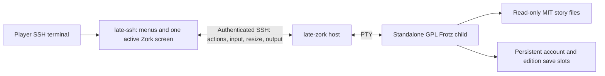

# Plan: Zork Trilogy door

Add one **Zork Trilogy** entry to the Games hub. It opens a menu for
choosing an edition, then that edition's save actions. Play the original
Z-machine stories with a vendored, locally modified Frotz executable in a
standalone door host, projecting its terminal through late.sh's existing door
transport and renderer.

**Status:** implemented, with local validation on 2026-10-09. The pinned stories,
modified standalone Frotz, private host, native menus, six slots, workspace
detach/resume, and delivery wiring are present. Development entry is enabled;
production entry stays disabled until image publication and cluster verification.
Validation evidence and the existing macOS repository-test limitation are recorded
below. Current component contracts and commands are in
`late-ssh/src/app/door/zork/CONTEXT.md`. Repository observations used for the
original design below were checked against
`6ff4199852e22ea7bfb2422316a7dce5deb3172d` on 2026-10-08.

## 1. Agreed behavior

### Six save slots, one running interpreter

Each late.sh account has two persistent save slots for each edition: six slots
in total. An account runs at most one Zork interpreter at a time. The host can
serve many accounts concurrently.

Switching editions preserves the current checkpoint, stops the current child,
and starts the chosen edition from its selected save. Reconstructing the game
and its visible screen should make this feel similar to returning to a live
process. Keeping three engines alive would mainly preserve transient details
such as unfinished typing, which are outside the initial persistence contract.

The two slots are not independent campaigns. Autosave follows the state being
played; the manual slot holds the player's deliberate checkpoint until their
next successful `SAVE`.

### Menu and navigation

The Games hub has one card, under the existing doors group, labeled
**Zork Trilogy**. It has no new top-level number shortcut. Enter opens a
native late.sh edition selector, followed by these edition actions:

| Action | Behavior |
|---|---|
| Continue | Resume the live instance of this edition if present; otherwise load its autosave. Disabled when neither exists. |
| Load manual save | Load this edition's manual slot. Confirm replacement of current automatic progress; disable when the slot is absent or unreadable. |
| New game | Start the edition from the beginning. Confirm replacement of existing automatic progress, and preserve the manual slot. |
| Back | Return to the edition selector, then to the Games hub. Browsing menus changes no save. |

Use arrows and Enter for selection and Esc to back out. Show each slot's last
successful save time and the manual slot's cosmetic description. Preserve the
selected edition when returning from a game. Missing, invalid, and temporarily
unavailable saves should be distinguishable in the menu.

Backtick detaches the current game while the player visits other late.sh
screens. Its interpreter and connection may stay alive until another edition
is launched, the player disconnects, or the idle timeout expires. Zork supplies
at most one live destination to the existing backtick cycle.

On ordinary game exit, return to that edition's menu. Surface a process or
transport failure as an error there. Keep the existing trailing-input grace
pattern so keys intended for a finishing game cannot activate menu actions or
late.sh's global quit.

### Autosave

- There is one automatically named slot per account and edition. It is never
  selected by a filename supplied by a player.
- Checkpoint changed state at coherent game input boundaries, including the
  initial prompt, ordinary command prompts, and game-owned confirmation or
  death/end prompts. A losing situation can replace an earlier autosave.
- Loading a manual save or starting a new game makes that state current; the
  next checkpoint updates this edition's autosave. Other editions' slots stay
  intact.
- Reconnection through Continue restores game state, visible story text, and
  the pending input prompt. It must not need an injected `LOOK` or replayed
  player commands to reconstruct the display.
- Unsubmitted typing, full scrollback, and arbitrary interruption points inside
  output pagination are outside the initial persistence guarantee. Recovery
  uses the last successfully committed coherent checkpoint.

### Manual save and RESTORE

Keep the game's `SAVE` operation and Frotz's description-entry interaction.
Replace the filesystem-facing wording with a concise reminder:

> One manual slot. Saving replaces it. Description:

Any entered filename-like text is a cosmetic description. It cannot select a
directory, address the autosave, or create another slot. An empty description
is allowed. Bound the description to 128 Unicode characters and strip control
characters before persisting or rendering it. Cancellation leaves the old
manual slot intact; successful submission replaces it atomically.

At a story input prompt, a first token equal to `RESTORE`, ignoring case and
surrounding whitespace, is intercepted before the story processes the input.
Ignore everything after that token for this initial release. Ask:

> Return to this Zork's menu? [y/N]

Yes returns to that edition's menu after securing its checkpoint. No, Enter,
or Esc cancels the request and continues the same input operation. Cancellation
must not advance the move count, run game logic, or produce the story's
`Failed.` message. Do not intercept text in the manual description prompt.
`RESTOREfoo` is not the `RESTORE` token.

Save selection happens in the edition menu. In particular, in-game RESTORE
does not directly reload the autosave. Audit Frotz's alternate save, restore,
restart, and quit hotkeys so they cannot bypass the two-slot rules or expose
arbitrary file access. Story-triggered restore paths, including end-of-game
paths, must reach the same menu policy.

### Initial scope

Ship the trilogy selector, normal gameplay, the two slots, edition switching,
terminal rendering, and reliable session cleanup. Spectating, leaderboards,
achievements, chip payouts, public transcripts, save import/export/downloads,
and other feature ideas are parked until the core loop works. Do not add
placeholder integrations for them.

## 2. Existing patterns and constraints

Use these implementations as references, checking source where a context or
notice has drifted:

| Reference | What to reuse |
|---|---|
| [CodeKeep door context](../late-ssh/src/app/door/codekeep/CONTEXT.md) and [host](../late-codekeep/src/host.rs) | Separate russh host, immutable account identity, per-account HOME, one-child lease held through teardown. |
| [Brogue door context](../late-ssh/src/app/door/brogue/CONTEXT.md) and [state](../late-ssh/src/app/door/brogue/state.rs) | Detached live state, backtick integration, 20-minute inactivity timeout, save-aware shutdown and exit grace. |
| [dopewars door context](../late-ssh/src/app/door/dopewars/CONTEXT.md) | Minimal upstream curses program on a PTY with the standard SSH/vt100 projection. |
| [Hub state](../late-ssh/src/app/door/hub/state.rs) and [door keys](../late-ssh/src/app/door/keys.rs) | One hub card and live destination; application-cursor key translation. |
| [Door-image workflow](../.github/workflows/doors.yml) and [Terraform door module](../infra/door/main.tf) | Asset builds and smoke tests, persistent storage, single host replica, private service, release plumbing. |

Existing GPL examples are dopewars and DCSS (GPL-2.0-or-later), BashQuest
(GPL-3.0), and Usurper (GPL-2.0-or-later). Their inspected recipes do not patch
game source. Brogue is AGPL-3.0 and has local hangup-save and victory-logging
patches. NetHack uses its own NGPL, with local build configuration changes.
See [NOTICE](../NOTICE), the recipes under `docker/doors`, and
`scripts/brogue_hangup_save.patch` / `scripts/brogue_victory_log.patch`.

Use the established host/client shape without introducing a general door
framework refactor. Keep sync UI state/rendering separate from async transport
and filesystem work, following [CONTRIBUTING.md](../CONTRIBUTING.md).

## 3. Licensing, assets, and provenance

### Unified licensing and redistribution

On November 20, 2025, Microsoft's Open Source Programs Office, Team Xbox, and
Activision [announced the release of Zork I, II, and III under the MIT license](https://opensource.microsoft.com/blog/2025/11/20/preserving-code-that-shaped-generations-zork-i-ii-and-iii-go-open-source/),
adding the grant to the existing `historicalsource` repositories. The pinned
repositories below carry byte-identical MIT licenses with
`Copyright (c) 2025 Microsoft`. The release covers the game code; commercial
packaging, marketing materials, and trademark rights are outside that grant.

The door contains separately licensed components:

| Component | License and retained material |
|---|---|
| Zork I, II, and III story files in `assets/zork/` | MIT; preserve the complete [copyright and permission notice](../assets/zork/LICENSE), existing story attribution, and [provenance](../assets/zork/PROVENANCE.md). |
| Frotz and our interpreter modifications in `vendor/frotz/` | GPL-2.0-or-later; preserve [COPYING](../vendor/frotz/COPYING), copyright headers, component notices, and dated modification notices. |
| late.sh's own Rust host and application code | [FSL-1.1-MIT](../LICENSE), as explained in [LICENSING.md](../LICENSING.md). This license does not replace or restrict the separate MIT/GPL grants above. |

**Execute, do not link.** The late.sh host runs Frotz as an independent child
program, exchanging terminal input/output, launch options, and ordinary process
status. It neither statically nor dynamically links Frotz, embeds its VM, nor
copies GPL interpreter code into Rust/FSL modules. VM checkpoint manipulation
stays inside the GPL interpreter. This is the separate-program/aggregation
design described in the [GNU FAQ](https://www.gnu.org/licenses/gpl-faq.en.html#MereAggregation);
process separation alone is not a blanket compatibility guarantee, so preserve
the independent-program boundary as integration features are added.

**Public source and forks.** Redistribute our Frotz modifications with the
complete vendored interpreter source as part of late.sh. The public source
distribution path is [github.com/mpiorowski/late-sh](https://github.com/mpiorowski/late-sh)
and third-party forks that comply with the applicable component licenses. The
`vendor/frotz/` tree and [local change/build notes](../vendor/frotz/LATE-ZORK.md)
make the modified interpreter available to inspect, rebuild, and redistribute
under GPL-2.0-or-later. A fork distributing late.sh must retain its applicable
license terms and notices; Frotz and any further interpreter modifications
remain GPL-licensed, and the Zork stories retain their MIT notice.

**Source accompanying binaries.** Our distribution strategy accompanies each
Frotz binary with its exact complete corresponding modified source, notices,
and compilation/installation scripts, following
[GPLv2 sections 1–3](https://www.gnu.org/licenses/old-licenses/gpl-2.0.html).
The [asset recipe](../docker/doors/zork.Dockerfile) copies the source from the
same inputs used to build the executable into `/usr/share/doc/frotz/source/`,
with `COPYING` and `zork.Dockerfile` beside it. Both the door asset image and the
runtime image carry this material. Public repository source must identify the
matching release commit; a link to a changing branch or to unmodified upstream
Frotz alone does not provide the source corresponding to our binary. Forks
redistributing modified binaries must likewise provide their corresponding
source under the GPL's distribution terms.

Keep [NOTICE](../NOTICE) and [LICENSING.md](../LICENSING.md) consistent with this
component boundary. Preserve the `.dockerignore` exceptions that allow the
required source, documentation, and license files into the build contexts.

### Story files

Copy the tracked `COMPILED/zorkN.z3` files from `~/p/my/zorks/zorkN/` into
`assets/zork/`, retaining the material described above. These are Z-machine
version 3 stories. Each inspected file is byte-identical to the
same repository's `zorkN.zip`; the `.zip` is a story file, not an archive to
unpack. No ZIL compilation is needed for the initial integration.

| Edition | Release / serial | Upstream commit |
|---|---|---|
| Zork I: The Great Underground Empire | 119 / 880429 | [97b7b3d68c075dd9af7da499c3e9690ada3471fd](https://github.com/historicalsource/zork1/tree/97b7b3d68c075dd9af7da499c3e9690ada3471fd) |
| Zork II: The Wizard of Frobozz | 63 / 860811 | [3da9661098809788a99cef00f00c865c6c204f96](https://github.com/historicalsource/zork2/tree/3da9661098809788a99cef00f00c865c6c204f96) |
| Zork III: The Dungeon Master | 25 / 860811 | [3ec9ed412b5f3cafe65d83c727d07db1fe4a86a8](https://github.com/historicalsource/zork3/tree/3ec9ed412b5f3cafe65d83c727d07db1fe4a86a8) |

SHA-256 of the selected assets:

```text
37084966477dff679282de42974b2077156b1bd68fad92a65d4ea94d8eb64d79  zork1.z3
3ae7d5558943e9721f3e4b273c8a7faec1a03a604e1ae4ee1cde472c21cb24ac  zork2.z3
b637a242865d059890184164ce8dec28554cc80901dcbf26c740b2d1ed0d4eb8  zork3.z3
```

Record the source path, commit, story identity, and hash in the asset provenance
file; validate hashes during builds.

### Frotz

Vendor the tracked source from `~/p/my/zorks/frotz` into `vendor/frotz/`:

- Upstream: <https://gitlab.com/DavidGriffith/frotz>
- Commit: `042d7bcadc1e2a8090cf737c841d8b7fc14b6eff`.
- Build version: **2.56pre**, development release. The inspected README still
  says 2.55; it is not the version pin.

Copy tracked source, including the upstream build machinery, rather than the
working directory wholesale. Exclude `.git`, compiled executables, objects,
and archives. Keep local modifications in the vendored tree, with their
purpose and upstream base documented.

Build the curses frontend with sound disabled (`make curses SOUND_TYPE=none`)
for the door. Use the dumb frontend for suitable interpreter tests, but do not
treat those tests as proof of the curses/PTY integration. Preserve standalone
interpreter use; enable the door save/menu policy explicitly.

## 4. Runtime and interface design



### Client and host responsibilities

Add the `late-zork` workspace crate and `app/door/zork` client module. Use an
edition enum with fixed keys `zork1`, `zork2`, and `zork3`, one `HubGame::Zork`
entry, and one Zork screen whose local state selects the edition menu or active
game. Edition titles and story paths come from this fixed catalogue.

Client state owns the selector, slot metadata for all three editions, and at
most one process proxy/parser. Add the usual Screen, App, input, tick, render,
config, session bootstrap, and test-helper plumbing. No gameplay database
migration is needed: saves and their metadata live on the door volume.

The private authenticated host interface needs these operations:

| Operation | Contract |
|---|---|
| List slots | Read metadata for the authenticated account's three editions, including availability, successful save times, manual descriptions, and any active edition. No caller-supplied filesystem paths. |
| Launch | Select an allowlisted edition and action: continue, manual, or new. Validate the slot and acquire account ownership before launching a fixed executable/story. |
| Terminal stream | Forward input and resize requests to the active PTY; return output and explicit exit/error status. |
| Return/switch | Secure a checkpoint and end the current child before releasing ownership or launching another edition. A failed voluntary switch leaves the current game available. |

Use SSH requests/channels for the host interface, with bounded structured
metadata responses separate from terminal bytes. Do not shell-evaluate launch
strings or scrape rendered prose to detect save success/menu transitions.
Frotz reports a deliberate return to the edition menu through a documented
process outcome, distinct from a crash. Exact checkpoint encoding and the
interpreter's control options are outputs of milestone 1 below.

Use CodeKeep's opaque account-label convention based on immutable account
UUIDs; public usernames and arcade handles must not determine save ownership.
Use a Zork-specific key-derivation domain and `LATE_ZORK_SECRET`, shared only by
the client and host. Client/host derivations must match exactly.

Acquire one account-wide child lease across the trilogy. Hold it through child
exit and completed writes, including disconnect cleanup. Another login may
inspect its slots but cannot launch another interpreter while that account is
busy; return a visible busy result. No automatic session takeover or cross-SSH
live-process reattachment is required.

### Storage and process isolation

Use `/var/lib/late-zork/<account>/<edition>/` as the private writable directory.
The logical files are `autosave` and `manual`; milestone 1 fixes their format
and extensions. Cosmetic metadata is not another playable slot. Temporary
files used for atomic replacement are implementation artifacts, not a history
of additional saves.

Launch with per-edition cwd/HOME, a cleared and allowlisted environment, and
read-only story files. Keep runtime secrets out of the child's environment.
Disable or contain transcript, command recording/playback, auxiliary-file, and
other interpreter file operations that the first release does not expose.
Do not depend on changing cwd alone to restrict file access.

Frotz already has `-R` restricted-path support, but inspect and exercise its
actual file handling before relying on it. Fixed save paths and treating
descriptions only as metadata remove the primary filename escape route.

### Terminal and session lifecycle

Use the curses frontend, client-side vt100 parser, and existing ratatui blit.
Apply mouse/paste-noise filtering and application-cursor translation. Forward
game input before global shortcut handling, reserving the existing backtick
detach behavior. Keep line editing, status display, and `[MORE]` pagination
working. Use ratatui's own text measurement for native menu layout.

Size the PTY from the actual content viewport; propagate window changes and
honor SIGWINCH. Avoid freezing curses geometry through stale LINES/COLUMNS
values. Verify default foreground/background and inverse status rendering in
both light and dark late.sh themes. Normalize only escape sequences that a
test demonstrates are mishandled by the current parser.

Use the existing 20-minute no-game-input idle shutdown policy. On disconnect
or host shutdown, request orderly termination, allow five seconds for the
child, and retain the existing eight-second host drain / thirty-second pod
termination ordering. A SIGKILL backstop preserves the last committed save,
not progress that never reached a checkpoint. Voluntary edition switching
must not kill the only current game after a failed checkpoint.

## 5. Save correctness and the focused interpreter spike

### What the inspected source establishes

In the pinned Frotz tree:

- `src/common/input.c::z_read` is the story line-input boundary. It draws the
  V3 status line and reads input before copying the command into story memory.
- `src/common/process.c::interpret` decodes operands before calling the input
  handler. Variable operands can affect the stack during decoding.
- `src/common/fastmem.c::z_save` / `z_restore` implement story SAVE/RESTORE.
  Successful V3 restoration executes a branch at the restored PC. Startup
  `-L` restoration uses this same mechanism.
- `src/common/quetzal.c` saves VM memory, stack, and PC. It does not by itself
  implement a resumable pending input operation or restore the visible screen.
- `src/common/random.c` has interpreter-side random state (`A`, `interval`,
  `counter`) that the inspected Quetzal writer does not save.
- The Zork source declares bare SAVE and RESTORE commands. The filename prompt
  is interpreter behavior. The supplied story bytes remain the authority for
  runtime tests; archived source is supporting evidence.

Consequently, calling the normal save routine from an arbitrary mutation or
loading an automatic snapshot through stock `-L` is not a proven solution.
Likewise, returning failure from the normal RESTORE opcode would let the story
print `Failed.` and would not provide the agreed cancellation behavior.

### Preferred checkpoint design

Add an explicit, versioned automatic-checkpoint path inside Frotz. At a stable
story input boundary, flush completed output and record VM state plus the
pending input continuation, RNG state, and a bounded representation of the
visible terminal and cursor. Capture only the current screen, not an unbounded
transcript. A same-size restore should reproduce that screen; a different-size
restore may clip/repaint it and resize normally without advancing the game.

Preserve decoded input operands with the continuation and resume that pending
input operation directly before normal opcode dispatch continues. Do not
decode stack-consuming operands a second time or execute a SAVE-opcode branch
for an automatic checkpoint. Scope this implementation to the three pinned
V3 stories rather than all possible Z-machine versions.

Manual SAVE keeps the normal story save/restore continuation semantics, while
its destination is fixed and its supplied name is metadata. Share the atomic
writer and slot bookkeeping where practical. Keep automatic and manual
continuation kinds explicit; do not present an engine-specific automatic
checkpoint as an interchangeable stock Quetzal save.

Record enough identity to reject the wrong story or unsupported checkpoint
format before replacing working state. Keep state, display/continuation data,
and essential metadata in one atomically committed slot artifact, so a new VM
state cannot acquire an old prompt through mismatched sidecar writes.

Write a temporary file beside the destination, verify successful serialization
and close/flush, then rename it into place. Preserve the old slot on failure.
Use the serialized state or a dirty indicator to skip redundant checkpoints;
do not infer state changes from score or move count alone. Successful restore,
restart, and any permitted interpreter undo operation must refresh automatic
progress at the next coherent boundary.

### Proportional recovery effort

The goal is a good ratio of reasonable effort to risk. Do not build a
transactional VM or attempt a perfectly resumable checkpoint at every machine
instruction. Signals should set a shutdown request and wake normal execution;
avoid serializing the VM or calling curses from the signal handler.

If a stable-boundary hook proves disproportionately difficult, a simpler
mutation-based trigger remains an allowed alternative. First prefer using it
to mark state dirty and write at the next input boundary. If an earlier write
point is materially simpler, demonstrate its behavior on the three games and
document the interruption/coherence risk before adopting it. Atomic file
replacement prevents partial files; it does not make a mid-update VM snapshot
semantically coherent.

On a failed automatic write, retain the old checkpoint and show a warning.
Do not silently claim a successful save, reset the game, or overwrite the
manual fallback. A corrupt or incompatible selected slot returns an error to
the menu; the player chooses another action. New game must not delete the old
autosave before the replacement initial checkpoint can be committed.

## 6. Configuration, packaging, and rollout

Use these integration defaults:

| Setting | Default / purpose |
|---|---|
| Client enabled/host/port | Profile configuration, following existing doors; dev `service-zork`, production `late-zork-sv`, port `2331`. |
| `LATE_ZORK_SECRET` | Required when the client door is enabled and on the host; matches at both ends. |
| `LATE_ZORK_BIN` | `/usr/games/frotz`. |
| `LATE_ZORK_STORY_DIR` | `/usr/share/late-zork`, read-only catalogue of the three pinned stories. |
| `LATE_ZORK_DATA_DIR` | `/var/lib/late-zork`, persistent account/edition state. |
| `LATE_ZORK_LISTEN_ADDR` / `LATE_ZORK_PORT` | `0.0.0.0` / `2331`, cluster-internal listener. |
| `LATE_ZORK_IDLE_TIMEOUT` | Host connection fallback of 3600 seconds; the client applies the 20-minute gameplay inactivity policy. |

Port 2331 is unused in the inspected door configuration. Keep the door disabled
in production until the host, secret, and storage are ready; a disabled client
must not make existing deployments fail startup for a missing new secret.

The implementation must cover the complete packaging chain:

- A `docker/doors/zork.Dockerfile` asset image builds the vendored Frotz source,
  copies the checked stories, and carries corresponding source and notices.
  Pin it in the root Dockerfile and bump that pin whenever its inputs change.
- Add root Dockerfile manifest/dummy-crate plumbing and `builder-zork`,
  `dev-zork`, and `runtime-zork` stages. Runtime includes curses/terminfo,
  Frotz, story assets, the host, and distribution material.
- Add the Compose service and `zork-data` volume, development secret/config
  wiring, and any affected Makefile environment generation. The normal local
  development path must work without manually installing a host Frotz binary.
- Add Zork to the door workflow's dispatch choices, all-games list, path
  triggers, and input-to-game mapping. Changes under both `vendor/frotz/` and
  `assets/zork/` must rebuild/test the asset image. Add its smoke script.
- Register the `zork` release suffix and deploy workflow choice. Add the door
  map entry, image mapping, and SSH-client secret injection in infrastructure.
  Use the existing single-replica door module, shared resource defaults, and a
  1Gi persistent volume with ownership initialization and retained data.

Roll out the asset image first so the root Dockerfile pin resolves, then the
host/storage/secret, then the enabled client. Respect the repository's existing
image/manifest skew rules when introducing the new environment variable.
Verify all three editions through the deployed host before general enablement.
Rollback disables entry to the door and preserves the volume. Never downgrade
a running save format silently; keep format compatibility tied to interpreter
and story provenance.

## 7. Implementation milestones

The following milestones are implemented. Interpreter, host, client, container,
and live SSH checks are recorded below. Production publication/deployment is a
separate rollout step; it has not been performed by this implementation session.

Milestone 1 uses the `LZORK001` container and explicit `LATE_FROTZ_DOOR` launch
modes, documented in `vendor/frotz/LATE-ZORK.md`. Both checkpoint kinds wrap a
Quetzal VM image with pending operands, RNG state, window records, visible
Unicode terminal cells, and metadata. The standalone interpreter owns all VM
serialization. The adjacent `ux_door_test.py` suite is the executable regression
evidence; dumb-Frotz transcripts are not used as a substitute.

1. **Vendor and prove the interpreter path.** Import the pinned stories/source
   with notices, build curses Frotz, and demonstrate ordinary play for all three.
   Prototype checkpoint/restore, current-screen restoration, and RESTORE
   cancellation. Record the chosen checkpoint encoding and interpreter control
   options with tests. Prove correct continuation before building the complete
   application UI around it.
2. **Complete two-slot persistence.** Implement manual descriptions, automatic
   checkpoints, identity/version checks, atomic replacement, and contained file
   access. Prove the old slot survives write failure and manual fallback survives
   a fresh game. Verify game-owned questions and death/end behavior.
3. **Add host and late.sh UI.** Implement account ownership, metadata operations,
   edition menus, one active proxy, detach, edition switches, and error handling.
   Demonstrate I → II → III → I with progress and visible context restored and
   at most one interpreter alive for that account.
4. **Package and validate deployment.** Complete Docker, Compose, workflow, and
   infrastructure wiring. Run the real PTY/container smoke tests and repository
   gate. Exercise restart persistence and non-root runtime permissions.
5. **Document the shipped behavior.** Add the Zork component context, update the
   root context's component map, relevant player/development documentation,
   NOTICE, and LICENSING.md. Keep source pins and rebuild instructions beside
   the vendored material. Leave parked feature ideas in this plan or a separate
   design document, not in current-state CONTEXT files.

## 8. Validation and acceptance

Tests live beside the code they exercise, following CONTRIBUTING.md. Use the
existing host/client test shapes for auth and SSH behavior, interpreter tests
for VM persistence, and real terminal tests for the PTY/rendering boundary.

| Area | Required scenarios |
|---|---|
| Basic gameplay | All three stories boot; LOOK, movement, inventory, SAVE, and QUIT work; descriptions, status lines, editing, and pagination remain readable. |
| Six slots | Two accounts and all three editions stay isolated; naming a manual save differently never creates another slot or redirects a manual write into the autosave. |
| Switching | I → II → III → I restores progress; browsing menus changes no slot; a failed checkpoint leaves the live game recoverable; no overlapping children for one account. |
| Ownership | Competing logins get a visible busy result; account ownership survives teardown and spawn failure correctly; reconnect works after cleanup. |
| Continuations | Ordinary prompts, confirmation prompts, end/death prompts, and decoded stack operands resume correctly; no duplicated command or skipped input. |
| State fidelity | Room, inventory, score, pending input, and RNG continuation survive autosave restore; current screen returns without injecting a game command. |
| RESTORE | Case and trailing text follow the agreed policy; No/Enter/Esc preserve game state and moves; Yes opens the edition menu; descriptions containing RESTORE remain descriptions. |
| Slot transitions | Manual load updates automatic progress at the next checkpoint; new game/restart preserve the manual slot; cancel and failed writes preserve previous valid slots. |
| Interruptions | Detach, idle timeout, SSH disconnect, host SIGTERM, abrupt termination, and restart preserve the last committed coherent slot; no signal-handler serialization. |
| Files and errors | Traversal-like descriptions are cosmetic; unsupported file features cannot escape the private directory; truncated files, wrong stories, unsupported formats, and unwritable storage produce useful errors. |
| Terminal integration | Resize smaller/larger, reconnect at a different size, light/dark themes, arrow/editing keys, split input sequences, paste/mouse noise, and trailing input after exit. |
| Packaging | Clean checkout builds without `~/p/my/zorks`; hashes match; vendored-source changes trigger the image workflow; runtime has notices/source, correct permissions, and persistent saves. |

Use deterministic RNG inputs where needed to compare uninterrupted and restored
execution. Fault-injection tests should target actual save corruption/race
risks rather than mirror implementation details. Keep the suite focused on the
three shipped stories and the new integration.

Run `cargo check` / `cargo build` for the affected crates, `cargo fmt --check`,
appropriate clippy checks, and focused `cargo nextest run` selections. Finish
with `make check`, the repository's full gate including its configured database
and telemetry build. Use `cargo test` only for harness/doctest needs that
nextest does not cover or when nextest is unavailable. A dumb-Frotz transcript
test cannot substitute for a curses PTY test or an end-to-end late.sh session.

### Planning baseline

During planning, the local trees and source licenses were inspected, source
commits and story hashes were recorded, and each `.z3` was compared with its
tracked historical `.zip` story. The local `dfrotz -v` identifies the pinned
2.56pre commit. All three stories were launched with that dumb-interface binary
and accepted LOOK followed by QUIT and affirmative confirmation.

Those initial checks established asset identity and a basic interpreter/story
baseline. The implementation checks below exercise the curses interpreter and
the actual host/client boundary.

### Implementation evidence

- The ten real curses PTY tests in `vendor/frotz/src/curses/ux_door_test.py`
  pass on macOS and in the built Linux amd64 asset image as a non-root user.
  They cover all three stories and both slot kinds, exact styled-screen and RNG
  continuation, decoded stack operands, story questions, death in every edition,
  a terminal Zork III death, resize, RESTORE cancellation, Unicode descriptions,
  abrupt termination, corruption, and failed writes preserving previous saves.
- Host/client tests cover authentication, account and edition isolation,
  account-wide leases, busy errors, natural and checkpoint exits, disconnect
  cleanup, spawn failure, read-only metadata, menu defaults, switch ordering,
  input fragmentation/filtering, idle deadlines, workspace detach/resume, and
  light/dark theme text. The final focused selection passes all 40 tests.
- `scripts/test_zork_host.sh` passes against the release runtime image. Its two
  opt-in tests exercise I → II → III → I with all six slots, then restart the
  host with a live interpreter and verify the six slots and visible continuation
  through a new SSH connection. The script owns and removes its container/volume.
- The asset and release runtime build from repository inputs without the
  reference checkout. The asset smoke suite uses the installed binary/stories
  and bundled source. Story hashes, non-root runtime permissions, and complete
  modified GPL source/notices/build recipe were checked in the images.
- Compose startup, workflow `actionlint`, shell `shellcheck`, Terraform formatting
  and validation, affected Rust checks, formatting, and clippy pass. The full
  `make check` runs formatting and workspace clippy successfully; 5,026 of 5,027
  tests pass (14 skipped). Its sole test failure on this Mac is the existing
  `ssh_test::rate_limited_peer_does_not_consume_a_global_permit`, whose bind to
  `127.0.0.2` fails with `AddrNotAvailable`. This platform failure is outside the
  Zork implementation; the gate must still pass in CI before merging.

The live late.sh SSH TTY review covers Games/edition/save menus, confirmation
defaults, gameplay, SAVE descriptions, RESTORE cancellation/return, game-owned
Ctrl+S, workspace detach/resume, terminal resizing, and native theme rendering.
See the component context for reproducible test commands and rollout order.

### Trilogy session review, 2026-10-09

A fresh test account completed the following through the real late.sh client
on SSH port 2222, in one uninterrupted 140×40 tmux session. Each edition was
played beyond its manual save before switching to the next edition via the
Games card. Returning with Continue checked the later automatic state; RESTORE
returned to the native menu to load the earlier manual state.

| Edition | Manual save restored | Later autosave restored |
|---|---|---|
| I | Living Room, score 10, move 10; sword, unlit lantern, and leaflet carried; rug still covering the trap door. | Cellar, score 35, move 16; lantern lit; leaflet dropped in the cellar. |
| II | Foot Bridge, score 0, move 6; sword and lit lamp carried. | Great Cavern, score 0, move 9; sword dropped in the cavern; lit lamp carried. |
| III | Junction, score 0, move 4; lit lamp carried; sword still embedded in the rock. | Barren Area, score 0, move 8; lamp off, darkness and inventory preserved. |

All six restored game-area text frames matched their saved frames exactly,
including the status line and prompt, before any verification command was sent.
Subsequent inventory and LOOK commands confirmed the room, carried/dropped
objects, lamp state, and rug state. Another I → II → III cycle confirmed Continue
now used the post-manual-restore autosaves (moves 12, 8, and 6 respectively).
All six fixed slot files remained present, with independent manual descriptions.
Screenshots of each edition were captured and reviewed.

This review also reproduced an immediate launch failure for Kitty clients:
`xterm-kitty` passed the original name validation but had no terminfo entry in
the container. Frotz reported `Error opening terminal: xterm-kitty.` The host
now always uses the shipped `xterm-256color` definition for the embedded vt100
screen; the outer terminal name only describes the player's SSH connection.
A fresh SSH connection explicitly reporting `xterm-kitty` successfully resumed
and switched among all three editions. The host regression exercises Kitty,
Ghostty, empty, and path-like PTY terminal names through an actual child process.
The 23 focused host/client/config tests, formatting, and host clippy pass.

Development environment observations: the earlier branch switch had stopped
the Zork watcher on a missing package; restarting only `service-zork` recovered
the save catalogue. A source-triggered watcher restart during this review also
left the old test interpreter detached from its host. That test-account child
was identified and stopped with SIGHUP; normal menu switches reaped their old
children. Hard watcher restarts with live games need separate lifecycle work.
The database already contains migration `229_le_word_languages`, while this
branch predates its language-aware queries. The two daily-word rows explain the
Le Word startup warning; no database reset or rollback was performed.

### Original planning-document acceptance

The document must preserve the final six-slot / one-engine decision, record
the agreed SAVE/RESTORE and menu behavior, identify the source/license boundary,
and provide an implementation sequence with measurable tests. The initial
documentation-only change was committed separately; implementation now includes
the code, assets, packaging, tests, and current-state documentation described here.
